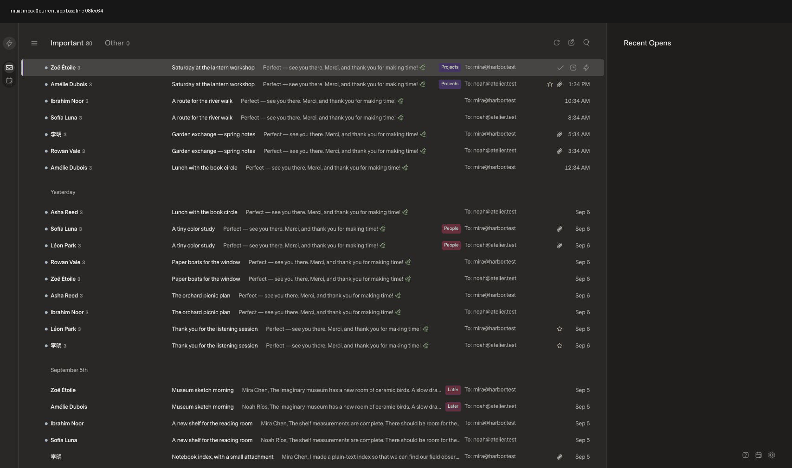
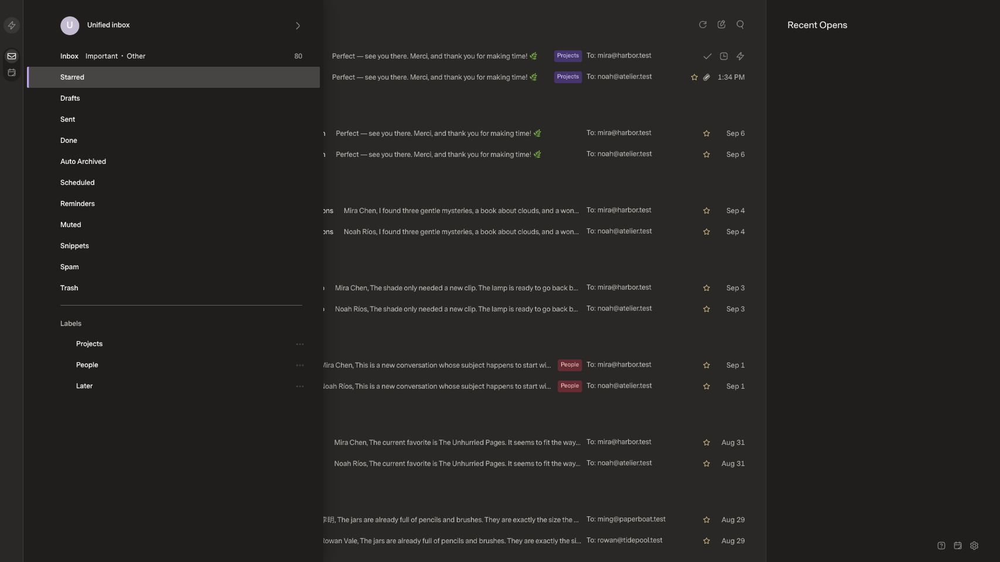
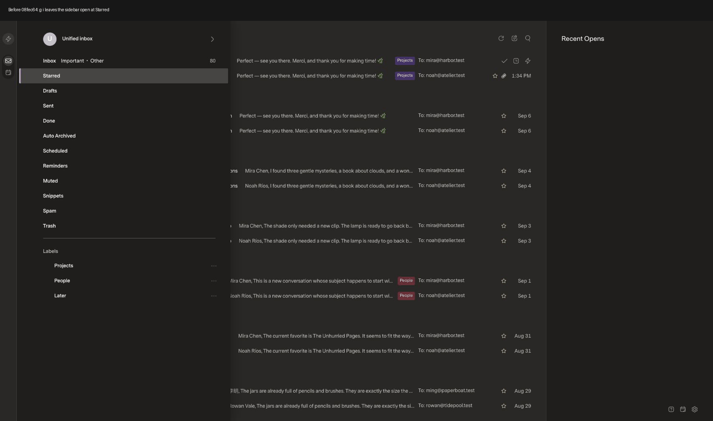
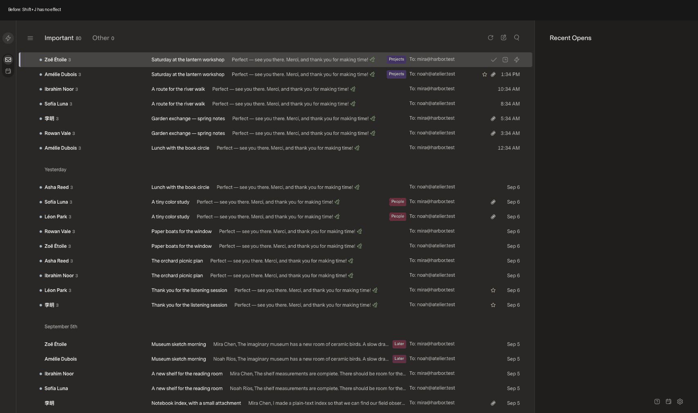
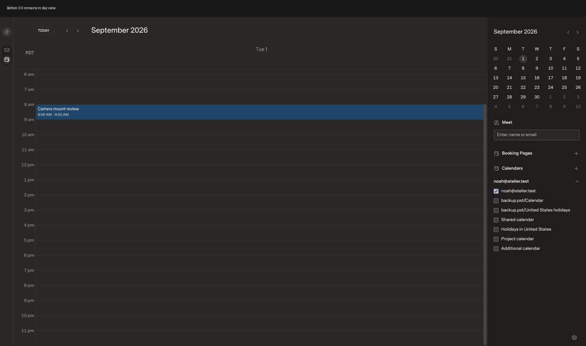
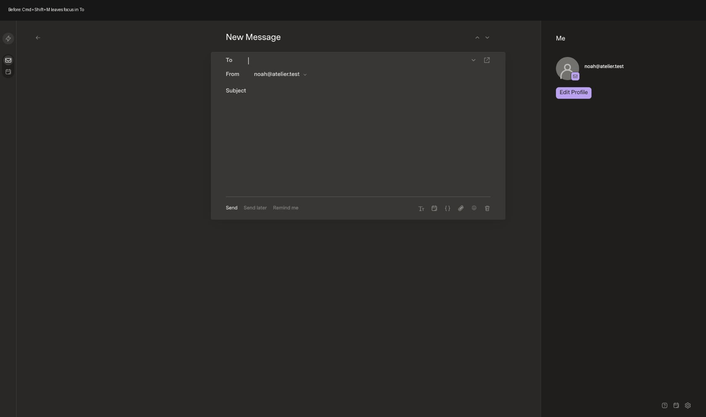

# Shortcut compatibility review

Current-app integration baseline: `08fec64` (UI asset `index-BMI0yhwg.js`).
Public review base: `f4fbd04` on upstream/main. The intervening upstream changes concern AI taught rules; the keyboard resolver and reader match the current app. Both bases will be checked.

Before evidence was captured using the built-in fictional offline provider, two mailboxes, 80 Inbox rows, dark Superlocal theme, comfortable density, 100% zoom, 1707×960 viewport, optimized Vite build, Bun 1.4.2 on macOS arm64. No real accounts or secrets are included. The animated key-event capture shows initial state, Shift+G, existing Cmd+Down, then gg. It demonstrates outcomes, not animation timing. The sidebar image shows that g i leaves Starred and the folder drawer unchanged.

Planned changes: add gg/Shift+G jumps, resolve G-sequence ownership across drawer/reader/iframe, compare the official Mac shortcut sheet against compose, selection, calendar and native window behavior. Preserve existing shortcuts and text editing. Capture matching after evidence and regressions before marking ready.

Official reference: https://download.superhuman.com/Superhuman%20Keyboard%20Shortcuts.pdf (Mac edition v8, retrieved 2026-09-07).

## Result

Public implementation: `52bf6f6`. Identical patch integrated onto the local baseline as `a733c96`; diff hunks were compared and match. The optimized local integration serves `index-ZIIYcTl2.js`, while the public-base build serves `index-Dadl7Xki.js`. Upstream remained `f4fbd04` at final ref check.

These are key-event screen captures assembled into animations with 1.8-second holds, showing results at action boundaries. They are not frame-rate/performance measurements. Calendar and composer comparisons use the public-base candidate; jump/sidebar comparisons use the exact current-app integration. Both were tested on the same fictional instance and theme. Selection recording presses Shift+J twice in the candidate to show accumulation. Temporary notifications and read-state changes from manual reader checks were dismissed/restored for the final jump capture.

Verified: gg/Shift+G reach the first/last list conversation; G I closes the folder sidebar and returns from Starred; G O leaves the reader instead of expanding a message; 00 opens week; T/N/P navigate calendar; Shift+J accumulates selections; Cmd+Shift+M focuses the composer body. Editing/modal/IME/repeat guards are covered by resolver regressions. No mail was sent.

Checks: 98/98 web tests; optimized web build; SDK typecheck/build; 19/19 shortcut tests also passed on current-app integration. The existing current-app API suite had passed 358 tests during setup; this patch changes no API/storage code, so that expensive unchanged suite was not rerun. Browser error log was empty during candidate QA. No performance budgets were weakened. The list jump uses the existing bounded `seekWindow(start/end)` and performs no new mailbox scan; renderer/query/storage algorithms are unchanged, so a new scale benchmark is N/A.

## Official list audit

Audited all categories in the linked Mac v8 sheet against the existing handlers and shortcut guide. Added missing selection, calendar and composer bindings; kept legacy aliases. Existing command/search/undo, conversation actions, labels, folders, filters, reply/forward, rich-text formatting and pop-out composition mappings remain in place. User-requested gg and Shift+G are additional aliases.

Known limits: `?` / Ask AI has no equivalent chat feature in Superlocal and remains unsupported. Calendar data is local to Superlocal, and dates without an interactive link are not made navigable by this keyboard patch. Provider capabilities still govern sending, unsubscribe and mail mutation. Shortcuts yield while typing or in a modal/settings editor. This is shortcut compatibility, not a claim of full Superhuman feature parity.

Native window/tab/zoom shortcuts belong to the desktop host. The local fork's separate macOS package implements those and removes conflicting native Select All/Redo accelerators; it is intentionally excluded from this upstream web-only PR. Ctrl+1–9 selects pinned mailboxes; an unpinned second mailbox needs pinning in Settings → Mailboxes (no backend change required).
