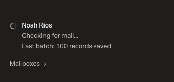
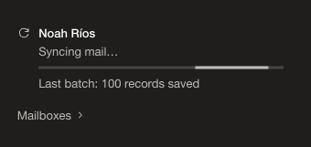
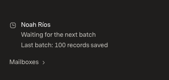
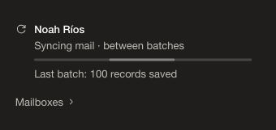

# Clear mail-sync progress

## Baseline

Review/application base: `ca3c9a924c24d597a9e5ee912fc57bb449435bc2` (PR #17). The hosted sign-in page still serves the recorded release assets `index-QrZyKKmi.js` / `index-CqbImCAc.css`. The matching optimized local build serves `index-z42NitiB.js` / the same CSS. The original Mac checkout's two unpublished offline-classifier commits and private README edit are preserved and excluded. Unapproved PR #18 is not included.

Before evidence was captured and inspected before implementation. The app uses its existing offline mock seed: 160 fictional messages, two sources, 80 inbox conversations. AI is off and provider network transport is disabled. The screenshots match the supplied Carbon sidebar; the rest of the fixture uses Comfortable / Super Sans Normal at 1440×1000 CSS pixels, DPR1, 100% zoom. Loopback authentication has no hosted Sign out button.

The status endpoint alone is intercepted with complete, source-scoped responses to keep the exact active → between-batches transition repeatable. The last-batch count of 100 is controlled presentation data, not a claim that the fixture imported 100 new messages. Mail data and other APIs remain real offline SDK responses. This review verifies presentation, not live provider throughput.

| Scenario | Before | After |
| --- | --- | --- |
| Active latest sync |  |  |
| Between batches |  |  |
| Active → between batches | [Recording](before.mp4) | [Recording](after.mp4) |

Full matching views: [before active](before-active.png), [after active](after-active.png), [before between batches](before-batch.png), [after between batches](after-batch.png). Pixel comparison of the between-batch pair found **no differences outside the sidebar**; all changed pixels are within x=1119–1410, y=822–924. The sidebar crops use identical coordinates.

The baseline recording was decoded and inspected. Its 1440×1000 viewport is encoded at 1036×720/25fps; it is visual evidence, not latency evidence.

## Change

- Active recent-mail work says **Syncing mail…**; historical work retains **Syncing older mail…**. A 3px secondary activity bar replaces the old spinning glyph. The source glyph is a stationary sync icon, not another animation.
- Pending pages say **Syncing mail · between batches**. The bar stays still and subdued between requests; it is not a percentage. First-sync idle says **Preparing mail sync…**.
- The existing **Last batch: N records saved** count is retained exactly: not cumulative, not necessarily new mail, and not an estimated total. The indeterminate progressbar has a source-specific accessible name and descriptive value text, with no numeric completion value.
- Paused, retry/backoff, reconnect, errors and unavailable status retain their explicit messaging and show no activity bar. Reduced motion disables the bar animation. The widget uses Helvetica Neue; surrounding appearance is unchanged.

Only `apps/web/src/MailSyncStatus.tsx` and `apps/web/src/mail-sync-status.css` change application behavior. No scheduler, polling, provider, query, reconciliation, cache, virtualization, mail-model, dependency or test-file changes. No startup/mail-action performance improvement is claimed or benchmark rerun required for this leaf copy/indicator change. Existing budgets are unchanged.

## Verification

- Optimized web build, SDK type check and SDK build pass. **70 web tests and 265 API tests / 7,752 assertions pass**, with no test changes or weakened watchdogs. The existing 10,000-thread/33rd-arrival test passed in 4,492.75ms under its original five-second budget. Candidate assets are `index-q8FzCx_W.js` / `index-DZXb6DpQ.css`, verified loaded. The existing Vite large-bundle warning remains unchanged.
- The delegated browser worker verified active copy, indeterminate ARIA semantics, transform-only animation without a duplicate spinner, reduced-motion disablement, and 1440/900px geometry. Its permissions blocked response-fixture controls, DOM activation and screenshot reading. The coordinator inspected the saved evidence and completed those remaining scoped checks directly in the same profile-bound session; this is not presented as fully delegated/native-input coverage.
- Controlled state checks passed for latest/backfill, between batches (stationary bar), singular/zero last-batch counts, first sync, caught-up hidden state, paused, reconnect, rate limiting, network error and status unavailability. [Unavailable evidence](after-unavailable.png) shows stale copy explicitly labeled and no progressbar. No fabricated percentage or cumulative count appears.
- [Open mobile sidebar](after-mobile.png), [light appearance](after-light.png) and [long name at 900px](after-long-name.png) were visually inspected. At 390px, status x=41–390 and scrollWidth=clientWidth=349; at 900px the 394px long name is ellipsized into 196px with its full title retained, and document width remains 900px. Helvetica Neue is scoped to the widget; the adjacent heading retains the existing font.
- Settings hid the sidebar and produced zero status polls during the observation window; returning resumed polling. Light appearance was switched back to Dark and verified through the returned inbox. Only fictional local UI controls were DOM-activated; no send, mailbox mutation, real account access or paid inference occurred. A transient mailbox-name response override was removed. True background-tab transitions, native keyboard/forced-colors and live-provider throughput are not claimed.

Both recordings were decoded and inspected: active → between-batch state is visible, with moving → stationary bar on the candidate. The after recording is approximately 4.7 seconds; it is motion evidence, not a latency benchmark. No real mail or private screenshots/logs are published.

PR #19 remains draft for user review; no merge or deployment is authorized. The original checkout remains untouched.
