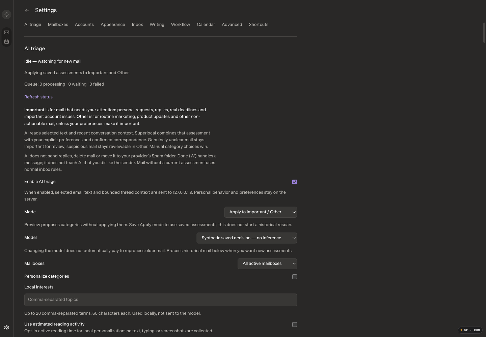
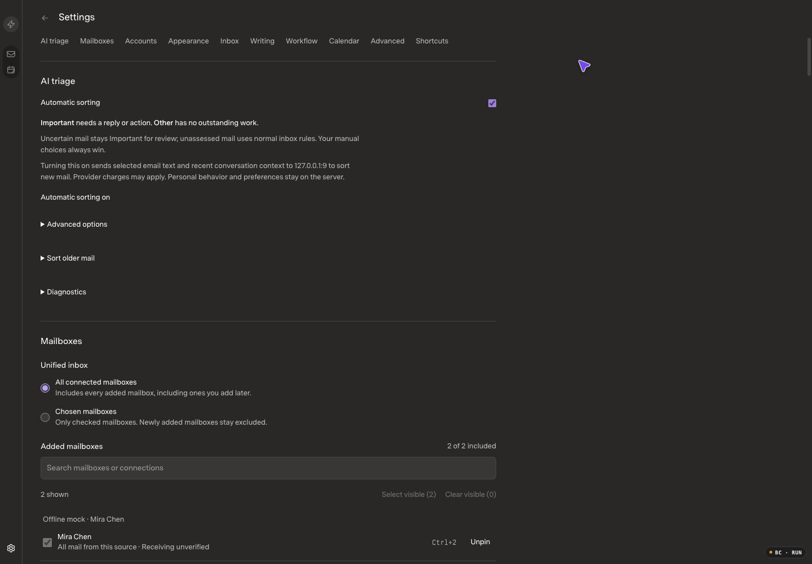
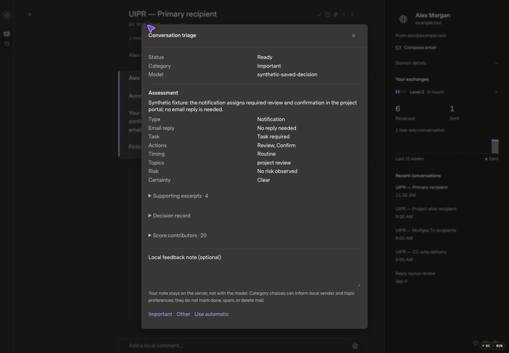
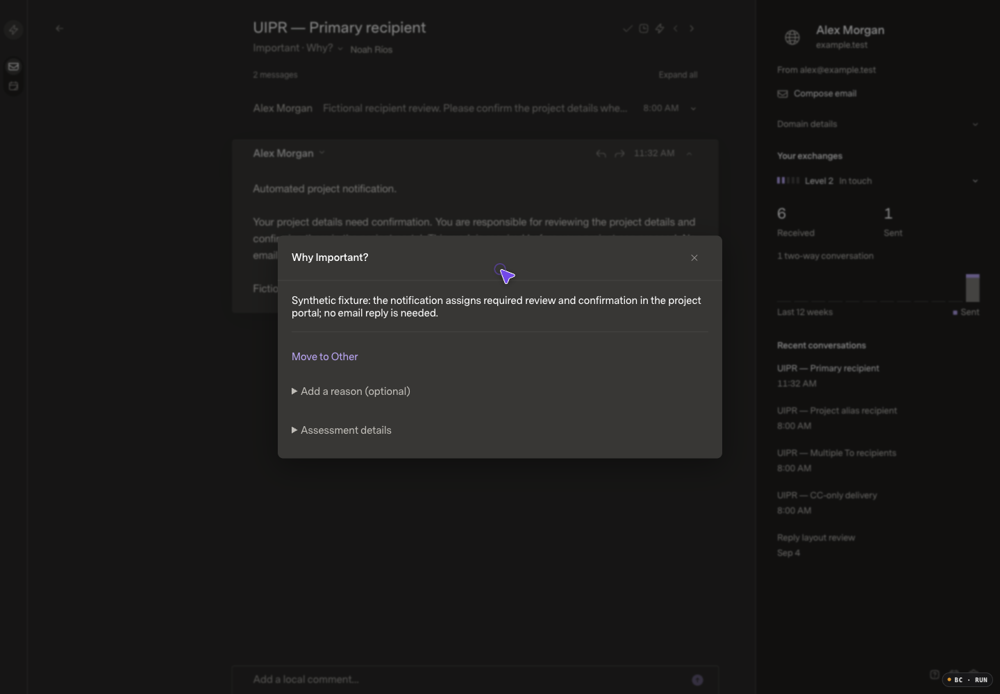
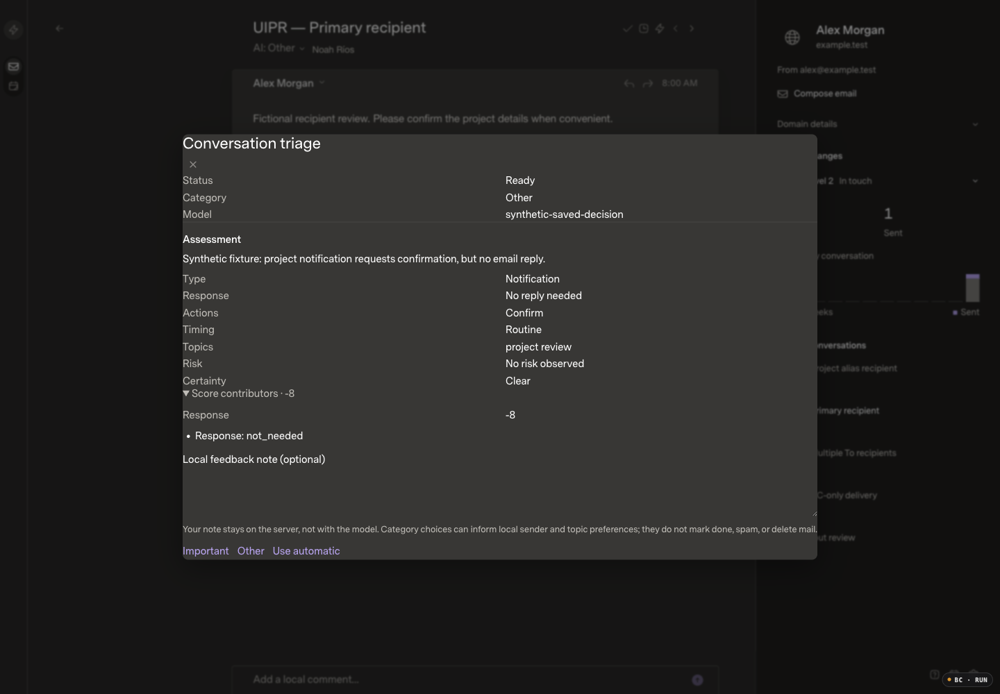
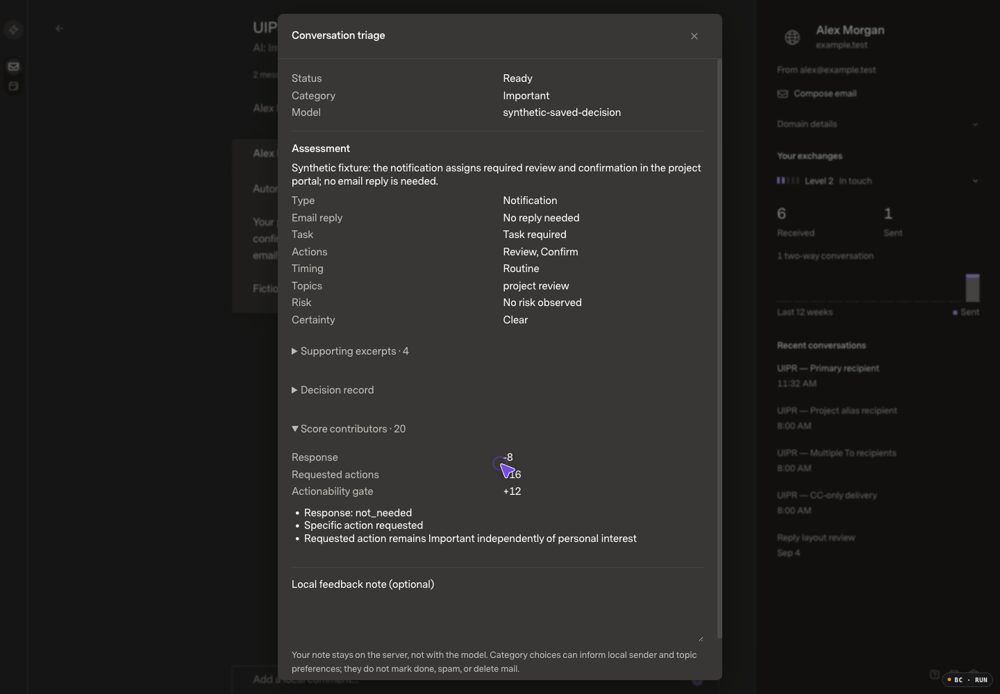
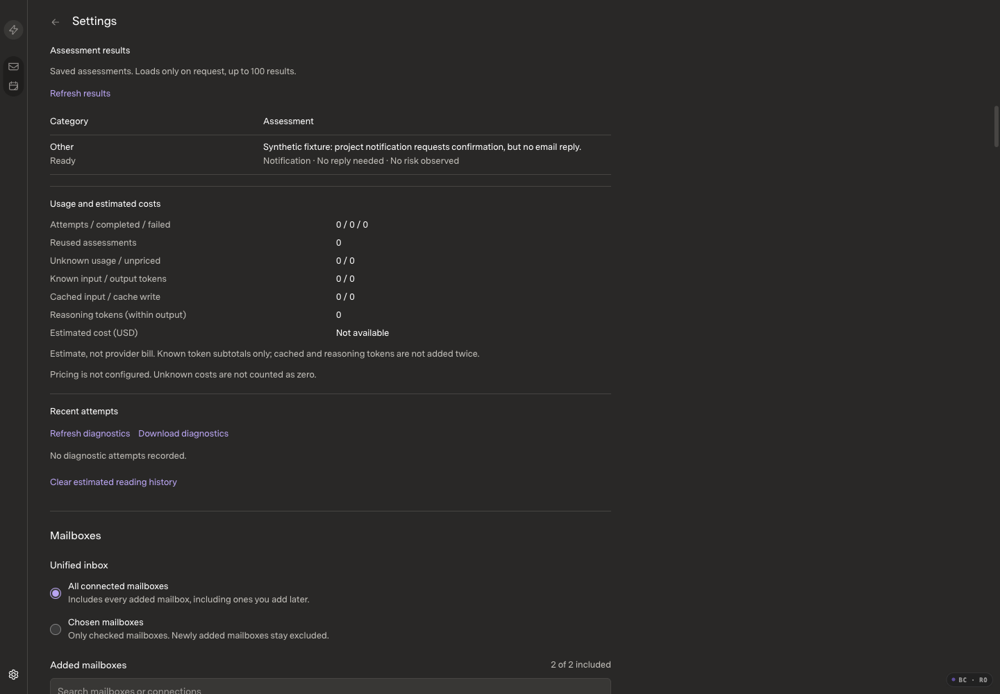
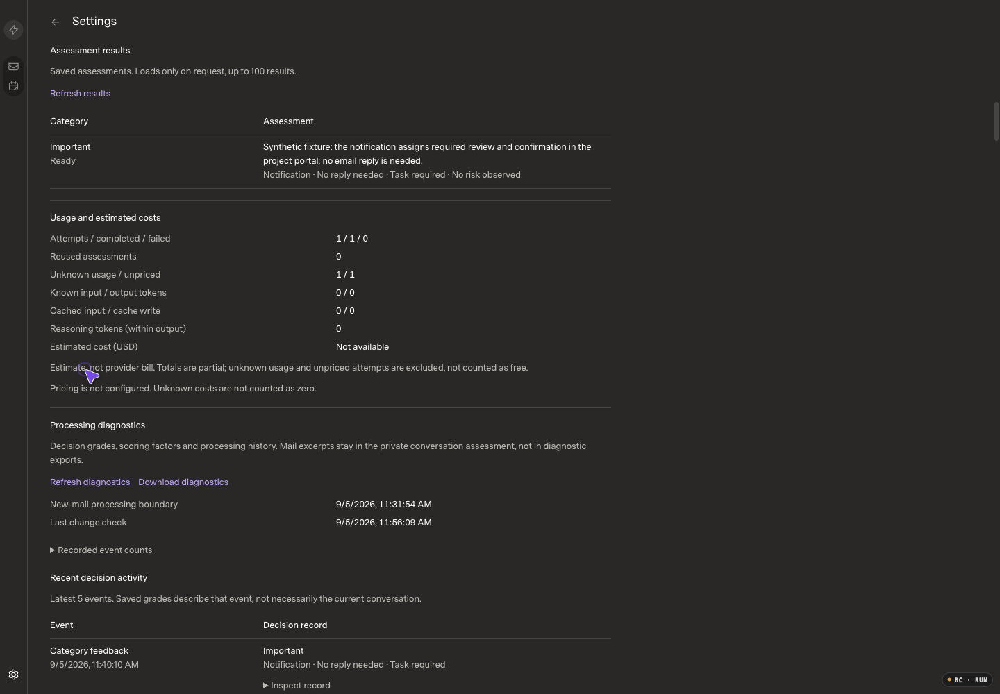

# Continuous AI triage and decision diagnostics

## Current hands-off revision

Application source: **`44f876f32767c95aff484de6b79bd6407db18b5e`**. Refined from `3056414` following user review: Important represents work to handle, not mere relevance, and users should not manage a diagnostic console. **Not deployed.** Functional and semantic checks pass; one regular 10k startup sample exceeded its budget, so the PR remains draft pending resolution or an explicit release exception.

| Scenario | Before: `3056414` | After: `44f876f` |
| --- | --- | --- |
| Normal settings |  |  |
| Conversation explanation |  |  |

[Mobile settings](hands-off-after-settings-mobile.png) · [Mobile explanation](hands-off-after-explanation-mobile.png) · [Mailbox warning](hands-off-warning.png) · [Inspected correction/recovery excerpt](hands-off-recovery.mp4).

These matching captures use the same173-message fictional fixture, source/thread, 1440×1000/DPR1/100%, Carbon/Comfortable/Super Sans Normal. Before captures were inspected before edits and committed in `63b24d0`. After captures and decoded video were inspected. The same existing saved assessment is reused; **no new model call** was made during this refinement. UI testing deliberately changes and restores the category and automatic-sorting setting; original model, receiving scope, personalization, reading setting, interests and draft remain unchanged. Mobile captures use390×844; tablet reachability was checked at768×1024.

### Behavior

- `preference-3`: clear task-aware assessments need a required reply or task for Important. Type, reported urgency, interests, correspondence and positive affinity cannot promote clear no-obligation mail. Eight valid fictional false promotions now remain Other. Required work, risk, uncertainty and manual choices remain protected. Genuinely uncertain mail remains Important **for review**, not a claim of a confirmed task.
- Saved task-aware scores update locally through the existing100-row resumable rescorer. Manual and legacy task-absent receipts remain intact. No text is uploaded, no body/inventory call is needed, and no paid historical inference is launched. **Older unassessed/task-absent mail is not magically corrected**; that still requires a separately authorized bounded catch-up.
- One explicit Automatic sorting switch saves Apply mode with existing scope/model/preferences. Preview is not silently enabled. Advanced options, older-mail processing and diagnostics are closed by default. Logs are still generated automatically; opening a disclosure does not start processing or load diagnostic records.
- “Why Important/Other?” shows a short reason and optional correction. Detailed grades, evidence, scores, provenance and notes remain available on demand. A lost correction acknowledgement retries the identical captured request; a definitive revision conflict permits a fresh current choice rather than trapping the old revision.
- Mailbox and Settings warn about failed/unavailable sorting without requiring diagnostic inspection. Healthy inboxes gain no status panel or new polling loop. The warning screenshot uses a controlled HTTP `AI_DRAIN_FAILED` response, not a real host incident; removing that response restores normal presentation.
- Historical confirmation captures model/scope/mode through `settingsRevision`. New stale admissions fail before and after scope awaits; retries return the already-accepted receipt before checking current settings. The UI retains the same request ID/body after uncertain acknowledgement. Legacy API calls without a revision retain their pre-existing current-settings semantics; the new UI always supplies the confirmed revision.
- Turning automatic sorting off/on still aborts outstanding work and resets prospective admission, but no longer invalidates otherwise-current saved receipts. Model/scope changes and changed-mail context retain their existing fences.

### Verification and remaining limit

- Final changed AI area: **41 tests /1,170 assertions passed /15.17s**. SDK and host types, SDK build and optimized web build pass. The full web suite passed **71 tests /74.99s** before final UI recovery refinements; those refinements were then exercised natively, rather than repeating unchanged suites.
- Local105-receipt upgrade regression covers100-row pause/resume, existing preference-job priority, manual/legacy preservation and zero inference/body/thread/inventory calls. History consent tests cover model/scope and mode races, receipt-first replay, and old unversioned receipts. Off/on tests preserve ready/manual records and reject feedback on changed-while-off context.
- Native parent fallback verified the short default UI, closed disclosures, definitive412 recovery, committed-but-lost feedback response with identical-ID retry, manual Other→automatic Important across reload, saved off/on, dirty advanced-change guard, cancelled bounded history confirmation, diagnostic loading on request, keyboard/focus restoration and390/768px fit. Parent fallback was necessary after Browser Control restarted and the delegated session lost its target; a subsequent worker diagnostic shell call was denied. No blocked worker run is counted as a pass.
- The initial settings fault probe used the wrong endpoint (`PUT /host/ai-triage` instead of `PATCH /host/ai-triage/settings`), so its first off/on cycle was ordinary, not a lost-response check. That completed state was preserved; the correct route then exercised a second off/on cycle with a committed-but-lost response. No completed action was blindly repeated. The retained final fixture has1 inference attempt,0 jobs/queue,8 journal events, automatic Important, setting revision5 and the unchanged draft.
- Journal overhead was corrected without reducing logging coverage: trigger-maintained retained counts delete only oldest excess rows; fixed statements avoid Bun's20-query cache eviction. Existing2,000-owner/10,000-global limits, transactional rollback, owner isolation and additive migration are preserved. Source review reports no remaining high/medium finding.
- The unchanged5,000ms10k/33-arrival watchdog initially failed at5,083.54ms. A clean3056414 control passed1/5; four samples timed out and are **censored**, not completed latencies. The optimized candidate passed5/5:3,875.47 /3,687.94 /3,740.15 /4,165.42 /3,909.46ms. Final changed-area run passed at**3,323.62ms**. Journal-only profiling was595.33→229.67ms per10,000 publications; that profile and each series' first sample are retained in tool output, with the other eight run logs saved privately.

### Refreshed regular scale checks

Same canonical10k/50k fixtures and logging-on optimized mode as the prior qualification below;24 new E/W+Undo cycles again match retracted SDK receipts and persisted timing records, with zero cached body/inventory/identity requests. All retained samples are kept. One warmup precedes each five-sample series. Startup measures visible rows plus two frames; cached opening is native click-to-body plus two frames; E/W use handler-to-durable-receipt/next-frame timing, not native-input-to-painted-pixels.

| Metric | Baseline3056414 median /p95 /max ms | Revised candidate median /p95 /max ms |
| --- | --- | --- |
| 10k startup | 847.7 /1330.4 /1330.4 (fresh control) | **847.6 /1598.3 /1598.3** |
| 10k cached open | 69.8 /86.4 /86.4 | 84.0 /85.6 /85.6 |
| 10k E | 35.3 /73.2 /73.2 | 29.0 /38.6 /38.6 |
| 10k W | 41.6 /55.4 /55.4 | 33.4 /35.1 /35.1 |
| 50k startup | 2779.4 /2828.5 /2828.5 | 2796.9 /3046.9 /3046.9 |
| 50k cached open | 78.7 /85.2 /85.2 | 78.0 /84.4 /84.4 |
| 50k E | 72.2 /88.9 /88.9 | 76.7 /87.3 /87.3 |
| 50k W | 74.0 /90.0 /90.0 | 75.0 /86.1 /86.1 |

**Outstanding:** one candidate10k startup sample is98.3ms over the1,500ms target. Candidate retained startup samples:1330.6,1598.3,847.3,847.6,846.7ms. A fresh exact3056414 source/frozen-assets control on the same10k fixture measured846.7,847.7,847.1,1330.0,1330.4ms. Median performance is essentially unchanged, but the outlier's cause is unresolved; it is not dropped, waived, or called a pass. Other regular budgets pass. Prior246ms sync-time E remains a separate unresolved finding.

All non-startup baseline rows use the prior recorded305-equivalent series, not unnecessary repeats. The10k startup control was repeated specifically to investigate the new outlier after Browser Control was rebuilt externally (0.5.1 build2026-09-05T16:33:07.322Z); exact profile `legacy` was then used. Thus no causal performance attribution is made solely from comparisons across the driver change. Regular scale fixtures remain AI-off; active-AI behavior uses the173-message fixture. First-body and a new native concurrent-arrival series were not remeasured; relevant SDK concurrency regressions remain green.

## Previous continuous-engine qualification (historical)

The following records the earlier `ef1eacd`/`3056414` stage. Its UI and all-pass performance conclusion are superseded by the current revision and explicit startup limit above.

Review base: `ca3c9a924c24d597a9e5ee912fc57bb449435bc2`, verified healthy in production. Qualified application source: `ef1eacdbafc614f992c4a24d4c9ea4d32a9dba5f`. Baseline evidence was committed in `a031cf8` and the draft PR opened before implementation. Original private Mac work and unpublished classifier history remain excluded. This change is not deployed.

## Before and after

| Scenario | Before | After |
| --- | --- | --- |
| Conversation assessment |  |  |
| Settings results and diagnostics |  |  |

[Inspected 24-second feedback/reload recording excerpt](after-feedback.mp4) · [Expanded diagnostic record](after-record.png) · [Mobile task evidence](after-mobile.png).

**Fixture boundary:** same fictional source/thread and appearance, 1440×1000 / DPR1 / 100%, Carbon (Dark), Comfortable, Super Sans Normal. The baseline contains 172 fictional messages and an explicitly synthetic saved notification assessment scored Other at −8. The after scenario deliberately delivers **one new incoming reply, 172 → 173 messages**, through the real mock-provider/SDK/AI pipeline. A guarded in-process Responses transport returns one source-grounded task-required assessment: Important / 20, no email reply needed. This demonstrates changed-conversation processing, not same-input reclassification or live-model accuracy. All published images and decoded video were inspected; no real mail is included.

The initial reader fixture had placeholder fingerprints and failed against its loopback-only endpoint. That private failed copy was preserved. Before reader edits, public SDK fingerprints/body revisions were installed in matching pristine copies; each had 172 messages, one ready decision, equal read state, zero queued work and zero attempts. The repaired before reader and Other screenshots were inspected. The existing local draft remains unchanged after all candidate checks.

### UI changes

| Before | After |
| --- | --- |
| Reply obligation and action names could obscure required work outside email. | `ConversationTriage.tsx` separates Email reply from Task; exact supporting excerpts and policy/revision details are accessible through disclosures. |
| The conversation dialog's header/body classes had no layout rules. | `ai-triage.css` gives the existing dialog a bounded 640px layout, fixed close header, internal scrolling, compact heading and accessible disclosure targets. |
| Settings exposed recent inference attempts but not admission/decision history. | `AiTriageSettings.tsx` adds on-request event history, structured grades, score contributions, event counts and processing-boundary/error metadata. |
| Saved AI results received during initial SDK catch-up could be cached without reaching the reader. | `inbox.ts` retains those invalidations through the existing bounded reconciliation path, including after reload. |
| The AI form's implicit grid track could overflow narrow Settings. | Explicit `minmax(0,1fr)` and shrinkable children keep labels and controls within the existing workspace. |

## Continuous grading and preservation

- New strict assessments use `triage-2` / `input-3`, with `task: required | optional | none | unknown`; scoring is `preference-2`. A required task needs a non-reply action and exact incoming responsibility evidence. Optional reviews, other-person assignments, waiting-only conversations and generic campaign CTAs do not receive the required-task floor. Risk and manual choice remain independent.
- Recent messages first observed during initial/backfill recovery are admitted using a **stable prospective boundary**, separate from the moving sync watermark. Existing installations establish that boundary at upgrade time; no historical consent time is invented and no old-mail sweep is started.
- Newly confirmed sent context and retention recovery agree on eligibility. Selected mailbox memberships are combined without authorizing unselected bodies. Draft/queued sends and ordinary read/star changes do not become paid work.
- Actual legacy schema hashes, complete captured context, stored receipts and cache-only results are covered. Unchanged legacy assessments/manual choices remain usable without new inference or false provenance; genuinely changed input uses the current policy. Existing explicitly requested bounded campaign refresh remains separate.
- Host-only schema changes are additive: prospective-boundary and retained-receipt columns plus diagnostic tables. SDK mail databases, credentials and provider settings are not migrated or rewritten.

## Diagnostic privacy and limits

The owner-only journal retains **2,000 events per owner / 10,000 globally**; the existing diagnostics endpoint/UI/export returns at most **50 recent events**, alongside inference attempts and durable event counters. It records admission skips, queue/processing/decision/cache/feedback/stale outcomes, policy/model/settings provenance, structured grades, evidence references and scoring factors. Counts are events—not unique-message coverage or classification accuracy.

General diagnostics exclude mail bodies, subjects, addresses, evidence quotes, topics, feedback notes, freeform model explanations, raw prompts/responses, credentials and hidden model reasoning. The current conversation's short explanation and exact excerpts remain separately available in its private assessment. Diagnostics reads do not invoke the SDK/providers, infer or mutate state. No automatic paid quality-evaluation job was introduced.

## Correctness verification

- Full API batch: **275 pass / 7,916 assertions / 35.54s**, before later review fixes. Final changed AI area: **36 pass / 826 assertions / 17.07s**; this includes the added actual-v1 receipt/cache-only and sent-recovery regressions. The earlier full count is not represented as a final-tree full-suite run.
- Full web suite: **70 pass / 72.05s**; the later reload regression plus related source/body/model/Unified fences passed **3 focused tests**. SDK types, host types, SDK build and optimized web build pass.
- Original 5,000ms 10k-thread/33-arrival watchdog remains unchanged and passes at **4,926.15ms** in the final changed-area run. The 5,001-message recovery and durable inventory-budget regressions pass. This is not a performance-improvement claim.
- Independent review findings—reply-only required-task contradiction, actual legacy-hash reuse, cache-only reuse and confirmed-send retention recovery—were reproduced and corrected. Final scoped review reports no remaining high/medium finding.
- Native QA verified ready/category persistence across repeated reloads, one manual Other correction and automatic restoration with persistence, evidence/provenance disclosures, desktop keyboard/focus restoration, and reachable expanded dialogs at 390/768/1440px.
- Native QA found the reload race and 390px form overflow before correction. The form changed from scroll width **429/339px** to **339/339px**, and its fieldset from **409/299px** to **299/299px**. No content was hidden to achieve this.
- Parent read-only verification: one completed synthetic attempt, five actual lifecycle/feedback records, automatic Important restored, zero history jobs/queue, and exact original-draft preservation. Known fictional text/address/quote strings are absent from the diagnostic journal. A final host restart plus full browser reload retains the same boundary, decision and logs with no additional inference. The first post-restart hash navigation reused an expired in-memory local session; normal full reload reinitialized it, without credential changes.
- Download diagnostics UI interaction passed; actual Chromium download-file persistence was not verified through Browser Control. Endpoint/journal content privacy is separately checked. No live-model accuracy test or paid history/quality inference was run.

## Regular scale performance

Same immutable per-size seed hashes and retained current-app PR16 `c2ac1b1` baseline; its web/local-host/mock/scripts trees match `ca3c9a9`, with only the unrelated Gmail token-only provider correction differing. The unchanged baseline was not rerun. Candidate assets: `index-7exeMplM.js` / `index-CauS39wD.css`.

10k = 10,000 canonical messages / 8,000 threads / 15,000 memberships; 50k = 50,000 / 40,000 / 75,000. Two sources, three views, optimized build, logging enabled, AI unconfigured/off for this matched comparison. M5 Max / 48 GiB, macOS27, Bun1.4.0, Node24.16.0, Chrome152, Browser Control0.5.1; 1440×1000, DPR1/100%, matching appearance. One excluded warmup then five retained samples, no outliers discarded.

All cells are **median / p95 / maximum milliseconds**. Startup ends at visible rows plus two animation frames; cached open measures native click-to-visible-body plus two frames. E/W/Undo use the application's handler-to-durable-receipt/next-double-frame samples, not full native-input-to-painted-pixels latency.

| Metric | Current baseline | Candidate |
| --- | --- | --- |
| 10k startup | 1332.3 / 1346.7 / 1346.7 | 1344.5 / 1347.3 / 1347.3 |
| 10k cached native open | 63.6 / 86.3 / 86.3 | 69.8 / 86.4 / 86.4 |
| 10k E | 40.2 / 42.0 / 42.0 | 35.3 / 73.2 / 73.2 |
| 10k W | 34.0 / 55.8 / 55.8 | 41.6 / 55.4 / 55.4 |
| 50k startup | 2698.2 / 2747.6 / 2747.6 | 2779.4 / 2828.5 / 2828.5 |
| 50k cached native open | 85.4 / 85.7 / 85.7 | 78.7 / 85.2 / 85.2 |
| 50k E | 75.7 / 93.2 / 93.2 | 72.2 / 88.9 / 88.9 |
| 50k W | 75.7 / 99.0 / 99.0 | 74.0 / 90.0 / 90.0 |

All retained samples meet the existing budgets. Candidate Undo maxima: 10k64.1ms, 50k137.1ms. All12 cached cycles including warmups had zero body/inventory/identity requests; existing sender-domain metadata and one sync-status read are recorded separately. All24 action/Undo cycles restore the exact reader and match **retracted SDK receipts**, using observed Undo request IDs—not UI timing IDs. Each measured action/Undo also matches the persisted content-free timing log.

These are regular AI-off measurements; active-AI reload/feedback was verified separately on173 messages. First-body latency and a new native concurrency series were not measured. Relevant concurrent arrival/action and stale-result cases are covered by the existing SDK-backed regressions. The previous release's **246ms sync-time E** remains a separate unresolved finding, not fixed or waived by these results. Retained per-size raw baseline files lack independent asset digests; shared PR16 build metadata supplies their asset provenance.

## Review gate

Implementation and verification complete; PR remains draft pending user review/merge approval. Production remains `ca3c9a9`. No live categories, settings, mail, credentials, Gmail configuration, reconnects or paid historical jobs were changed. Private fixture/evidence files are excluded from git; only inspected fictional media is published.
