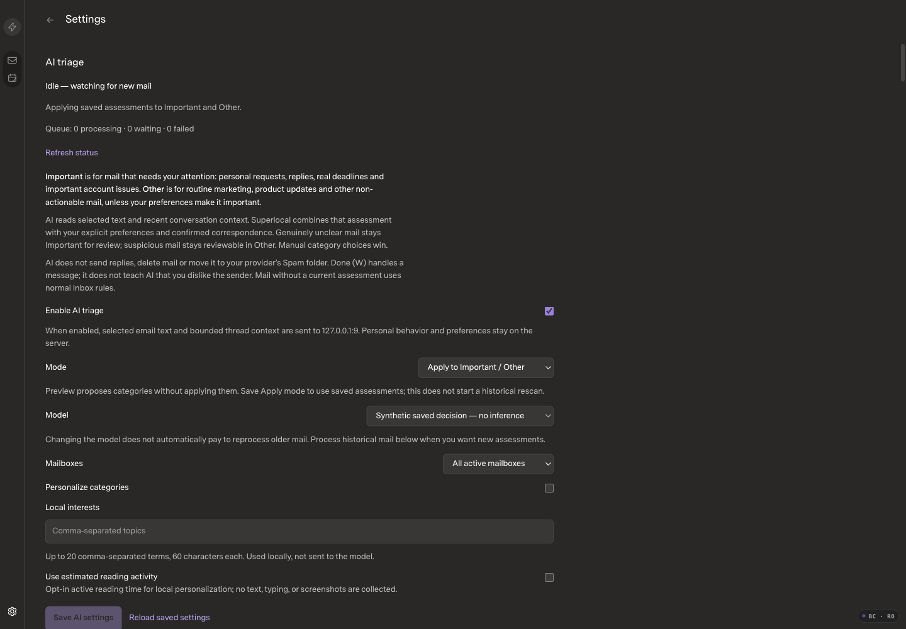
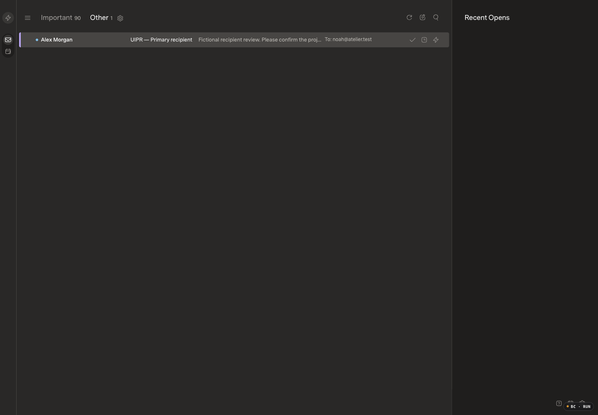

# Continuous AI triage and decision diagnostics

Review base: `ca3c9a924c24d597a9e5ee912fc57bb449435bc2`, verified healthy in production. Original private Mac work and unpublished classifier history are excluded. This draft records before evidence prior to application implementation.

## Before

Both captures were inspected. Current optimized application source, 172-message fictional fixture, 1440×1000 / DPR1 / 100%, Carbon (Dark), Comfortable, Super Sans Normal. Existing fixture contains one explicitly synthetic saved notification assessment (no reply needed; confirmation action) scored Other at −8. It is a controlled saved-state reproduction, not a claim of real model inference. Local provider configuration is a loopback discard endpoint; no cloud credentials, paid inference or real mail is present.

The initial reader experiment invalidated a placeholder fixture fingerprint and produced three loopback-only failures. Those are a fixture limitation, not an application classification finding. The private failed fixture is retained. Before editing the reader, the fixture was repaired using the actual public SDK semantic fingerprint and captured body revision; the matching baseline/candidate each retain 172 messages, one ready synthetic decision, the same unread state, zero queued work and zero attempts. The repaired reader and Other screenshots above were inspected. Replay opens the selected fictional thread first to resolve current cached body context, then opens the assessment and returns to the list.

## Intended behavior

- Separate outstanding task responsibility from email reply requirements; retain source-grounded evidence, uncertainty, risk and manual choices.
- Prospectively grade genuinely recent messages first imported through initial/backfill recovery without automatically processing historical mail. Do not confuse the moving sync cursor with a stable processing boundary.
- Keep bounded, owner-only processing/admission/decision logs with model/policy/settings provenance, structured grades and scoring factors. No mail bodies, subjects, addresses, freeform rationale, evidence quotes, raw responses or credentials in diagnostic exports. Existing private conversation explanations remain separate.
- Surface task status and decision activity in existing Settings and conversation assessment UI. No new dashboard or background diagnostics polling.

## Verification plan

Existing deterministic tests only: required versus optional/other-person/waiting tasks; first-seen full-sync arrivals versus older history; source/membership ownership, replay/restart/late-result fences; diagnostic retention/redaction; explicit correction memory. Relevant SDK/host types, builds and regression suites; matched fictional after evidence and native UI checks. Source changes and final checks pending.

No live settings change, email send, reconnect, historical inference job or paid quality sample is authorized by this implementation. Merge/deployment requires review approval after qualification. Earlier performance findings remain separate and are not claimed fixed.
