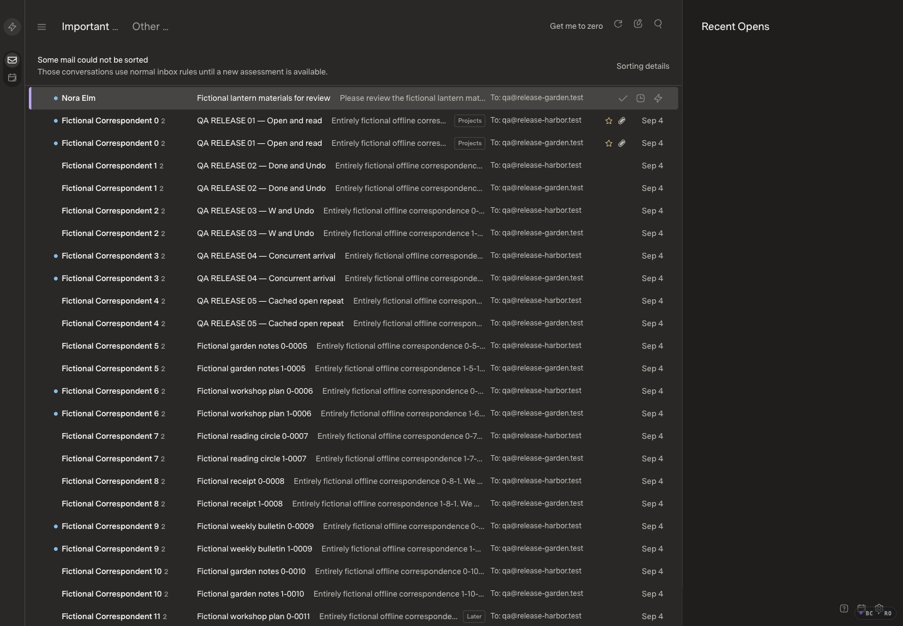
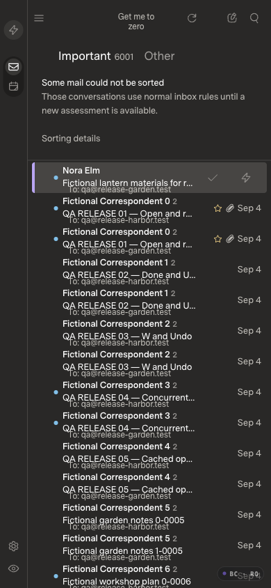

# Demand-driven inbox — before implementation

Current intended/deployed baseline: `34eb87c50c8aeb423f268057adb5df142bd72646`. The frozen review checkout `b81208bdf35429e481c216a76e2c68f2ba00370b` has the identical tree. Production is healthy; the original private README edit and unpublished classifier history are excluded.

## Scope

Keep the existing page layout while removing the historical AI-failure banner from the inbox flow. Load only requested conversation pages plus a modest buffer; eliminate startup-triggered full-message duplication and query materialization. Preserve backend search, custom/no-label providers, sender/contact reads, drafts, actions, captured cleanup and conditional Undo. Provider-native category labeling will be reviewed as a bounded incremental stage, not a historical bulk write or a Gmail-only replacement for all providers.

Fable 5.1 is the independent design/code reviewer. Initial design review favors the existing SDK keyset pager plus bounded host projection; no additional category database or provider framework. Sender/contact history must remain complete for the cached authorized corpus through SDK reads. Sparse filters may scan bounded batches and return a continuation; unknown is never zero or absent.

## Current-app evidence

| Scenario | Before | After |
| --- | --- | --- |
| Desktop, saved historical assessment failure |  | Pending |
| Mobile, same state |  | Pending |
| Delayed sorting-status response | [Baseline recording](startup-before.mp4) | Pending |

The fictional visual pair contains 10,001 canonical messages, 8,001 source/thread conversations and 15,001 receiving memberships, across two sources and three receiving views. One failed assessment was generated through the official mock provider, real SDK and real AI service using a single in-memory invalid response. No real model/network call, real mail, handwritten canonical row or historical inference scan was used. Before/head configurations and saved state are paired, with independent files. Separate matched 10k/50k/150k scale fixtures remain available.

Appearance: Dark (stored Carbon), Superlocal, Comfortable, Super Sans / Normal; body family `SuperMailSans, Adelle, "Helvetica Neue", sans-serif`. Desktop1440×1000 and mobile390×844, DPR1, 100% zoom, optimized build, logging enabled. Loaded JS `index-CvpnI3tR.js`, CSS `index-DYO1h_iS.css`; main JS hash matches the deployed image. Both stills and decoded recording frames were inspected. Recording fits1036×720; only fictional page content is included.

A controlled1500ms delay on the ordinary GET `/host/ai-triage` reproduces the reported shift without modifying its response: the inbox list starts at y=76px and moves to y=137px when the historical-failure banner appears. Expected candidate behavior: no such banner insertion or list displacement; diagnostics remain available without obscuring mail. The existing mobile text overlap is visible in the baseline and must not be misrepresented as a new regression.

## Qualification gate

This baseline-only checkpoint precedes source edits. Candidate evidence, Fable diff reviews, current-source tests and optimized matched timing measurements are pending. Budgets remain100ms cached opening,150ms E/W,1.5s10k startup,4s50k. React Scan diagnostics remain separate from uninstrumented acceptance. No new test files/frameworks/CI, live mail mutations, paid history scans, merge or deployment are authorized by this checkpoint.
