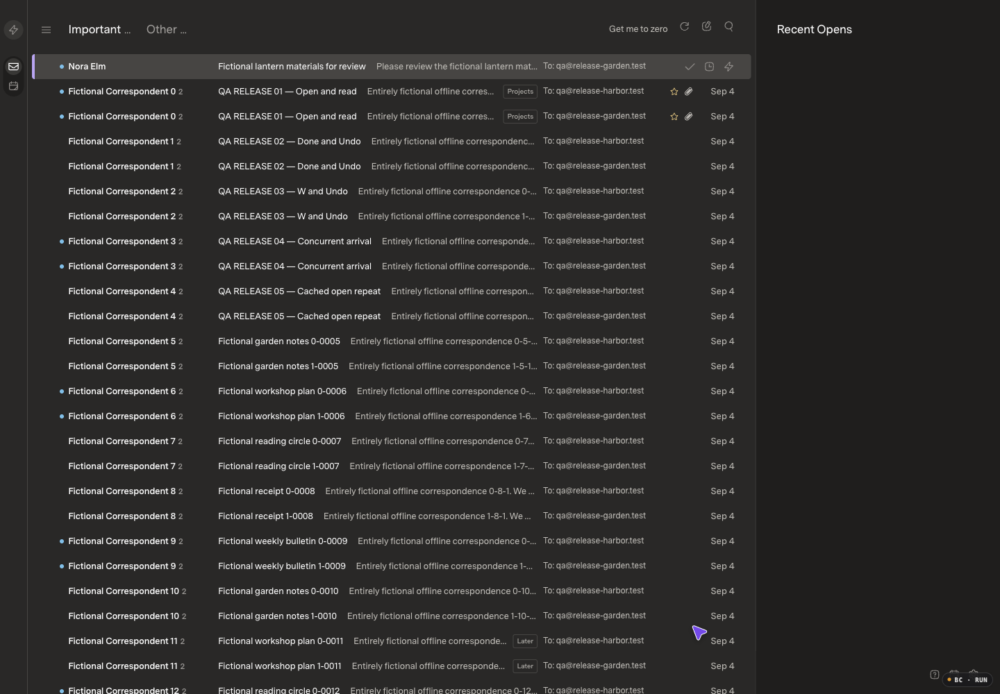
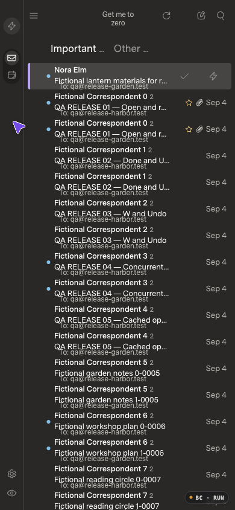
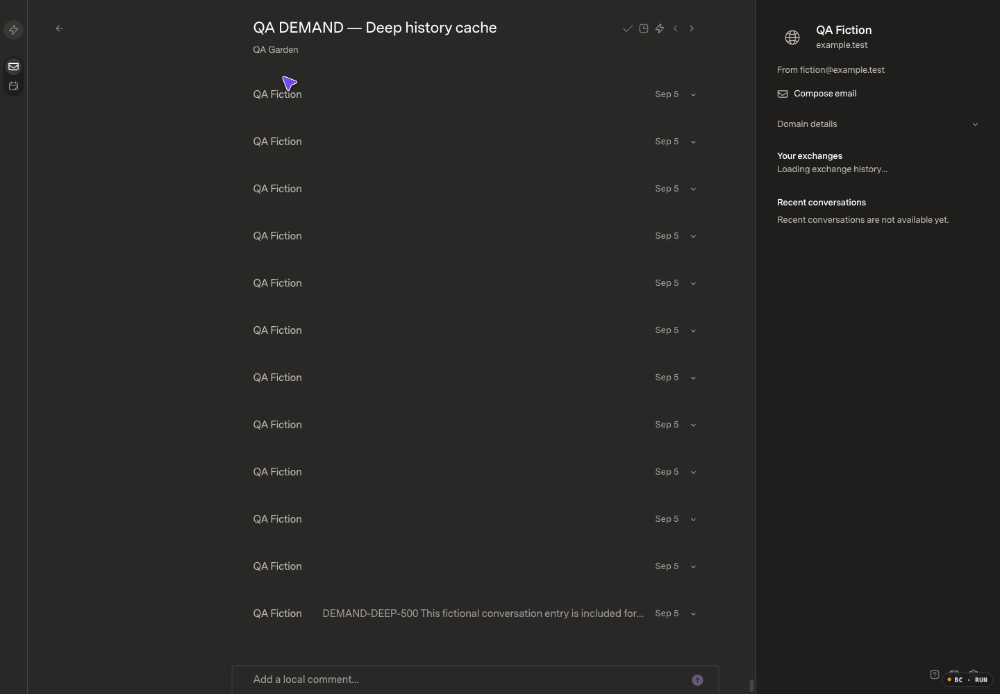
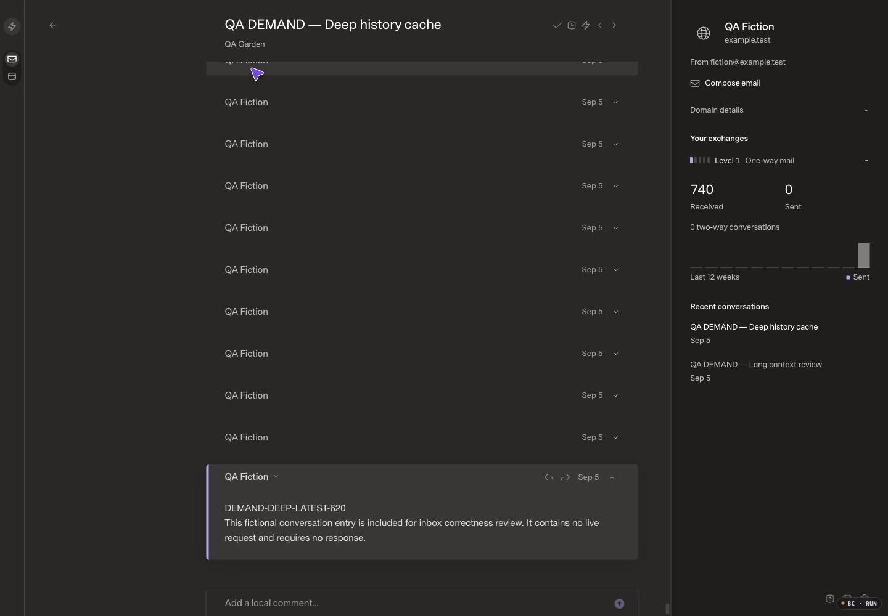

# Demand-driven inbox — candidate review

Current intended/deployed baseline: `34eb87c50c8aeb423f268057adb5df142bd72646`. The frozen review checkout `b81208bdf35429e481c216a76e2c68f2ba00370b` has the identical tree. Production is healthy; the original private README edit and unpublished classifier history are excluded.

## Scope

Keep the existing page layout while removing the historical AI-failure banner from the inbox flow. Load only requested conversation pages plus a modest buffer; eliminate startup-triggered full-message duplication and query materialization. Preserve backend search, custom/no-label providers, sender/contact reads, drafts, actions, captured cleanup and conditional Undo. Provider-native category labeling will be reviewed as a bounded incremental stage, not a historical bulk write or a Gmail-only replacement for all providers.

Fable 5.1 is the independent design/code reviewer. Initial design review favors the existing SDK keyset pager plus bounded host projection; no additional category database or provider framework. Sender/contact history must remain complete for the cached authorized corpus through SDK reads. Sparse filters may scan bounded batches and return a continuation; unknown is never zero or absent.

## Implemented candidate

Reviewed code and regression-test revision: `7fd238fb61b936488389052285bd38b478d5c00d` (application code `5f053d46d060579264a2b742a1c589e070daad12`; `7fd238f` adds coverage only). The implementation includes demand-driven windows, scoped reconciliation, reader-first dispatch, nonblocking SDK correspondence reads, current long-thread action targets and bounded retention of open messages. None is deployed.

- Ordinary query, page, lookup, changes and sender/contact reads no longer activate the full host mail copy. The SDK supplies scoped ordering, complete aggregates and bidirectional bookmarks. Each host request uses at most five conversation reads and four targeted metadata-detail reads; the browser requests 100 rows plus one buffer response, then stops. File-backed sender statistics run in a lazy read-only SDK worker, not on the foreground action thread.
- Sparse scans retain advancing cursors; reverse navigation survives partial page eviction and ordinary deltas. Primary-folder counts and exact From/To predicates make off-preview matches usable without loading full threads or confusing custom Gmail labels with system folders.
- Select all and Zero explicitly prepare their frozen captures. Preparation is not acceptance: it creates no accepted session ID until current, and the UI requires another deliberate Start/Select all. Existing receipts, conditional Undo, later-reply exclusions and V1 recovery remain. Old disposable copies may remain dormant after restart; no mailbox-sized cleanup runs merely because a view opens.
- Historical sorting failures remain in Settings, not an inbox banner. Current Apply-mode operational problems use a small indicator on the existing Settings gear. Partial and unfinished views retain continuation/Retry; no new sync-status warning or layout reservation was added.
- The SDK now safely maps canonical custom-label IDs at provider dispatch. **Automatic provider-native category mirroring is not enabled.** Self-triggered inference and concurrent W/revision behavior must be separately qualified before enabling it; no historical relabeling or paid scan is part of this candidate.

## Current-app evidence

| Scenario | Before | After |
| --- | --- | --- |
| Desktop, saved historical assessment failure |  |  |
| Mobile, same state |  |  |
| Delayed sorting-status response | [Baseline recording](startup-before.mp4) | [Candidate recording](startup-after.mp4) |
| Resident-list scrolling | [Baseline recording](scroll-before.mp4) | [Candidate recording](scroll-after.mp4) |
| First cleanup in the Garden receiving view | [Baseline recording](cleanup-before.mp4) | [Candidate recording](cleanup-after.mp4) |

The fictional visual pair contains 10,001 canonical messages, 8,001 source/thread conversations and 15,001 receiving memberships, across two sources and three receiving views. One failed assessment was generated through the official mock provider, real SDK and real AI service using a single in-memory invalid response. No real model/network call, real mail, handwritten canonical row or historical inference scan was used. Before/head configurations and saved state are paired, with independent files. Separate matched 10k/50k/150k scale fixtures remain available.

Appearance: Dark (stored Carbon), Superlocal, Comfortable, Super Sans / Normal; body family `SuperMailSans, Adelle, "Helvetica Neue", sans-serif`. Desktop1440×1000 and mobile390×844, DPR1, 100% zoom, optimized build, logging enabled. Baseline assets: JS `index-CvpnI3tR.js`, CSS `index-DYO1h_iS.css`; main JS hash matches the deployed image. Both stills and decoded recording frames were inspected. Recording fits1036×720; only fictional page content is included.

A controlled 1500ms delay on the ordinary GET `/host/ai-triage` reproduces the reported shift without modifying its response: the baseline list moves from y=76px to y=137px when the historical-failure banner appears. The candidate stayed at **y=76px before and after** the delayed response, with no banner or reserved gap. The actual response still reported enabled Apply mode, one saved failure and no waiting/processing jobs. Both Settings gears retained their plain accessible name and no operational-problem hint. [Settings diagnostics remain available](settings-diagnostics-after.png).

Candidate assets are `index-MtzEi-D5.js` (SHA256 `678ab46524a63937e5ad8820dbbeecdfb756bd6d970d0fd49e019f78c7b0e9f6`) and `index-BzUBT1ZO.css`; served bytes were compared with the optimized build. Mobile remains390×844 at scale1 with no document overflow. The initial candidate mobile capture had a different hovered row and was retained privately; the published capture restores the original unread Nora row and matching highlight. The **pre-existing mobile text overlap remains visible** in both images and is not claimed fixed. The resident-scroll pair uses pointer(1000,600), three +600px and three −600px wheels, returning to the same head/order with36px desktop rows; it is not a backend-paging benchmark.

The cleanup pair uses the same Garden receiving view:5,001 messages,4,001 conversations and5,001 memberships, all initially unhandled. On the baseline, the ordinary view had already prepared its index and the first create returned200. The candidate returned an honest503 preparation state with [Start session and Back to inbox](cleanup-after-preparing.png); two explicit Starts, at least five seconds apart, returned503 then200. Both captures ended [before](cleanup-before.png) / [after](cleanup-after.png) with3,001 remaining, zero decided and a durable paused state. These are matching workflows, not cold-host latency samples.

### Deep-reader correction

This additional pair compares the intermediate candidate `c9de63b` with `5f053d4`, **not** the deployed baseline. It uses the same620-message thread inside the150,740-message correctness fixture, same appearance and viewport.

| At the bounded history limit | Before correction | After correction |
| --- | --- | --- |
| Open latest message |  |  |
| Paging and explicit recovery | [Before recording](deep-history-before.mp4) | [After recording](deep-history-after.mp4) |

The after recording adds the explicit recent-history recovery to the matched seven-page path. [The old selected message also remains available after recovery](deep-history-recent.png). No cache limit was raised.

## Final performance qualification

Application `5f053d46d060579264a2b742a1c589e070daad12`, with test-only commit `7fd238fb61b936488389052285bd38b478d5c00d`, was measured against the deployed-tree baseline `b81208bdf35429e481c216a76e2c68f2ba00370b`. Values below are **median / p95 / maximum, in milliseconds**, from five retained samples after one warmup. Native input-to-correct-content plus two bounded animation frames is an estimate, not measured paint or INP. No final sample was censored or replaced.

| Scenario | 10k baseline | 10k final | 50k baseline | 50k final |
| --- | ---: | ---: | ---: | ---: |
| Usable navigation | 186.2 / 197.1 / 197.1 | **176.5 / 238.0 / 238.0** | 491.5 / 615.1 / 615.1 | **328.7 / 341.8 / 341.8** |
| Cached opening | 93.0 / 103.8 / 103.8 | **28.1 / 29.5 / 29.5** | 28.7 / 46.0 / 46.0 | **28.1 / 30.0 / 30.0** |
| E — Done | 91.7 / 114.3 / 114.3 | **44.0 / 49.0 / 49.0** | Stopped after failed warmup | **42.5 / 49.7 / 49.7** |
| W — Done with attention feedback | 105.1 / 138.8 / 138.8 | **37.7 / 50.1 / 50.1** | Not run after E failure | **43.0 / 51.7 / 51.7** |
| E Undo, separately measured | 362.9 / 379.8 / 379.8 | 118.7 / 209.0 / 209.0 | No retained distribution | 62.4 / 196.1 / 196.1 |
| W Undo, separately measured | 295.1 / 395.3 / 395.3 | 153.4 / 197.9 / 197.9 | No retained distribution | 165.0 / 170.0 / 170.0 |

The final retained navigation samples were 176.5, 158.8, 137.1, 238.0, 199.6ms at 10k and 168.0, 329.3, 325.7, 341.8, 328.7ms at 50k. The final 10k navigation maximum is higher than this baseline's maximum, although both remain below the 1.5s budget; this is not an across-the-board speedup claim. All final cached-open and E/W samples satisfy the unchanged 100ms and 150ms budgets; the 50k navigation budget remains 4s. Undo is not folded into E/W acceptance.

**Conditions and fixture identity.** Apple M5 Max / 48GiB, macOS27 arm64, Bun1.4.0, Node24.16.0, Chromium152, SQLite3.54.0; optimized `start` UI with logging enabled, reusing the verified built assets. No development/HMR timings, React Scan, artificial network delays or overlapping test/build jobs. Viewport1440×1000, DPR1, 100% zoom, the appearance above, visible/focused during retained actions. The unrelated original local service was left running as in the baseline (observed1.3% CPU before final qualification).

| Official fictional mock/SDK seed | Canonical messages | Source/thread conversations | Receiving memberships | Initial paired canonical fingerprint |
| --- | ---: | ---: | ---: | --- |
| QA RELEASE 10k | 10,000 | 8,000 | 15,000 | `b45fa666037d94b547c1e3a55f1ab6f6628a2b819e18965fff156a409fd83346` |
| QA SCALE 50k | 50,000 | 40,000 | 75,000 | `518a5337348d6063a9f628a39b99528b6408433d061d6aa9faf52f928bc09885` |

Both seeds use two sources and three receiving views; memberships are not extra canonical messages or resident browser rows. Final ordinary openings returned100 conversations plus one buffer response, rather than copying either corpus. Before/head started from matching canonical/membership hashes; later checks restored Done/snooze state but advanced read warmth and revisions, so final databases are not byte-identical to their initial snapshots. Browser caches start empty on reload; SQLite/OS caches and the baseline host index were warm. The 50k candidate had already completed an explicitly requested cleanup capture. Its23,200 frozen items survived; the final postcheck found disposable materialization tables empty, consistent with capture-completion pruning, whose exact time was not measured. This is **not pristine-host, cold-index or provider-history qualification**.

**Foreground versus secondary work.** At 50k, five concurrent E samples were49.7,52.6,50.7,36.2,35.3ms (median49.7 / p95-max52.6); concurrent W was53.4,36.6,35.9,36.5,38.7ms (36.6 /53.4). All ten began during a real sender request, made no body request before the action and completed at least198.6ms before its response began. No response was artificially delayed. Their Undo median/p95/max was46.1/47.6/47.6ms for E and46.0/46.8/46.8ms for W. A separate10k concurrent E sample finished in50.9ms,61.8ms before the sender response.

First body load is separate (one sample per size):10k GET9.7ms / correct-ready38.9ms / two-frame49.1ms;50k GET12.7ms / correct-ready35.6ms / two-frame44.6ms. Exact body content and reader identity matched. Body completion preceded secondary sender dispatch; the initial50k sender request itself took1,651.3ms, without delaying the reader. Cached opening made **zero body/query/page/change/inventory requests**.

Handler acceptance median/p95/max was0.3/0.3/0.3ms for cached opening,16.2/17.6/17.6ms for E and14.7/16.4/16.4ms for W at10k; at50k it was0.2/0.3/0.3ms,17.7/21.7/21.7ms and15.0/18.4/18.4ms. App frame estimates were separately logged (E33.6/43.3/43.3ms and W33.7/37.3/37.3ms at10k; E42.1/46.5/46.5ms and W36.6/51.5/51.5ms at50k). The254/128ms action motion and320ms Undo motion are not included as handler-acceptance time. Retained ordinary startup/cached/E/W samples had no long tasks; Undo observations included one/two at10k E/W and zero/one at50k.

**Durability and idle behavior.** The final10k run added13 receipts, all retracted, with52 captured membership restorations;50k added22 receipts and88 restorations. Read-only verification across all retained runs found52/58 total retracted receipts,208/232 restored membership checks,24/28 retracted W feedback entries, zero Done and no pending/failed provider operations at10k/50k. Both final reloads still exposed the action targets in Important. Each size used seven query requests and seven buffer requests for seven reloads.

The immediate10k idle observation included one5ms changes request5,501ms after the initial event-stream headers; no newer SDK event existed. This is consistent with the preserved one-time five-second healthy-stream catch-up plus scheduled reconciliation, not proof of recurring polling. The original watch is retained. A separate settled10.008s watch made no body/query/page/changes/count requests. At50k, initial catch-up completed5.457s after observed headers, followed by10.002s with zero mail requests. Sync-status and telemetry continued. A401 during the subsequent fixture switch is retained as setup evidence, outside both saved measurement series; neither retained series had an HTTP error.

## Qualification gate

The baseline-only commit `4e8cea6` and draft PR preceded implementation. Fable 5.1 reviewed the architecture, SDK boundaries, quiet status/preparation UI, reversible paging and long-thread context/cache corrections. Its final source and visual reviews found **no new blocker**, including inspection of paired stills and bounded recording frames. These reviews are not release approval; user/designated-reviewer approval is still required before merge or deployment.

Final checks passed: SDK/host/web type checks, SDK declaration and optimized web builds, **336 API tests / 110,555 assertions** (57.17s), and **84 web tests** (92.32s). The unchanged 10,000-thread/33rd-arrival watchdog passed in **3305.68ms**. The two affected web cases also passed after the ordinary-row fast path; the earlier internal query-cap correction passed **11 affected host tests / 818 assertions**. Existing test files cover owner/scope fences, exact cursor reversal, no ordinary materialization, sparse filtering, long-thread W/Undo, giant off-preview search, held-arrival visibility, stale deep-history invalidation and actual delayed SDK pages. No test files, frameworks or CI were added.

The final checkpoint correction was verified against reproduced failures: a delayed page missed an offscreen flag update after a completed drain; a valid old page could outlive the 16-entry numeric checkpoint cache; and two independent tabs could overwrite one shared reconciliation pass. Signed read checkpoints now retain the relevant history without weakening SDK retention checks, and independent public queries have bounded, capture-safe LRU reclamation. Both public switching and explicit cleanup remain usable after 128 view opens. Frozen selections and conditional W/Other/Later Undo survive disposable-query reclamation.

Matched browser measurements retain failures rather than replacing samples. On the deployed-tree baseline, the 10k cached-open maximum was **103.8ms**, above the 100ms budget. The 50k E warmup hit a reconciliation HTTP409 and took **1452.8ms** through two frames; exact Undo succeeded, and E/W distributions were stopped rather than fabricated. Both baseline fixtures were checked read-only afterward: every attempted action was retracted, original Done/snooze states were restored, and no provider operation remained pending or failed. These are baseline defects, not passing candidate evidence.

The initial candidate `624711c` passed five 10k startup samples (median175.6ms/max179.1ms) and cached openings (median30.3ms/max45.8ms), but E warmup still produced `HOST_INBOX_CURSOR_INVALID` responses. A separate native E/Undo reproduction isolated a client bug: the pinned-conversation list changed from one to five IDs between pages of the same change request. Server cursor validation correctly rejected the changed scope. Both actions were retracted, all eight checked membership states restored, and the host's dormant message/row/query/contact/capture tables remained empty. A separate read-only probe also found sender statistics delaying an otherwise5.5ms body request to147.9ms. These failed candidate observations are retained; the subsequent reconciliation and correspondence-worker fixes were requalified as documented below.

After `42cdf59`, the repeated 10k run passed all five retained samples: startup median169.3/max197.0ms, cached opening29.5/44.6ms, E47.5/52.8ms, and W43.0/49.6ms. All51 change responses were HTTP200; all12 E/W-plus-Undo cycles restored the original routes, bodies and membership states. The10.026-second idle observation made no body, query, page, changes or count requests. Each fresh navigation used one query and one buffer response. Undo is reported separately (E median173.2/max228.6ms; W213.2/214.0ms), as is first browser body load (n=1,496.2ms through two frames). Sender statistics were still a synchronous metadata scan at that revision; this intermediate run did not establish nonblocking or500k behavior.

The intermediate `900f1c0` 10k run passed startup (median146.7/max164.3ms), E47.7/51.2ms and W44.9/51.6ms, with54 HTTP200 change responses and12 exact Undo restorations. **Cached-open sample3 failed the frame deadline:** correct body ready15.4ms, independent app frame telemetry1846.8ms, one104ms long task, and no body/inventory/query/page/change requests. The five samples remain45.6,29.5,censored,29.2,45.6ms; p95/max are not fabricated from the four uncensored samples. A focused follow-up did not reproduce the stall; its cause remains unresolved, not attributed to browser scheduling without evidence. Earlier passing samples do not erase this failed run.

The 50k follow-up exposed a separate, reproducible bottleneck: Done took532.2ms when pressed while a sender-history query was running. Reader-first dispatch (`45e3f58`) restored fast first-body loading but could not protect simultaneous actions from synchronous SQLite work. `69369dd` moves only file-backed correspondence reads to one bounded read-only worker. Counts and owner sequence come from the same snapshot; scope/store authorization is rechecked before publication. There is no synchronous failure fallback, new derived index, or provider/model call. Contacts and in-memory correspondence remain inline.

On `69369dd`, all five retained 50k samples passed: startup median152.9/max181.0ms, cached28.4/45.1ms, E43.0/48.4ms and W46.2/59.2ms. **Five concurrent E and five concurrent W samples also passed** (47.6/50.3ms and50.6/51.9ms): every action finished at least209.3ms before its outstanding sender request began responding, with zero body requests before the action. All23 new receipts were retracted, with92 captured memberships restored. First-body n=1 was23.0ms correct-ready /42.2ms through two frames. The old frame outlier is retained without a causal claim.

Worker checks: SDK/host types and declaration build passed;335 API cases passed in the integrated run. Its one failure was a test assuming one event-loop turn proved worker exit; the corrected test waits for the real close event, and the full seven-case cached-read group passed afterward. Both affected web cases passed. Coverage includes file-backed50k writes during reads, snapshot catch-up, owner/scope/store fences, four-job admission, graceful shutdown, external worker termination and demand-only recovery. The forced15-second deadline/fallback branch remains unexercised; Bun’s worker termination API is experimental.

Explicit 50k cleanup preparation was also exercised. Initial manual attempts correctly returned `HOST_INBOX_PREPARING` without an accepted ID, automatic retries, or E/W actions from the hidden inbox. Once the backend was ready, one explicit Start was accepted in52ms; enumeration completed16.445s later. The resulting capture held **23,200** active Important conversations, not the resident200. Pause, reload and resume retained the same V2 capture with zero decisions. Preparation completion itself was not timed continuously, so its total duration remains unqualified. All mail remained unchanged.

On `69369dd`, five 10k samples passed: startup median142.1/max162.5ms, cached28.6/28.7ms, E40.5/56.8ms and W42.6/57.1ms. One concurrent E finished in48.9ms,54.9ms before the sender response began. All13 new actions were undone with52 captured memberships restored. The immediate post-reload watch included one4.4ms changes request near the existing five-second initial-stream catch-up; a separate settled10.002-second watch made no body, query, page, changes or count requests. The initial observation remains recorded, not silently replaced.

## Large-corpus correctness

A separate enriched fixture started with 150,740 canonical messages, 90,002 source/thread conversations and 225,740 memberships. Initial bounded loading succeeded (n=1, 522.3ms through two frames; not a matched performance distribution). Its ordinary host-copy, derived-row, match, contact and capture tables stayed empty.

Native acceptance exposed two defects, both reproduced before correction:

- **Expanded 120-message thread:** after mark-read, W captured revision1 from stale display summaries although the trusted host target was revision4. Two attempts were safely rejected with412, without accepting feedback or Done. `c9de63b` refreshes retained display state and captures W from the selected snapshot's explicit targets. A new unread→read cycle then submitted revision10 correctly; native W/Undo and Tomorrow/Undo restored all120 memberships to **119 Done + 1 awake**, with null snoozes. The original preparation receipt was untouched.
- **620-message history:** the old moving-window slice evicted the open latest message, causing an empty reader and unrequested body loads. `5f053d4` keeps anchors and expanded/active/draft-origin pins inside the same **500-summary total** limit and adds **Show recent messages** only after eviction. Seven native pages returned620 unique summaries while retaining at most500; the latest card and body nodes stayed mounted, with zero body requests from paging. The reset recovered the newest100, including the evicted #550, while retaining open #20. A real upstream star update to #20 caused one targeted summary read and bounded changes, no body/history request or node replacement; the star was restored afterward. On real context changes, pin revalidation is limited to four concurrent authorized metadata reads, with no automatic retry. The extreme case of500 explicitly expanded cards can require500 targeted reads; this is not an unlimited history cache.

The exact off-window search `bounded-150k-0-14001` returned the expected two-message thread from May2025. Forward/reverse list navigation covered1,100 unique response IDs, kept exposed resident rows≤1,000 and mounted rows≤39, and returned to the same head without reopening the query.705 adjacent pairs were verified;108 comparisons remain unverified because two response payloads were unavailable to the browser driver. No duplicate or gap was observed. A separate real R49 page held across an offscreen R50 update replayed from R49 when its target became resident; the changed star appeared without a query restart and was restored afterward.

One fictional later reply was delivered only after a native Done receipt captured its two older messages. Before Undo, the original two were Done and the new reply remained awake at membership revision1. The arrival did not navigate the current reader. The native Undo toast expired during fixture injection; the exact durable API Undo retracted only the two captured states. This is concurrency/correctness evidence, not a native Undo timing sample. The correctness fixture is now150,741 messages /90,002 threads /225,741 memberships; pristine matched scale fixtures were not changed.

Latest-#620 and old-#20 reply drafts were independently exercised. Exact text, recipient, source message and draft identity survived paging and recent-history reset; the latest draft also survived Settings and reload. The old message remained pinned after its card was collapsed because the draft still referenced it. Both owned drafts were natively discarded (204 followed by404); no mail was sent or scheduled. Final read-only verification found242 restored membership checks, zero remaining drafts or pending/failed provider operations, and only the original119 preparation memberships still Done.

The existing restricted-provider case now explicitly exercises `labels:false`: demand paging and host query/lookup, Done/W/Undo, manual Other/Undo, and native-label capability rejection before admitting operations/events. It passed96 assertions and the SDK typecheck. Host metadata stayed body-free; W's two cached full-message reads were counted separately, with no upstream fetch or mutation. This is API integration coverage, **not no-label-provider browser coverage**; the browser fixtures use the label-capable official mock.

The expanded-reader batch passed SDK/host types, declaration build and all84 web tests (92.32s). The two affected web cases passed again after the ordinary-row fast path and binary-order correction; optimized web types/build passed. Fable5.1 reviewed the strict total limit, capture fences, stale-response cancellation and cache identity. Native Deep before/after media is a **candidate-regression comparison (`c9de63b`→`5f053d4`)**, not the deployed PR20 comparison.

The configured fictional visual fixture also exercised **native Other followed by exact native Undo** through individual cleanup review. The category receipt was retracted, the original null override returned, and progress went0→1→0 with all6,001 items remaining. No Done/W or native-label write occurred. The paused capture was retained; it is separate from the3,001-item Garden media pair.

## Remaining limits and release boundary

1. The intermediate `900f1c0` cached-frame stall remains unexplained. Final passing samples neither erase it nor establish its cause. There is no self-approved performance exception.
2. No500k latency/initial-fetch or complete-provider-history claim is made. Above100k has scoped native correctness evidence and one startup observation, not a matched timing distribution. Cold cleanup-preparation duration remains unqualified. Correspondence is still O(N) cached work; contacts remain inline.
3. Automatic native category mirroring stays disabled. The no-label-provider integration test is not browser evidence; no-label browser acceptance is still unqualified. No live native-label migration, paid history scan or automatic paid retry is enabled.
4. The forced15-second worker deadline/termination fallback was not exercised. Graceful exit and external termination/recovery were verified; Bun worker termination remains experimental.
5. The existing mobile overlap is unchanged. Authenticated Sign out/sync-footer ordering was not re-audited in the loopback fixture; its component is unchanged. The pre-existing late cleanup Resume navigation behavior remains outside this fix. Missing driver payloads leave108 paging adjacencies unverified despite705 verified pairs and no observed gap.

All owned qualification runtimes and the audit browser session were stopped after export. Original installation/state, fictional recovery captures and the unrelated private README edit were preserved. The PR remains **draft**. User/designated-reviewer approval is required before merge or deployment; this review does not authorize live mail mutations or paid inference work.
