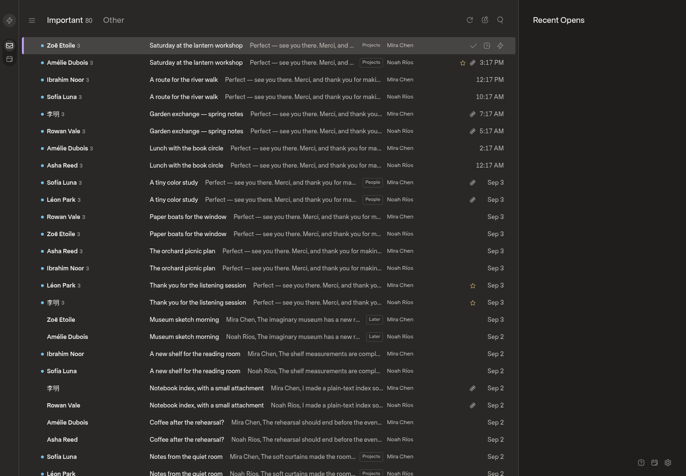
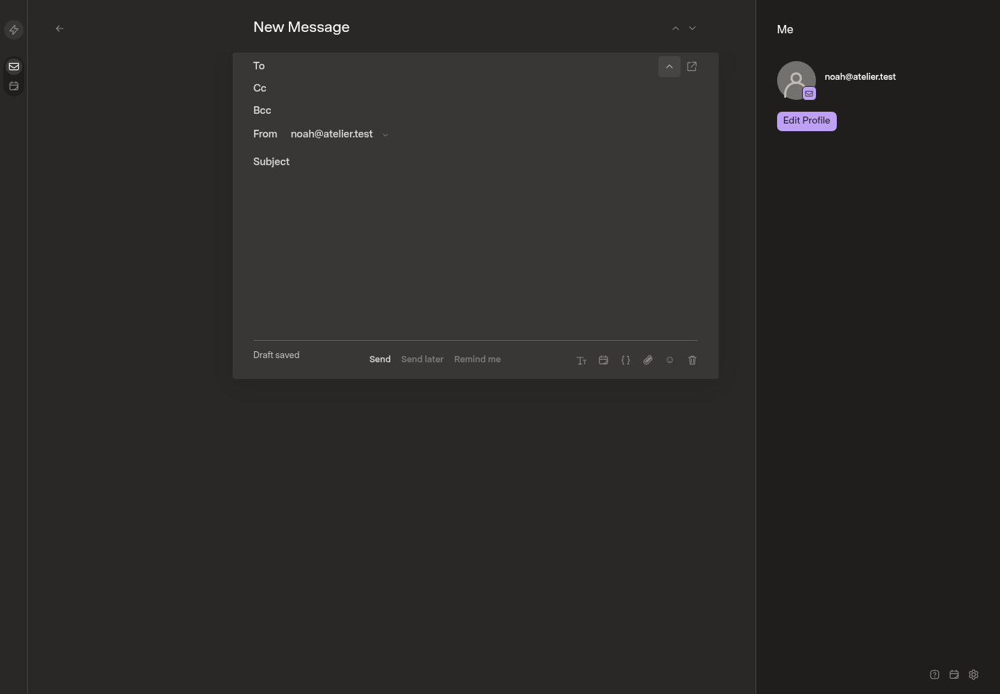

# Gmail send-as and recipient display

## Scope

Keep Gmail sending identities attached to one connection and one sync stream.
Discover verified identities, preserve explicit draft senders, choose reply
identities conservatively, and validate identity authorization before dispatch.
Alias management remains in Gmail. See `docs/gmail-send-as-plan.md`.

The inbox row currently renders `mailboxNames`, not message recipients. The user
explicitly chose to replace that badge with actual recipients. Mailbox navigation
and message ownership must remain unchanged. Missing recipients must not fall
back to the connected account address.

## Baseline

- Upstream: `18c78f673e1cc8ca7112f851f3ed6cf797c59c62`.
- Local planning commit: `88c20e1`; no application changes at capture time.
- Production image revision, checked read-only:
  `840aa96b1c5d0d13ed76c6347a1d8fd8e7088598`.
- Production's reader source matches upstream. The intervening startup change
  remains in the implementation base. Production is not modified.
- Optimized web build with Bun 1.4.0 and Node 24.16.0 on Linux x64 under WSL.
- Isolated offline installation and browser profile, 1440 by 1000 CSS pixels,
  DPR 1, 100% zoom, fresh dark-theme defaults. These are fictional fixture
  captures, not evidence of the user's personal browser preferences.
- Included mock seed: two accounts, 160 messages, 128 threads. Composer capture
  adds one empty draft. No real mail or provider credentials were loaded.

The source build completed. The served application loaded the fictional inbox
and composer, and both screenshots were inspected. No feature tests have run
yet and no candidate behavior is claimed by these baseline captures.

## Review gates

The user explicitly selected the repository's draft-first UIPR workflow over
the conflicting generic delivery guidance. The unavailable `personal-design`
skill is replaced by available UI guidance, with user approval. Before/after
evidence, tests, review, and separate deployment approval remain required.

Before acceptance, add alias-recipient fixtures, matching candidate captures,
sender-selection recordings, authorization and persistence regressions, and
controlled Gmail qualification. Ordinary fixture tests do not prove Gmail
compatibility. No license was detected during the original investigation;
clarify upstream permission before distributing modified builds.
