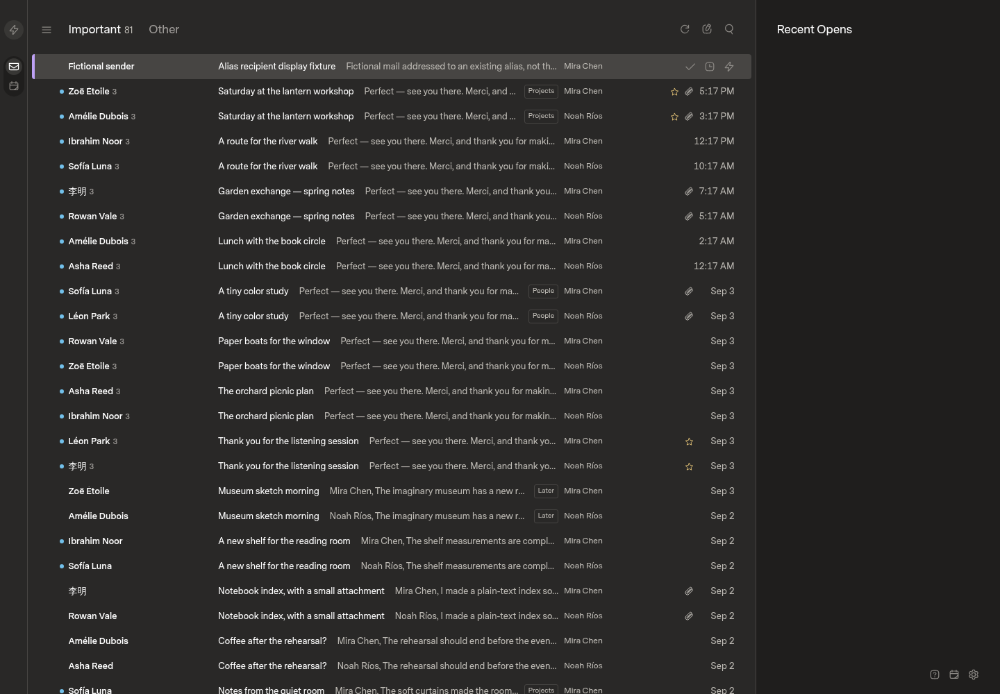
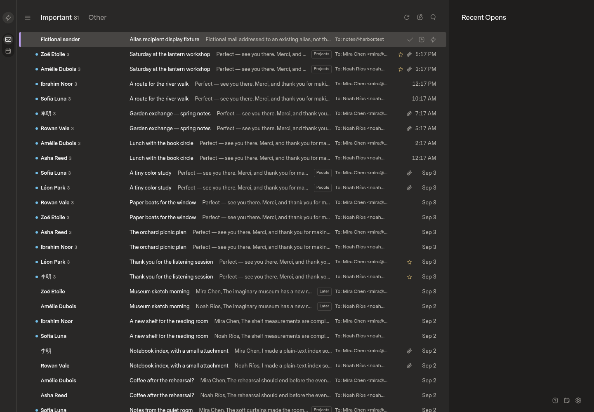

# Gmail send-as and recipient display

## Scope

Keep Gmail sending identities attached to one connection and one sync stream.
Discover verified identities, preserve explicit draft senders, choose reply
identities conservatively, and validate identity authorization before dispatch.
Alias management remains in Gmail. See `docs/gmail-send-as-plan.md`.

The inbox row currently renders `mailboxNames`, not message recipients. The user
explicitly chose to replace that badge with actual recipients. Mailbox navigation
and message ownership must remain unchanged. Missing recipients must not fall
back to the connected account address.

## Baseline

- Upstream: `18c78f673e1cc8ca7112f851f3ed6cf797c59c62`.
- Local planning commit: `88c20e1`; no application changes at capture time.
- Production image revision, checked read-only:
  `840aa96b1c5d0d13ed76c6347a1d8fd8e7088598`.
- Production's reader source matches upstream. The intervening startup change
  remains in the implementation base. Production is not modified.
- Optimized web build with Bun 1.4.0 and Node 24.16.0 on Linux x64 under WSL.
- Isolated offline installation and browser profile, 1440 by 1000 CSS pixels,
  DPR 1, 100% zoom, fresh dark-theme defaults. These are fictional fixture
  captures, not evidence of the user's personal browser preferences.
- Included mock seed: two accounts, 160 messages, 128 threads. Composer capture
  adds one empty draft. No real mail or provider credentials were loaded.

The source build completed. The served application loaded the fictional inbox
and composer, and both screenshots were inspected. No feature tests have run
yet and no candidate behavior is claimed by these baseline captures.

## Review gates

The user explicitly selected the repository's draft-first UIPR workflow over
the conflicting generic delivery guidance. The unavailable `personal-design`
skill is replaced by available UI guidance, with user approval. Before/after
evidence, tests, review, and separate deployment approval remain required.

Before acceptance, add alias-recipient fixtures, matching candidate captures,
sender-selection recordings, authorization and persistence regressions, and
controlled Gmail qualification. Ordinary fixture tests do not prove Gmail
compatibility. No license was detected during the original investigation;
clarify upstream permission before distributing modified builds.

## Recipient-display candidate

Only the recipient-display slice is implemented so far. `MailRow` now renders
the existing `Mail.to` value instead of `mailboxNames`. Long values retain their
full text in the tooltip. Missing To data explicitly says "To recipients not
shown"; it does not guess the receiving account or expose Bcc. Cc remains in
message header details. For a conversation, this is the representative message's
To value already selected by the mail model, not a union of every historical
recipient. Mailbox navigation, ownership, sync, and draft behavior are unchanged.

The comparison below adds one fictional incoming message to the same retained
mock installation: sender `sender@letters.test`, To `notes@harbor.test`, delivery
recipient `notes@harbor.test`, subject "Alias recipient display fixture". The
store is still Mira's existing mailbox. Both captures use that same data,
viewport, theme, and highlighted row. Total seed plus fixture: 161 messages and
129 threads. The empty composer draft remains retained.

Both captures were inspected. Browser DOM verification confirmed the fixture's
recipient is exactly `To: notes@harbor.test` and its row no longer contains
`Mira Chen`. The served candidate asset was `index-CZYwWjf6.js`; the baseline
asset was `index-DafGZ9nT.js`.

### Checks

- Optimized web build: passed, retaining the existing large-chunk warning.
- SDK typecheck and build: passed.
- Focused real-component server rendering: passed for an alias, multiple To
  recipients, a named recipient, missing To, and markup escaping. Each case
  also rejected fallback to a deliberately different mailbox name.
- Web suite: 67 passed, 1 failed. The SDK-backed optimistic flags case timed
  out at its existing 180-second limit.
- API suite: 225 passed, 14 failed, 11 inter-test errors. Failures include
  timeouts and 503 responses during fixture operations. The initial attempt
  could not create the suite's hardcoded macOS temporary path. The reported
  counts are from a second run with that path provided inside an isolated
  sandbox, not on the host filesystem.

The aggregate gate is not green. No unchanged-base comparison has established
the cause of the remaining failures. Do not treat them as proven pre-existing
failures or raise timeouts to make the contribution pass. No test assertions or
source fixtures were changed. Durable recipient regressions, additional layout
states, and performance evidence remain acceptance work.

Sender discovery, composer identity selection, draft/reply persistence, and
dispatch-time authorization are still unimplemented. Keep this PR draft and
production pinned while resolving verification and completing those slices.
