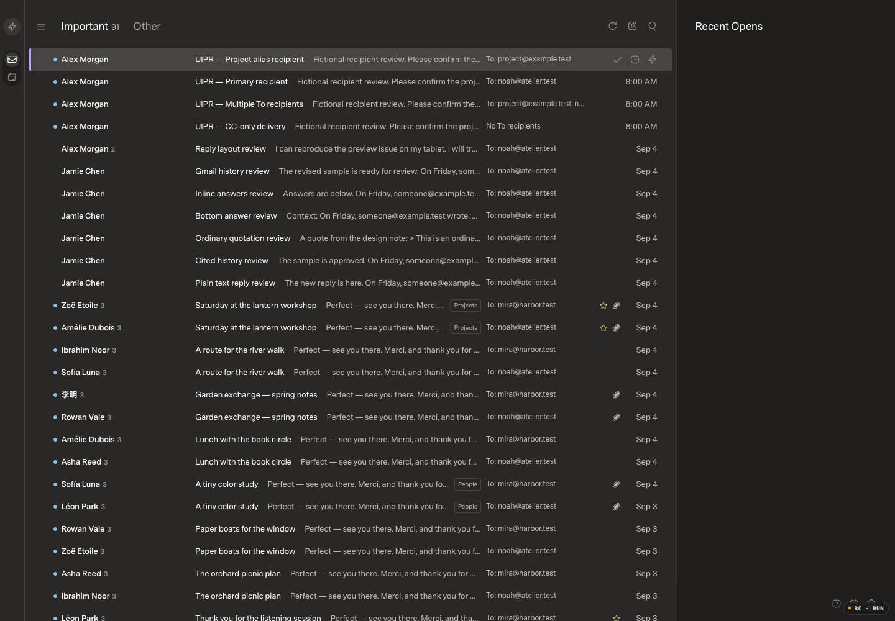
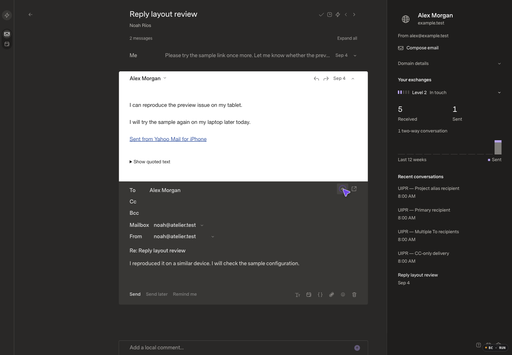
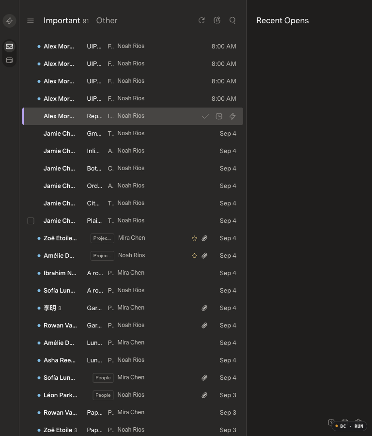
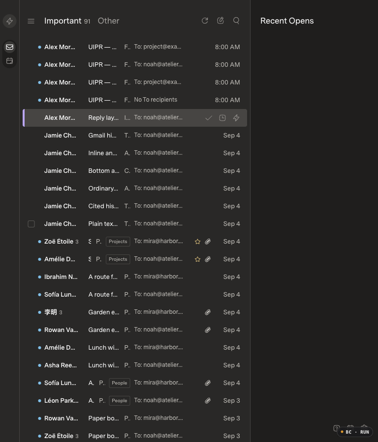

# Gmail sending identities and actual recipients

## Review baseline

Review base: `a519975219dbf893966bf63a82d7a8d99099c34d`, the verified healthy hosted release. The isolated branch excludes the original Mac checkout's unpublished classifier commits and README edit. The running baseline's `5fd73c8` tree exactly matches this merge's tree; its optimized assets are `index-dTGfxQe5.js` and `index-DhjA4v3r.css`.

Before evidence was captured and inspected before application implementation. All messages, names and addresses shown are fictional. The mock-only paired fixture contains 172 canonical messages / 172 projected rows and one existing unsent draft. The four additional scenarios cover an alias To, primary To, multiple To and empty To with Cc. AI is disabled; provider network transport is disabled. No live mail is included.

Appearance: Carbon (Dark), Comfortable, Super Sans Normal / Superlocal, 1440×1000 CSS pixels, DPR 1 / 100% zoom. Runtime uses the existing optimized build with performance logging enabled. The Browser Control badge appears at the lower-right edge; it is tooling, not application UI.

| Scenario | Before | After |
| --- | --- | --- |
| Inbox recipients |  |  |
| Saved reply sender |  |  |
| Tablet inbox, 768×900 |  |  |

Interaction recordings: [before](before-sender.mp4) / [after](after-sender.mp4). Both were decoded and inspected. Before, collapsing recipients hides From; afterward, From stays visible. CDP recording does not capture native operating-system dropdown popups; options and selected values were independently verified through the actual controls.

The final static after captures use a fresh copy of the same pristine fixture, with the same existing draft, read state, appearance and viewport. Source: `c2ac1b1` (feature `d287727` plus the verified spacing correction). Optimized assets: `index-z42NitiB.js` / `index-CqbImCAc.css`.

## Changes and checks

- Sending identities are separate from receiving scopes. Gmail requests only primary/default/verification/address fields; primary plus accepted custom addresses are returned. No SMTP settings, signatures, new OAuth scopes or mailbox duplication.
- Display lookup is lazy and source-scoped, with a 60-second / 128-entry SDK cache and full owner/source/connection/credential/provider-instance fences. Gmail responses are limited to 100 entries / 64 KiB. Public legacy display above 100 identities fails explicitly; legacy sending authorization is not truncated.
- Submission and dispatch obtain fresh authorization independently of the display cache. Dispatch validates after attachments and before sending, with revision, membership, credential and lease checks. Removed aliases fail without changing the saved From. Authentication retries revalidate; uncertain sends are not blindly retried.
- Implicit replies select an unambiguous authorized To/Cc identity. Only a confirmed sent-folder message can retain its outgoing From. Explicit draft choices and compose defaults remain authoritative. To/Cc chooses among authorized identities; it does not prove delivery or grant authorization.
- Rows display actual To email addresses with the full formatted To in a tooltip. Empty To is explicit; Cc/Bcc and mailbox ownership are not substituted.

### Automated and independent verification

264 API tests / 7,707 assertions passed; 70 web tests passed. The original five-second 10k-thread/33rd-arrival stress test passed in 4,039.70 ms without changing its watchdog. Provider tests: 309 passed, six deferred Outlook failures unchanged from the already-tested baseline. SDK/host types, SDK build and optimized web build pass.

Two final edge cases were reproduced before correction and then passed in an affected-only run (two tests / 44 assertions): incoming From must not count as sent-folder evidence, and oversized public legacy sender lists need an explicit error while retaining valid legacy sending. No unchanged full suite was repeated after those narrow checks or CSS-only corrections. An independent source review found no additional high/medium issue. Scoped staged-source secret and whitespace scans passed. Only existing test files were extended; no dependencies, migrations or CI were added.

### Native UI verification

Alias selection survived autosave/reload, pop-out/return and Settings/Back with unchanged draft text and recipients. Command–Shift–F focused From; From stayed visible when recipients collapsed. Replying to the fictional project alias selected that alias. The one newly created test reply was discarded; the original draft was restored to its original primary From and verified after reload. No mail was sent.

The 1440/768/390 checks found two new layout problems and verified their correction: at 768px the subject grew from 3px to 63px after narrowing To metadata to 100px; Mailbox label separation is now 9.414px at all three widths instead of overlapping by 4.586px. Document widths fit the viewports, and mobile controls remained keyboard reachable. Tablet subjects remain truncated, as on the baseline; full recipient values remain accessible. Naturally occurring identity-error UI was not encountered in this browser pass; failure/retry state and preserved writing are covered by the SDK/web checks, not claimed as a native error-flow pass.

### Optimized scale qualification

Matched immutable per-size seeds: 10,000 canonical / 8,000 threads / 15,000 memberships; 50,000 / 40,000 / 75,000. Both have two mock sources and three views, AI off, timing logging on. M5 Max / 48 GiB, macOS 27, Bun 1.4.0, Node 24.16.0, Chromium 152, Browser Control 0.5.1; 1440×1000, DPR1, 100% zoom and the same appearance. The earlier combined `bd15f51` results are the matching `a519975` application baseline; pristine database hashes match. That unchanged baseline was not rerun.

Five retained samples per case after one excluded warmup; values are milliseconds. Nearest-rank p95 equals max with five samples.

| Size / case | Baseline median / p95 / max | Candidate median / p95 / max | Target |
| --- | ---: | ---: | ---: |
| 10k startup | 1330.5 / 1346.6 / 1346.6 | 1332.3 / 1346.7 / 1346.7 | 1500 |
| 10k cached open | 80.8 / 83.4 / 83.4 | 63.6 / 86.3 / 86.3 | 100 |
| 10k E | 48.9 / 56.5 / 56.5 | 40.2 / 42.0 / 42.0 | 150 |
| 10k W | 40.3 / 61.7 / 61.7 | 34.0 / 55.8 / 55.8 | 150 |
| 50k startup | 2765.8 / 2781.3 / 2781.3 | 2698.2 / 2747.6 / 2747.6 | 4000 |
| 50k cached open | 83.5 / 85.9 / 85.9 | 85.4 / 85.7 / 85.7 | 100 |
| 50k E | 89.9 / 91.7 / 91.7 | 75.7 / 93.2 / 93.2 | 150 |
| 50k W | 77.7 / 89.0 / 89.0 | 75.7 / 99.0 / 99.0 | 150 |

All regular samples pass. Startup measures fresh navigation to a visible first row plus two frames; cached open measures native click through body readiness plus two frames, not handler-only time. E/W uses actual durable-acceptance action telemetry, not provider settlement or helper waiting time. All twelve cached cycles including warmups had zero body, inventory or sending-identity requests; an existing sender-domain metadata GET remains. The unusually fast 864.9ms final 10k startup sample is retained, not removed. First-body latency was not remeasured; no comparison is claimed.

All 24 action/Undo cycles restored their exact reader hash/body. The coordinator cross-checked all 20 measured pairs through their observed Undo request IDs against retracted SDK receipts. UI timing IDs are not SDK receipt IDs. Measured candidate Undo maxima were 63.7ms at 10k and 143.0ms at 50k; the earlier baseline's 153.8/155.5ms observations remain historical findings.

### Concurrent-arrival finding and review gate

**The PR remains draft: one sync-time E outlier is unresolved.** In the first setup, background sync imported the new reply before the manual sync/E sequence. E took **246.0ms** (201.4ms to acceptance), over the 150ms target; Undo took 124.3ms and restored the reader. An outer-document text locator then timed out because the new HTML body was inside the scriptless iframe. Inspecting that existing iframe verified the body without repeating E or Undo. The locator error is not an application defect, and it does not erase the measured latency failure. The exact root cause and whether that outlier predates this change are not established.

A second, explicitly controlled setup removed the inter-tool staging gap and retained both trials. Sync ran from `1788617161780` to `1788617161826`; E began at `1788617161810`, before the sync response completed. E took **72.2ms**, Undo **146.8ms**. The new reply was visible after Undo, excluded from the captured action, and not Done or snoozed in either membership. Final fixture counts are 50,002 messages / 75,004 memberships. This is one successful overlap, not a five-sample concurrency benchmark, not proof of an exact transaction-commit instant, and not a fix for the earlier 246ms observation. No budget was raised and no failed sample discarded.

Real Gmail alias delivery has not been tested by this PR; read-only live discovery previously succeeded under existing grants, and MIME/authorization behavior is covered offline. Separate Google settings-read and send operations cannot make revocation atomic between those requests. Owned browser sessions/runtimes were stopped; fictional evidence was retained. No merge, deployment or reviewer approval is claimed.
