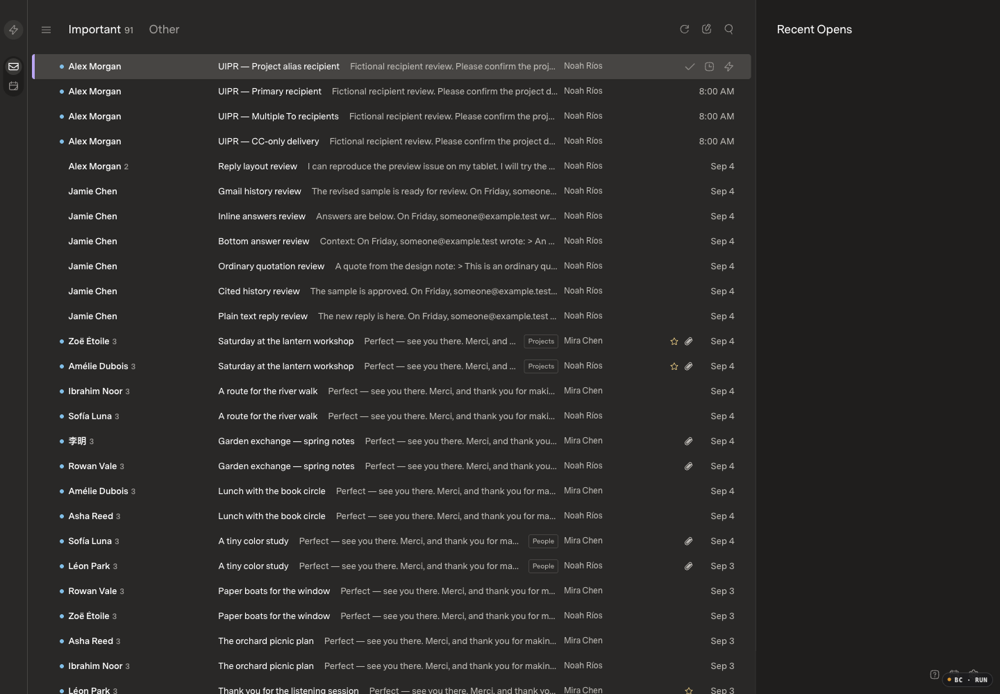
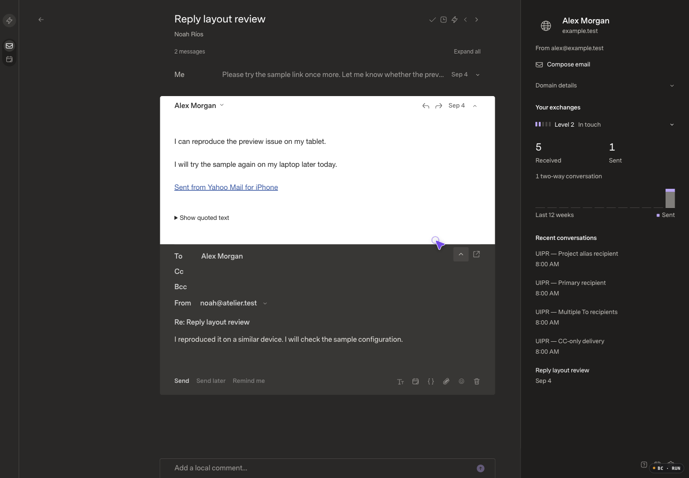

# Gmail sending identities and actual recipients

## Review baseline

Review base: `a519975219dbf893966bf63a82d7a8d99099c34d`, the verified healthy hosted release. The isolated branch excludes the original Mac checkout's unpublished classifier commits and README edit. The running baseline's `5fd73c8` tree exactly matches this merge's tree; its optimized assets are `index-dTGfxQe5.js` and `index-DhjA4v3r.css`.

Before evidence was captured and inspected before application implementation. All messages, names and addresses shown are fictional. The mock-only paired fixture contains 172 canonical messages / 172 projected rows and one existing unsent draft. The four additional scenarios cover an alias To, primary To, multiple To and empty To with Cc. AI is disabled; provider network transport is disabled. No live mail is included.

Appearance: Carbon (Dark), Comfortable, Super Sans Normal / Superlocal, 1440×1000 CSS pixels, DPR 1 / 100% zoom. Runtime uses the existing optimized build with performance logging enabled. The Browser Control badge appears at the lower-right edge; it is tooling, not application UI.

| Scenario | Before | After |
| --- | --- | --- |
| Inbox recipients |  | Pending implementation |
| Saved reply sender |  | Pending implementation |

## Intended changes

- Separate verified sending identities from receiving mailbox scopes. Gmail lists only primary and accepted custom identities without changing Gmail settings or OAuth grants.
- Preserve explicit draft From through saves/reloads and validate fresh authorization before submission and dispatch. Do not silently replace removed/unavailable senders.
- Choose an unambiguous verified identity for new implicit replies; retain existing new-compose defaults.
- Keep mailbox selection separate from From selection, without duplicating accounts, mailboxes or sync work.
- Replace mailbox-name row metadata with actual representative-message To recipients, including an explicit absent-To state. Do not infer delivery or disclose Bcc.

## Qualification status

Draft baseline only. Implementation, matching after images, interaction recording, targeted regressions and relevant optimized performance qualification are pending. No merge, deployment or reviewer approval is claimed.
