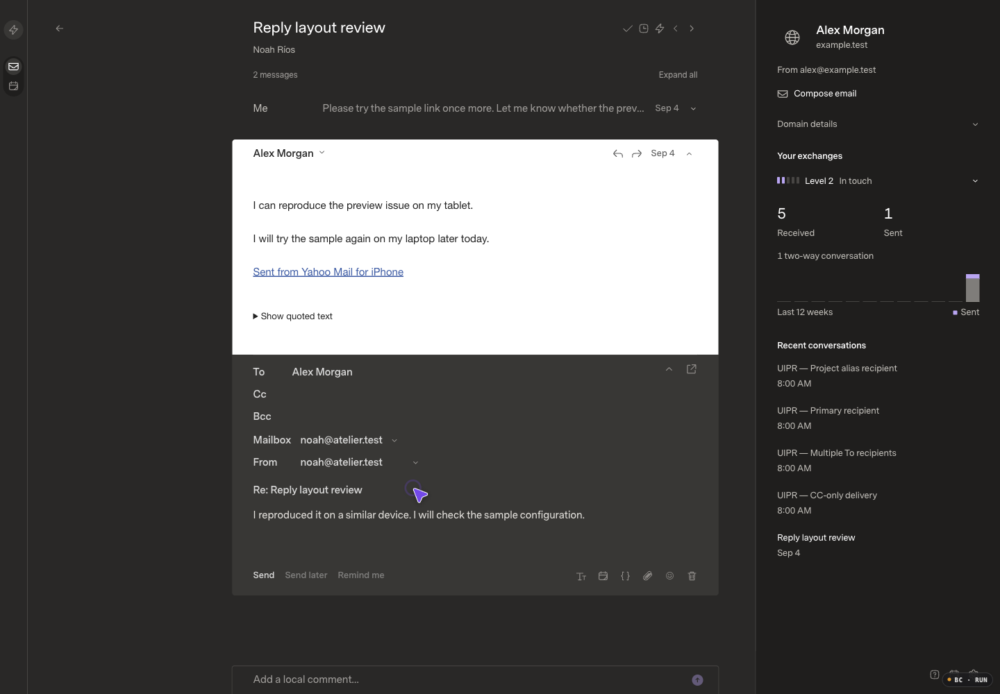

# Token-only Gmail sender discovery

Review base: `27dea23dcd8ab15d2fd6cdf3dafc8853271b51e2`, verified deployed and healthy. This is the narrow follow-up approved by the user after PR #16's live sender endpoint failed with HTTP 400 / VALIDATION.

The actual OAuth callback stores tokens/scopes without an email field. A matching token-only fictional Gmail provider loads its primary profile successfully, then reproduces the new discovery guard before any send-as network request. The production endpoint failure and source reproduction are recorded separately; no credentials were inspected or rewritten.

## Before

Captured and inspected before implementation. The current released UI is shown with the same 172-message fictional fixture, existing draft, 1440×1000/DPR1/100%, Carbon/Dark, Comfortable and Super Sans Normal settings. The sending-identity HTTP response is explicitly intercepted in this local-only visual fixture to reproduce the observed production `{code: VALIDATION, error: Invalid request, retryable: false}` response. This is a controlled UI reproduction, not a claim that the mock provider uses real OAuth. Assets are `index-z42NitiB.js` / `index-CqbImCAc.css`; the application tree matches the release.

## Approved correction

Derive the primary address from Google's authenticated send-as response. Preserve optional explicit-address mismatch checks, response validation/bounds, and the SDK's native-source identity validation. No credentials, OAuth scopes, receiving mailboxes, cache fences or UI source changes.

## After and verification

[Inspected recovery recording](recovery.mp4): Retry clears the error without changing From, recipients or draft writing. The after response uses identities produced by the corrected Gmail adapter with token-only fictional credentials and a mocked authenticated Google response. Source-ID wrapping at the local UI interception boundary is fixture plumbing, not a new application API. The independent SDK test below exercises the real adapter, HTTP adapter and client without that UI interception.

- 12 focused provider tests / 147 assertions pass, including token-only grants, primary-vs-default selection, malformed/conflicting responses, explicit expected-address checks and existing size bounds.
- 13 source-scoped SDK identity tests / 192 assertions pass. The added real Gmail adapter → SDK HTTP/client test uses token-only credentials, accepts an authorized alias through submission and queued MIME generation, rejects pending aliases, and rejects a primary that differs from the stored profile. Profile/INBOX reads occur only at connection, not discovery.
- SDK typecheck and build pass. Independent read-only review found no high/medium issue. No UI source, query, reconciliation or rendering implementation changed; the unchanged broad suites and scale benchmarks were not repeated.
- Before merging, the corrected adapter was exercised with the two existing live Gmail grants using at most two read-only requests. It returned five identities (four custom) and one primary-only identity; both primary addresses matched their SDK native profiles. No credential/configuration write, reconnect, live send or extra profile request was made. Post-deployment SDK endpoint verification will be recorded on the PR.

Before/after images and decoded recording were inspected. A first exact-text wait missed the error because Retry shares its container; the existing rendered state was inspected, not replayed as an application action. The user authorized applying and shipping this narrow correction. The previous release's performance exception remains disclosed and does not assert that the 246ms outlier is fixed.
