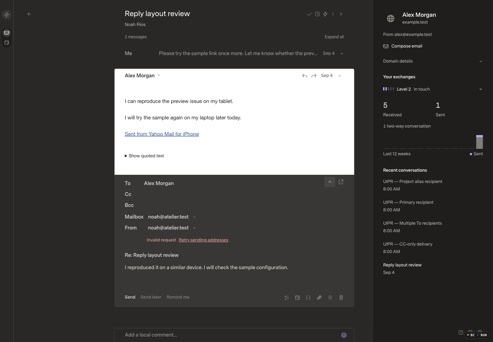

# Token-only Gmail sender discovery

Review base: `27dea23dcd8ab15d2fd6cdf3dafc8853271b51e2`, verified deployed and healthy. This is the narrow follow-up approved by the user after PR #16's live sender endpoint failed with HTTP 400 / VALIDATION.

The actual OAuth callback stores tokens/scopes without an email field. A matching token-only fictional Gmail provider loads its primary profile successfully, then reproduces the new discovery guard before any send-as network request. The production endpoint failure and source reproduction are recorded separately; no credentials were inspected or rewritten.

## Before

Captured and inspected before implementation. The current released UI is shown with the same 172-message fictional fixture, existing draft, 1440×1000/DPR1/100%, Carbon/Dark, Comfortable and Super Sans Normal settings. The sending-identity HTTP response is explicitly intercepted in this local-only visual fixture to reproduce the observed production `{code: VALIDATION, error: Invalid request, retryable: false}` response. This is a controlled UI reproduction, not a claim that the mock provider uses real OAuth. Assets are `index-z42NitiB.js` / `index-CqbImCAc.css`; the application tree matches the release.

## Approved correction

Derive the primary address from Google's authenticated send-as response. Preserve optional explicit-address mismatch checks, response validation/bounds, and the SDK's native-source identity validation. No credentials, OAuth scopes, receiving mailboxes, cache fences or UI source changes.

Implementation, matching after evidence, token-only OAuth regressions and live post-deployment checks are pending. The user authorized applying and shipping this narrow correction; the previous release's performance exception does not assert that the 246ms outlier is fixed.
