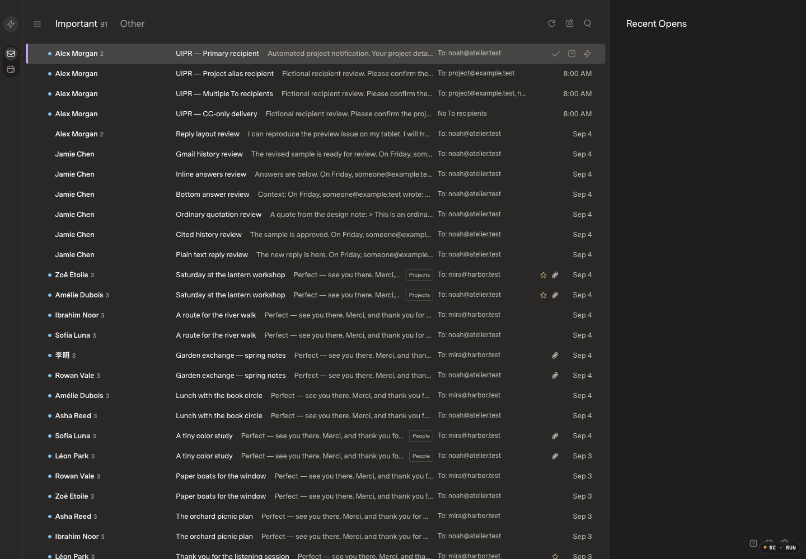
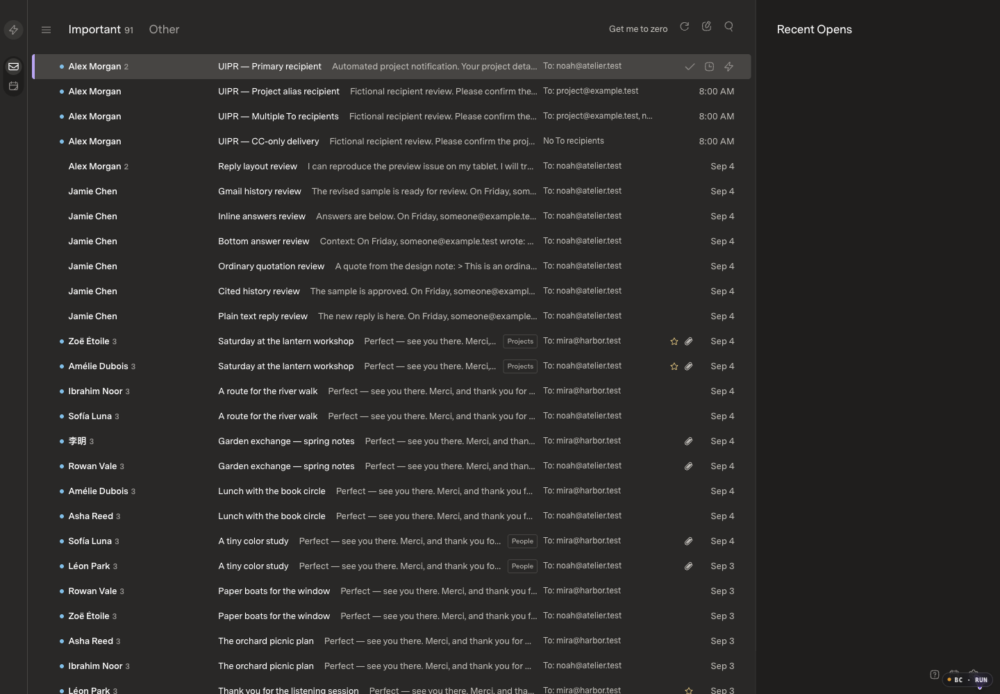
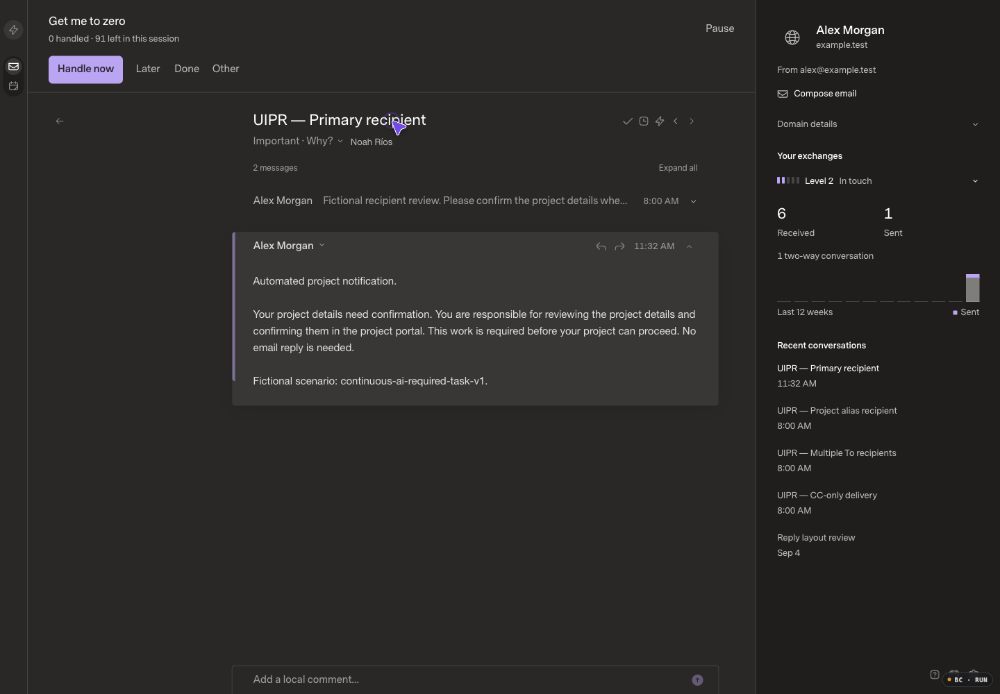
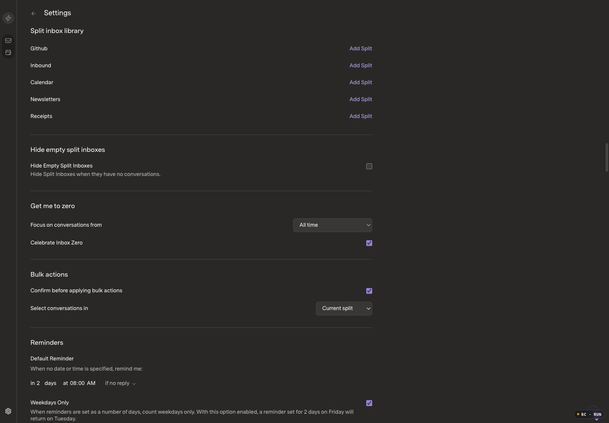
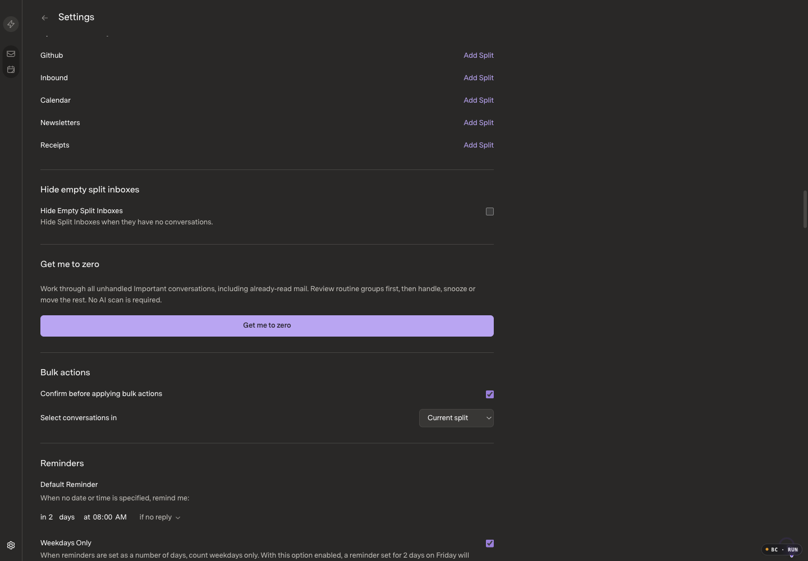
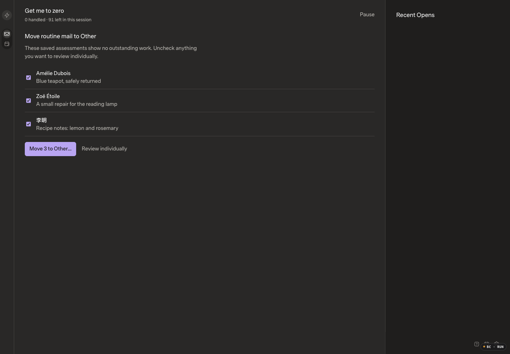

# Guided inbox zero

## Scope and baseline

Get me to zero now starts from active, unhandled Important conversations, including already-read mail. It first proposes only small, conservatively evidenced routine groups, then opens remaining conversations in the existing reader with Handle now, Later, Done and Other. Opening or drafting never counts as handling. Unchecked batch items stay reserved for individual review across reloads.

The session freezes its receiving scope and conversation IDs, persists bounded ID-only progress under the existing immutable owner namespace, and pauses on reload or scope changes. Later arrivals are not appended. Undo uses durable conditional receipts. Completion checks remaining Important work rather than declaring that read, hidden or newly arrived mail is handled.

Other/Important choices are app-owned and independent of AI configuration, training and provider folders. They bind to reviewed source/generation/message/content/receiving context. New replies cannot inherit an old choice. A late classification cannot navigate away from the current reader; the user explicitly continues. Category-only cross-tab updates become visible on focus/reload or ordinary mail reconciliation, not instant push.

- Initial implementation gate: inspected PR18 application `44f876f32767c95aff484de6b79bd6407db18b5e`, review `340ea1f15db750d621bb6d303773163657705528`; before-only commit `916f3ce` opened this continuation in the existing draft PR.
- PR19 merged and deployed during this work. Refreshed current-app baseline `2a141528b52cffa0493038a24b74e4db82c0ed12` combines PR18 with shipped `0f6fd258aea9a228a4ca7d09d9a72d383c3f6170`. Review integration merge `ed534e44` preserves that sidebar.
- Feature commit: `f55a8f7ed050c838c9c4ab2c6d248fd899930651`.
- Current before assets: `index-B1bmOW3d.js` / `index-CREYoHPy.css`. Candidate static captures initially used `index-DXnAH6eM.js` / `index-Cx__i9xy.css`; final targeted checks use `index-VkD8qFXr.js` with the same CSS. Later changes preserve unchecked IDs, hidden-history eligibility, and captured-queue navigation rather than altering the pictured layout.
- Fictional fixture:173 canonical messages,139 source-thread conversations,173 memberships;91 Important conversations in Unified. Separate cloned before/after data, original draft and keys preserved.
- Agent Browser, Chromium152,1440×1000 CSS pixels,DPR1,100%; Superlocal / Carbon (labeled Dark) / Comfortable / Super Sans Normal. Optimized build, logging enabled.

## Before and after

All images were opened and inspected. Earlier pre-PR19 captures remain historical; these current-baseline pairs supersede them.

| Scenario | Current before | Candidate after |
| --- | --- | --- |
| Important inbox |  |  |
| Existing reader |  |  |
| Settings |  |  |
| Routine group |  |  |

[Mobile decision focus](final-focus-390.png) · [Mobile Settings](final-settings-390.png) · [Tablet focus](final-focus-768.png) · [Mobile batch confirmation](after-current-batch-confirm-390.png)

[Current-baseline recording](before-current-batch.mp4) → [Guided batch/Undo/navigation recording](after-batch.mp4). Both use the same controlled173-message Preview fixture and1440×1000/DPR1/100% appearance; CDP encodes fitted1036×720 video. The baseline shows the preference-only entry and ordinary reader; the candidate shows resume, explicit two-item batch confirmation, review, Undo, captured-queue navigation and final restored inbox. Both recordings were decoded and their frames inspected.

[Persisted unchecked exclusion](final-batch-exclusions.png) · [No automatic re-proposal after confirmation](final-batch-after-confirm.png) · [Final captured-queue reader](final-browse-reader.png)

The batch scenario is **controlled synthetic input, not model-accuracy evidence**: three copied host-owned receipts were constructed from public SDK metadata and validated with the existing strict assessment/scoring code. Preview mode keeps them Important until a user chooses Other. Exactly three quiet conversations were proposed; the required-task and unassessed control conversations were excluded. Zero model calls, callback calls or history jobs were introduced.

## Correctness and recovery

- Done/Undo, Later/Undo, read mail, pause/reload/resume, Settings and command-palette entry, keyboard/Escape and390/768 layouts were exercised natively. Original composer/draft state remained unchanged.
- Later/Undo initially restored SQLite but returned before the client applied the SDK membership response. The queue saw stale snooze state. Immediate receipt publication fixed it; the actual browser reproduction and new existing-file SDK regression both passed afterward. No refresh/inventory wait was added to the action's critical path.
- Two intentionally lost Other acknowledgements committed successfully. The explicit retry retained identical ID and complete payload across all three requests; exactly one durable command existed. Undo restored Important. Normal Other survived reload and could be explicitly corrected back to Important without AI.
- Safe batches support unchecking, an explicit cancelable confirmation, exact selected targets, Undo and bounded requests. Cancel changed no mail. The two selected conversations stayed in Inbox/Other; the unchecked conversation stayed Important. Undo restored both. Unchecked-ID persistence has separate targeted browser coverage.
- Manual category validation rejects arrays/objects instead of coercing them. Host-owned durable counters cap keys/commands at100k per owner/500k global and serialized storage at256MiB per owner/1GiB global. Existing exact-ID replay and Undo remain available above capacity; no eviction or ID reuse.
- Owner/source/generation/membership/context fences, partial groups, lost acknowledgements, delayed older pages, new replies, expanded receiving scope, and unaffected mail identities are covered by existing-file SDK-backed tests. No canonical SDK table access was added to the application service.
- Independent category-storage and asynchronous-session reviews found no remaining high/medium findings after fixes. These are source reviews, not live-model-quality claims.

## Tests and privacy

- Full API:289 passed,8,516 assertions; unchanged10k/33rd-arrival watchdog3,606.86ms.
- Final full web:78 passed after the Later/normalizer/hidden-history and captured-queue navigation corrections. Final UI build/typecheck passed.
- SDK typecheck/build and host typecheck passed. No new test files, dependencies, CI or frameworks.
- Main fictional persistence:173 messages/139 threads/173 memberships; same one draft hash; same one inherited AI attempt; zero jobs/queue; settings revision5 enabled/Apply unchanged.
- Initial batch persistence:exactly two targets, retracted receipt, null restored entries; canonical messages/memberships/upstream unchanged; same draft; revision6 Preview; one inherited attempt, four ready receipts, zero jobs/queue. Later exclusion recheck is separately recorded.
- No real correspondence, private screenshots, credentials/configuration, databases or raw private logs are published. No live-inbox cleanup, new paid inference, merge or deployment is authorized by this work.

## Performance and release status

Apple M5 Max,arm64,Bun1.4.0,Chromium152; optimized builds and logging on. Identical immutable-seed clones:10k messages/8k threads/15k memberships and50k/40k/75k. One warmup plus five retained samples per metric. No outlier was discarded. Native cached click-to-ready is separate from handler-to-frame E/W and Undo telemetry.

Median / p95 / max milliseconds, current integrated baseline → candidate before the final guided-only Next/Previous binding:

| Metric | Baseline | Candidate |
| --- | --- | --- |
|10k startup|1348.0 /1364.0 /1364.0|1330.7 /1347.2 /1347.2|
|10k cached open|78.9 /83.9 /83.9|78.8 /84.7 /84.7|
|10k E|29.7 /37.6 /37.6|52.1 /56.3 /56.3|
|10k W|32.4 /58.0 /58.0|39.2 /54.5 /54.5|
|50k startup|2679.6 /2830.6 /2830.6|2729.9 /2762.5 /2762.5|
|50k cached open|79.1 /79.5 /79.5|**91.1 /114.9 /114.9**|
|50k E|73.3 /86.4 /86.4|77.7 /91.1 /91.1|
|50k W|68.5 /75.3 /75.3|77.0 /82.9 /82.9|

**Keep draft.** Two50k cached-open samples,103.7ms and114.9ms, exceed100ms; cause remains unresolved and no exception is approved. PR18's earlier retained10k startup1,598.3ms sample also remains unwaived; this series does not erase it. An integrated-baseline W warmup returned412 during a read-state race; its failure was preserved before a separate successful warmup and five retained samples. Initial fixture-auth/setup timeouts are preserved separately, not counted as measured successful samples. No causal performance-regression claim is made from these noisy comparisons.

### Guided workflow and concurrent arrival

Final guided reader build `index-VkD8qFXr.js` retains the same CSS. Opening the session took51ms at10k and94ms at50k (one driver-observed sample each, not n=5 startup qualification). These sessions contained6,000 and23,200 currently Important conversations respectively. A warmup plus five retained action samples follows; all E/W samples remained below150ms.

| Guided action |10k median /p95 /max|50k median /p95 /max|
| --- | --- | --- |
|E|37.9 /42.3 /42.3|72.4 /81.2 /81.2|
|E Undo|45.2 /64.8 /64.8|118.5 /128.6 /128.6|
|W|39.4 /62.1 /62.1|80.8 /91.1 /91.1|
|W Undo|48.8 /63.4 /63.4|139.6 /146.4 /146.4|

Ordinary candidate Undo:10k E46.9/64.1/64.1 and W45.2/62.3/62.3;50k E105.2/145.9/145.9 and W130.5/147.2/147.2. Twelve cached native-click cycles including warmups made zero body requests; no cached-open inventory or identity requests were observed. Separate first-body driver elapsed samples were95→98ms at10k and218→236ms at50k; these are not cached-open or n=5 latency claims. E/W telemetry is handler-to-next-frame estimation, not a physical animation-duration measurement; no new animation was introduced.

A50k Done command was captured with four memberships before delivering one new fictional reply. The public SDK sync ran while that command was held; then the exact captured command was released. Undo restored the original reader and the new QA Concurrency reply was visible in the isolated iframe. Its two memberships were outside the earlier capture. This is a controlled ordering/receipt test, not a natural network-latency measurement; the deliberate hold is not a performance sample.

A separately injected category update left the active reader and0/91 progress unchanged, showing Continue review instead of navigating away. The explicit Continue moved to the next item; the injected choice was then undone. No AI call was used for this scenario.

The final read-only durability check passed977 assertions:48 ordinary/guided cycles (including warmups) correlated to48 distinct retracted receipts, with exact restored membership state and bounded action-window work. The concurrent reply produced50,001 messages/40,000 threads/75,002 memberships; both new memberships remained awake and not Done after Undo. No AI settings, attempts, jobs or queue entries existed in either scale fixture.

All five owned browser sessions were deleted and all owned test runtimes stopped. The older disconnected `superlocal-hands-off` metadata remains an unrelated, previously reported tooling-cleanup blocker; no target/profile fallback was used.

Main/deployment remains separate from this draft review.
