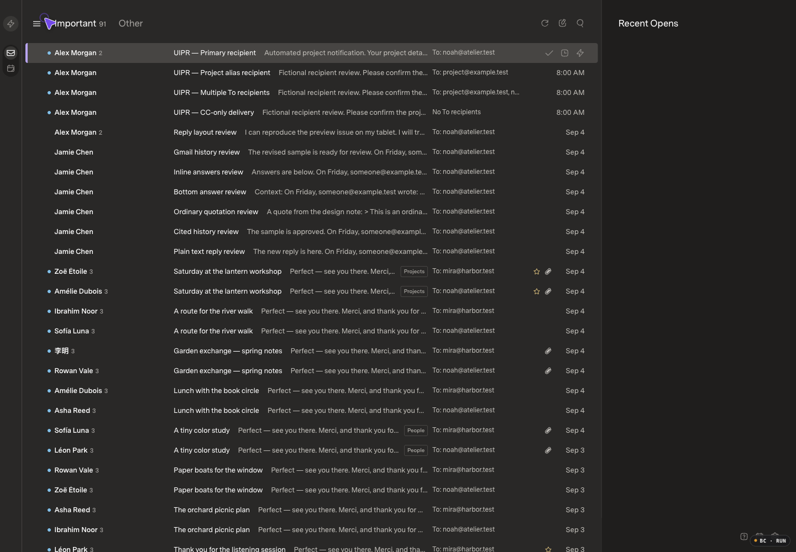
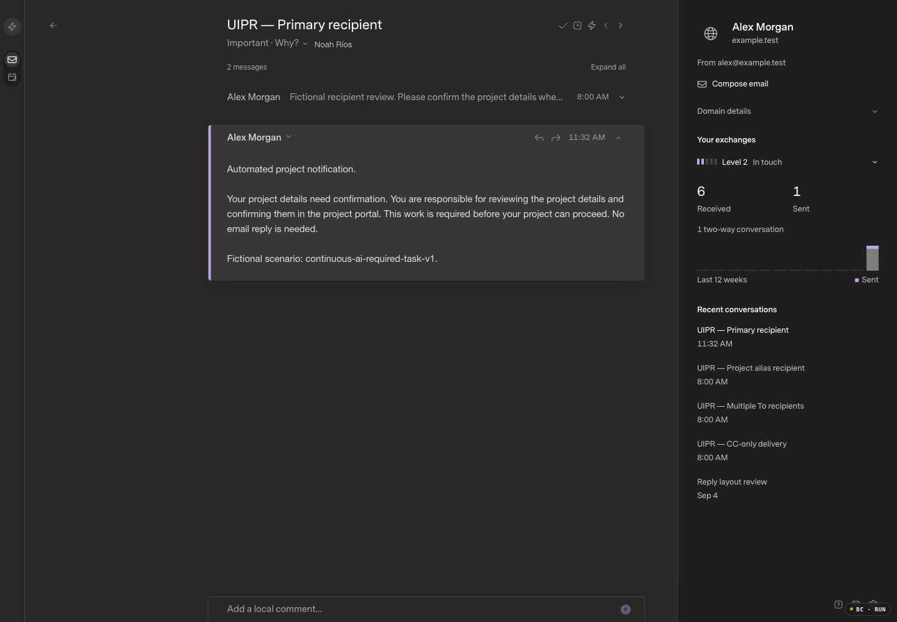
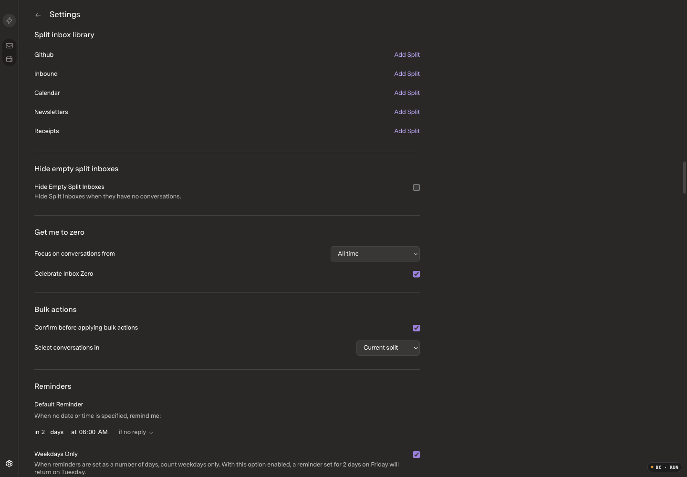

# Guided inbox zero

## Before implementation

- Current intended application baseline: PR #18, review `340ea1f15db750d621bb6d303773163657705528`, application `44f876f32767c95aff484de6b79bd6407db18b5e`.
- Hosted/main baseline remains PR #17, `ca3c9a924c24d597a9e5ee912fc57bb449435bc2`. This is a continuation of the existing combined draft PR, not a deployment.
- Concurrent PR #19 contains baseline evidence and uncommitted mail-sync presentation work. It is not copied into this branch; recheck its completed revision before handoff.
- Fixture: retained fictional SDK/mock seed, 173 canonical messages, 91 Important conversations displayed, one saved task-aware assessment. No real mail or inference is used.
- Before captures: optimized assets `/assets/index-DO5d9AqG.js`, `/assets/index-CNQOY0jI.css`; Agent Browser, Chromium 152, 1440×1000, DPR 1, visual viewport scale 1.
- Appearance: Superlocal, Carbon (the existing UI labels this Dark), Comfortable, Super Sans Normal. The source mapping in `Settings.tsx` confirms Carbon → Dark. No appearance preferences were changed.
- Parent and browser QA inspected all three before images. Opening the fictional reader was the only mail interaction; matching after evidence starts from a fresh copy of the same initial seed.

| Scenario | Before | Expected change |
| --- | --- | --- |
| Important inbox |  | Start or resume an explicit cleanup session, without starting AI history. |
| Conversation |  | Outstanding work stays visible alongside deliberate Done, Later and Other decisions. Reading alone is not handling. |
| Get me to zero settings |  | Replace unused age/celebration controls with an entry point for all unhandled Important work. |

## Implementation plan and review gate

Use the existing source-aware mail model and durable SDK Done/snooze actions. Freeze the selected mailbox scope and conversation IDs; advance only after accepted decisions. Keep explicit manual category choices independent of AI and bound to the reviewed context, so a later reply cannot inherit an old correction. Propose only conservative, revalidated, user-confirmed batches; uncertain/actionable/manual Important choices remain outside automatic suggestions. No paid mailbox scan, provider archive-all action, or live cleanup is authorized.

Persist bounded ID-only progress inside the existing immutable owner storage scope. Retain Undo, pause/resume, error/retry and changed-mail safety. Zero must not be claimed while new or otherwise unhandled Important work remains.

After evidence, correctness checks, scale/concurrent-action checks, and independent review are pending. PR #18 remains draft; its existing 1,598.3 ms 10k startup outlier is not waived. No merge or deployment approval is implied.
