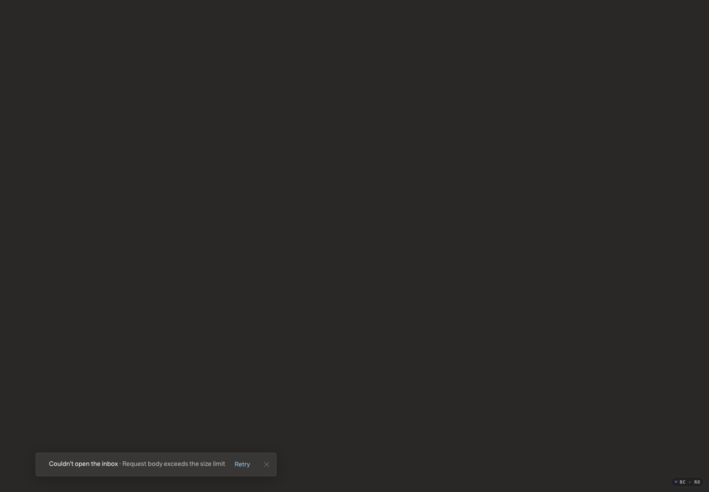

# Bounded inbox loading — before implementation

The user requested a first window of100–300 conversations across the combined receiving scope, modest automatic older-mail prefetch, bounded browser residency, server-backed deeper history/search/counts and cleanup, and support beyond100,000 aggregated messages. Merely downloading the full inventory in one response is not the final design.

Current intended application baseline: PR20 review `01dd8d07049cc1557accb9957ec3037afe07d58b`, feature `2bc0e42f074a84423f62436c78ba285adcbcf4a8`. Main/production remains `4fe8579a0a0b52cec15bc33a783b264cea78b50c`. This refinement preserves the intended PR20 app, rather than going back to an older public UI.

The [10k current app](10k-after.png), [50k current app](50k-after.png), [10k loading](10k-after-startup.mp4) and [50k loading](50k-after-startup.mp4) were captured and inspected on the same intended source and assets before this refinement. They are the streaming-only baseline here, not the proposed bounded-window result.

## Above100k failure

[Inspected baseline recording](150k-before-startup.mp4)

A new entirely fictional paired fixture contains150,000 canonical/upstream messages,90,000 source/thread conversations,225,000 projected memberships, two sources and three receiving views. It includes75,000 messages shared across receiving memberships, plus recent routine content and explicit tasks. All canonical writes came through the real SDK and official mock-provider methods; no inference or fabricated assessments.

The unchanged SDK reproduces `SNAPSHOT_LIMIT` /413. Native startup on the current app shows zero rows and “Couldn't open the inbox · Request body exceeds the size limit” with Retry. That generic displayed wording is recorded as observed, not treated as the root cause. No cap was raised and no data was removed.

Captured1440×1000/DPR1/100%, Dark(Carbon), Comfortable, Superlocal, Super Sans Normal; JS `index--eWWOAiH.js`, CSS `index-Cx__i9xy.css`. Still and decoded recording inspected. Media is fictional and excludes private mail and browser chrome. Recording is fitted to1036×720.

## Required behavior

- First usable view comes from a bounded conversation page, not a full inventory. “Ready to use”, “more pages available”, “totals current” and provider-history completeness remain distinct.
- App-owned view semantics must run over the full authorized backend corpus. Unloaded rows are not absent, ineligible, zero search results or completed cleanup. Unknown totals stay explicitly unknown until established.
- Background prefetch and browser caches stop at finite budgets. Deeper navigation loads bounded pages; reader/drafts/selections/pending commands/Undo remain safe across eviction.
- Complete scoped conversation aggregates and explicit action-context completeness prevent actions against only a partial thread. Captured IDs/revisions still exclude later replies.
- Existing snapshot/page/action/privacy limits remain. Startup must stop depending on a100k whole-inventory snapshot, not increase that snapshot's cap.

This before-evidence update is part of the already-open draft PR20 and precedes implementation. After evidence and full qualification are pending. No merge, deployment or live inbox mutation is authorized.
