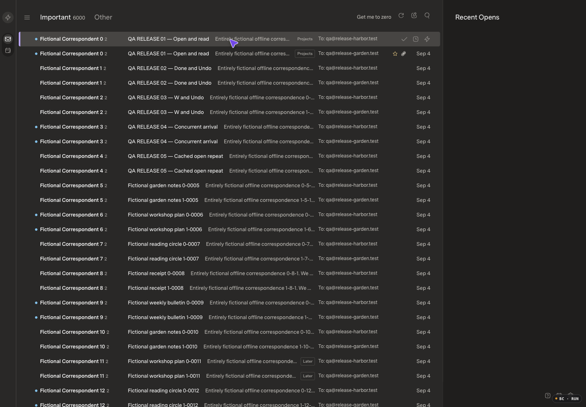
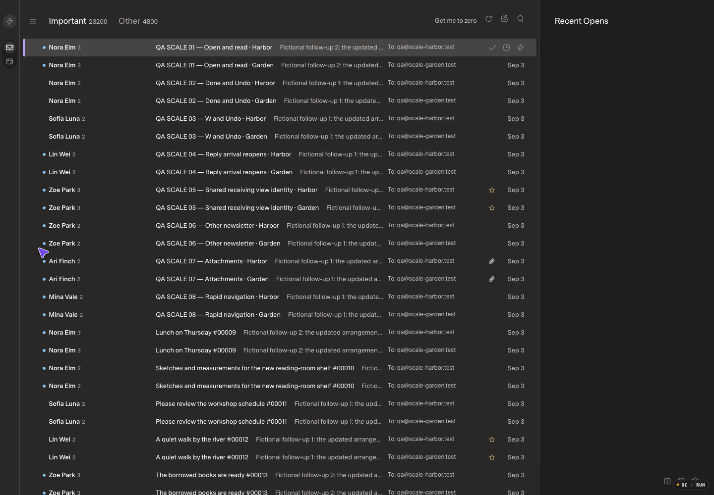
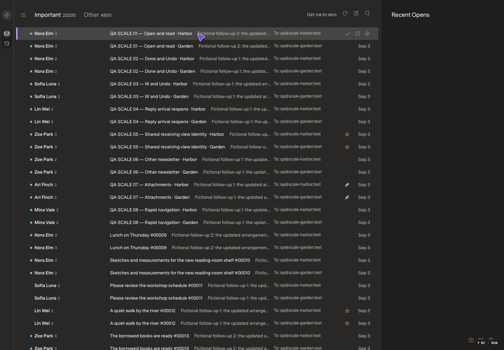

# Hosted startup transport

## Result and release boundary

Startup now transfers the same bounded SDK snapshot pages through one HTTP response instead of waiting for a new request per page. The complete inventory and signed catch-up still precede the first usable inbox. No loader, partial-list completion claim, compression, auth cache or enlarged page limits were added.

**Keep PR20 draft.** Startup budgets pass, but a retained candidate cached-open sample is **114.9 ms against 100 ms**. The baseline also has an **118 ms** miss. Neither is waived or explained by this change. No merge/deployment, live cleanup, send or AI history scan is authorized or performed.

## Revisions and evidence

- Current main/deployed base: `4fe8579a0a0b52cec15bc33a783b264cea78b50c` (PR18).
- Before-only gate: `7ff5c35ff04a3e77d3e545ec5767ab7b40e29f96`; inspected fictional still/recording and draft PR existed before implementation.
- Feature: `2bc0e42f074a84423f62436c78ba285adcbcf4a8`.
- Before JS `index-VkD8qFXr.js`; after JS `index--eWWOAiH.js`; CSS unchanged `index-Cx__i9xy.css`.
- Original private README edit and unpublished classifier history are excluded.

| Scenario | Before | After |
| --- | --- | --- |
| 10k inbox |  |  |
| 50k inbox |  |  |
| 10k startup, controlled 50 ms/request delay | [Before recording](10k-before-startup.mp4) | [After recording](10k-after-startup.mp4) |
| 50k ordinary startup | [Before recording](50k-before-startup.mp4) | [After recording](50k-after-startup.mp4) |

Stills and decoded recordings were inspected. The same flat inbox, row layout, counts and controls remain; only startup duration changes. All media is fictional, without private mail or browser chrome. Captures use 1440×1000 CSS pixels, DPR 1, 100% zoom; recordings are fitted to 1036×720. Appearance is Dark (stored Carbon), Comfortable, Superlocal, Super Sans Normal. Films illustrate loading; timing distributions below, not film length, qualify performance.

## Reproduction and fix

Actual hosted navigation was measured before implementation using content-free resource timing: 34 sequential snapshot requests, 19.53 MB uncompressed metadata, and 5259.8 ms to a double-frame estimate after rows appeared. The snapshot sequence alone took 3985.7 ms, including summed TTFB 2918 ms and transfer 940.3 ms. These two diagnostic navigations are not five-sample acceptance evidence. No private request bodies, credentials or correspondence are published.

`client.mailboxSnapshotPages()` requests NDJSON on the existing POST `/v1/mailbox-snapshot`. Ordinary JSON paging remains unchanged; no serial fallback masks a failed stream. Each page still comes from the real SDK and retains the 500-row, 4 MiB and 5000-membership bounds, 100,000-ID inventory, bounded shared inventory memory and five-minute expiry. Transfers reauthenticate the same owner per page, use four-owner/eight-global admission slots, honor backpressure and cancellation, and validate bounded UTF-8 frames. A terminal page **and clean EOF** are required; truncated, inconsistent, trailing or revoked transfers cannot publish partial mail.

The browser accumulates privately, preserves the earlier metadata baseline and then performs the existing signed catch-up. Read/body caches, incremental updates, action receipts, category logic and provider write policy are unchanged. Host shutdown also aborts snapshot reads.

### Long-pause failure found and fixed

A deliberate 45.7-second paused initial transfer stalled after release. At the five-minute SDK deadline it correctly failed with no partial rows. A separate raw reader, without the browser TransformStream wrapper, reproduced the stall after a 35-second pause: only 9,623,298 bytes arrived before a 45-second diagnostic abort.

The host now disables Bun's shorter 30-second socket-idle timer **only after a successful authenticated snapshot NDJSON response**. Ordinary requests keep their idle timeout; the SDK/client five-minute transfer deadline remains. The identical raw 35-second pause then drained all 61,017,442 bytes in 35,724.4 ms. This is a correctness stress test, not startup latency evidence.

## Matched performance

Apple M5 Max / arm64, Bun 1.4.0, Chromium 152; optimized builds and timing logging enabled. Each series retains one warmup plus five measured samples. All outliers and setup failures are preserved privately. Startup means native visible rows followed by two animation frames, not browser paint or Lighthouse LCP.

Immutable fictional seed clones:

| Size | Canonical messages | Source threads | Projected memberships |
| --- | ---: | ---: | ---: |
| 10k | 10,000 | 8,000 | 15,000 |
| 50k | 50,000 | 40,000 | 75,000 |

Final startup was rerun on fresh, byte-copied original seeds after the host idle-timer fix. No action receipts, AI attempts/jobs/queue or category commands were created in these final startup-only clones. The application may project one source/thread into multiple receiving views; internal projected-row counts are not canonical conversation counts.

### Final startup, median / p95 / maximum in milliseconds

| Scenario | Base | Final candidate |
| --- | --- | --- |
| 10k ordinary | 1344.8 / 1346.0 / 1346.0 | **928.9 / 929.4 / 929.4** |
| 50k ordinary | 2729.5 / 2764.0 / 2764.0 | **2248.3 / 2293.5 / 2293.5** |
| 10k with 50 ms/request admission delay | 2348.2 / 2381.0 / 2381.0 | **1329.3 / 1388.8 / 1388.8** |
| 50k with 50 ms/request admission delay | 8262.2 / 8313.5 / 8313.5 | **2080.3 / 2129.8 / 2129.8** |

All 24 final startup samples used exactly **one** snapshot request. Content-free refresh logs confirm 20 pages/10,000 messages and 100 pages/50,000 messages still arrived. The delay uses a 50 ms pre-request wait followed by normal continuation, not response interception, buffering or bandwidth shaping. It isolates serial-request overhead but does not recreate production hardware, bandwidth or every proxy characteristic. Delayed versus ordinary series have independent warmup/cache variation; do not interpret their difference as pure wire latency.

### Cached/action paths, median / p95 / maximum in milliseconds

These paths were measured on the same paired seed copies before the final host-only idle-timer adjustment. Their source and browser bundle did not change; only affected startup and long-pause behavior were rechecked afterward.

| Metric | 10k base | 10k candidate | 50k base | 50k candidate |
| --- | --- | --- | --- | --- |
| Cached open | 85.7 / 92.8 / 92.8 | **77.7 / 114.9 / 114.9** | **85.0 / 118.0 / 118.0** | 83.9 / 86.0 / 86.0 |
| E | 41.2 / 58.1 / 58.1 | 42.8 / 58.1 / 58.1 | 76.3 / 89.2 / 89.2 | 54.9 / 55.6 / 55.6 |
| E Undo | 61.6 / 64.2 / 64.2 | 45.5 / 59.9 / 59.9 | 106.8 / 132.3 / 132.3 | 55.5 / 121.6 / 121.6 |
| W | 40.7 / 41.9 / 41.9 | 37.3 / 58.4 / 58.4 | 74.8 / 90.4 / 90.4 | 75.8 / 90.9 / 90.9 |
| W Undo | 44.7 / 60.5 / 60.5 | 60.0 / 61.9 / 61.9 | 102.1 / 123.4 / 123.4 | 138.4 / 140.2 / 140.2 |

Every cached open had zero body/inventory requests and the correct reader identity. Measured action windows had zero inventory requests. E/W accepted-time medians/max were 24.4/26.8 and 27.3/30.6 ms at 10k; 45.3/47.3 and 62.0/64.1 ms at 50k. Candidate first-body driver elapsed was n=1 at 94/221 ms, separate from cached/open distributions; no baseline first-body comparison is claimed.

The initial 50k baseline W series overlapped a worker's targeted checks (passive hold messages were unavailable due a team-tracking limit). That entire raw series remains retained; only W/Undo was repeated in isolation. The table uses the isolated result, not discarded outliers. Other baseline series were not repeated; the 118 ms cached miss remains. The higher candidate 50k W Undo median is retained without an invented explanation.

## Correctness and concurrency

- Full API: **297 passed, 8669 assertions**, 36.36 s. The unchanged 10,000-thread/33rd-arrival watchdog passed in **3280.42 ms** against its existing five-second guard.
- Full web: **78 passed**, 76.994 s. SDK typecheck/build, host typecheck and optimized web build passed. Host types were rechecked after the idle/shutdown adjustment; unchanged full suites were not repeated.
- Existing test files cover real socket multi-page transfer/catch-up, split UTF-8, response/page/membership limits, slot cleanup, owner/scope/expiry/credential cancellation, terminal-plus-EOF, truncation/trailing errors, bounded restart, private partial accumulation and late owner/stop fences. Existing E/W/Undo/newer-context and identity cases remain.
- **307 read-only durability assertions passed:** 54 measured action/Undo cycles including warmups and the retained overlap series, plus two controlled commands; all 56 distinct durable receipts are retracted. Source/mailbox scope and original Done/snooze state match the seeds. No inference or category-cleanup commands were created.
- After the idle fix, an initial 50k stream was held for about 32 seconds. Another tab accepted Done on the captured messages; one guarded fictional reply was delivered and synced, followed by conditional Undo. Before release the initializing page had zero rows. After release it used one snapshot plus one signed catch-up and displayed the new reply. The later reply was absent from the captured Done receipt; its two memberships remained not Done, unsnoozed, revision 1. Old targets were restored.
- Two controlled probes produced two retained fictional replies; final correctness clone is **50,002 messages / 40,000 source threads / 75,004 memberships**. Those mutated copies were not used for final startup distributions. The 10-second native Undo toast elapsed during the long manual probes, so their Undo used the exact conditional API receipt; native Undo was independently verified in the measured cycles.

Initial cross-port setup 401s recovered before warmups without cookie/key/config changes. Wrong refresh-as-bootstrap assumptions and an initial verification script's failure to map W's feedback Undo to its SDK receipt were corrected after inspection; original failures are retained. No completed mail action was blindly replayed.

## Remaining limits

The startup fix is committed and reviewable, **not deployed**. Production still runs the base revision. Actual hosted post-deployment latency is therefore unmeasured; controlled-delay results are not a production promise. Compression remains off, so metadata transfer volume is not reduced.

The candidate 114.9 ms and baseline 118 ms cached-open misses remain unwaived. PR18's previous release-specific acceptance does not authorize this PR. A separately requested Fable source review was cancelled without a verdict after a prolonged wait; no independent reviewer approval is claimed. Parent review and the explicit tests/runtime evidence above are the verification basis. User/designated reviewer approval is still required before merge or deployment.
