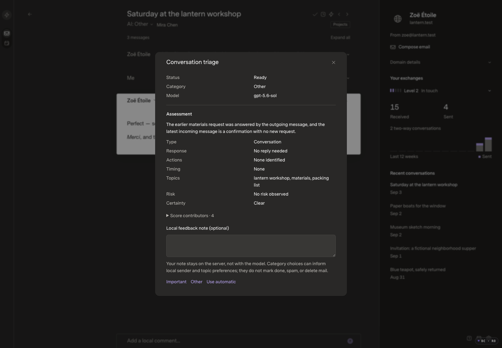
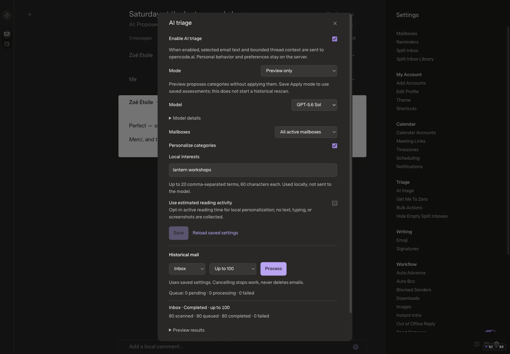

# Optional AI triage and local preferences

## Revisions and scope

Review/deployed baseline: `b7f8e3c1252e6cb72fc92b4be8954d1285a28bd1`.
Initial implementation: `73ed32bee05bc792e25db7dc111f5290ffa655ce`, including SDK
`a298e0b6488be6ecbf7eb24859fdab67d0f67bcf`. Final application/qualification head:
`b3927a361b657385c5de95067eef2cfa9131b026` (performance fix `7f4078d`, then
resolved-arrival hold priority). No applicable public changes
intervened. The original Mac checkout's unpublished offline classifier and
private README edit are excluded and untouched.

The user approved PR #9 and temporarily allowed a 30-second setup-test watchdog.
**That temporary allowance has now been removed.** The full 10,000-history /
33-arrival stress case passes its original default five seconds (4,658.73ms
isolated). Its dataset, signed-cursor and reserved-capacity assertions are intact.
Application budgets and the global test timeout were never raised.

Deployment target is the existing hosted Docker installation only. AI remains
off by default; installing a private provider key is not user opt-in. No merge,
image publication or deployment is implied by this review evidence.

## Visible changes

- Optional settings for Preview/Apply, model/mailbox scope, local interests and
  separately opt-in estimated reading activity. Preferences/behavior stay local.
- Reader explanation and explicit Important/Other feedback; W remains Done plus
  its separate durable feedback/Undo, not AI training or recategorization.
- Bounded history jobs with pause/resume/cancel, result preview and private
  diagnostics/token/cost estimates. No automatic paid historical rescan.
- A bounded 1.5-second presentation hold for genuinely new conversations in
  Apply; failure/staleness falls back to baseline. Existing readers do not wait
  or navigate when results arrive. Chronological ordering is retained.
- No new automatic tabs, provider spam moves, attachment upload, mail execution,
  public report upload, or change to send/draft/source routing.

## Matching fictional media

The current UI uses 160 fictional messages/memberships, two sources and 80 inbox
conversations. Captures use 1440×1000 CSS pixels, DPR1, 100% zoom, Carbon,
Comfortable, Super Sans/Normal, optimized assets and bounded logging enabled.
The 900×900 capture is explicitly a responsive case. SuperMailSans is the
existing internal family name for the selected Super Sans, not a replacement.

Baseline assets: `index-DKT4qbWB.js` / `index-Bb0O4DVi.css`. The same baseline
revision's hosted build uses `index-D6wJS4aX.js`. Original UI captures use
`index-1CjlPl6e.js` / `index-CEstZs62.css`; final background-batching build uses
`index-DIdh3Vm7.js`; the arrival-priority follow-up uses `index-RYlqcA7N.js`,
both with the same CSS. The final AI-off capture was refreshed on
that exact build and matching pristine fixture. Geometry/styles remain unchanged;
9,272 pixels differ by at most 5/255 per RGB channel from the baseline (the earlier
AI-off capture was pixel-identical). Media were inspected; no real email,
credentials, private logs or browser chrome are published.

| Before | After / expected difference |
| --- | --- |
| [Inbox](before-inbox.png) | [Final AI off](after-off-inbox.png): unchanged layout; low-amplitude RGB differences quantified above |
| [Reader](before-reader.png) | [Explanation](after-assessment.png): optional assessment and local feedback overlay |
| [Settings](before-settings.png) | [Preview settings over the same reader](after-preview-reader.png): new opt-in controls; saved older results are explicitly stale after disable/re-enable |

[AI dialog opening and closing recording](after-dialog.mp4) — H.264, 1036×720
encoded from the 1440×1000 viewport, 64 frames, approximately 2.56 seconds. Decoded
frames show Settings → AI dialog → Settings. This is interaction evidence, not
native-input or precise animation latency evidence.

[Responsive settings, 900×900](after-settings-900.png): no document/dialog
horizontal overflow; the selected typography and reader remain intact.

Browser QA used isolated `superlocal-*` sessions. Task-authorized DOM activation
was disclosed rather than presented as native input. A final delegated worker
could inspect but could not activate controls under its read-only input policy;
the coordinator completed only the blocked settings/recording checks directly.
Final Preview save/reopen/disable preserved the reader URL, kept the queue empty
and retained exactly 82 earlier fictional inference attempts—no new paid calls.

## Correctness and integration

- Complete deterministic API suite: **237 passed, 6,664 assertions**, including
  recovery beyond 5,000 items, skipped-inventory byte budgets, priority under a
  full paused history lane, cancellation/stale results, private owner fences,
  pricing/usage uncertainty and bounded newest-thread context.
- Complete web suite: **67 passed**, including an extended real-SDK-backed case
  proving background AI updates defer while a durable mail action is pending and
  apply afterward without replacing unrelated conversations or fetching bodies.
  Host/SDK type checks, SDK build and optimized web build passed. No new test
  files/dependencies/CI were added. A final 3.44-second focused SDK-backed client
  check also proves that a resolved incoming hold bypasses the background gate
  while a durable action remains pending. Only affected checks were rerun.
- SDK newest-first context: three focused cases / 106 assertions; default oldest
  order unchanged, indexed reverse traversal and owner/source/cursor boundaries.
- Actual compatible provider: one direct fictional Responses call completed in
  2,492ms, then an 80-conversation browser history job completed without moving
  the reader. Pause/resume left 82 attempts / 80 completed / two cancelled or
  failed attempts. Known usage: 75,208 input and 19,677 output tokens.
- Preview→Apply, explicit category override, E/W plus Undo, disabled baseline,
  diagnostic download and responsive settings were exercised. The download was
  bounded to 50 attempts and scanned privately for credential/raw-prompt markers.
  Suspicious-mail and legacy No-reply distinctions have behavioral test coverage,
  not a separately qualified final browser fixture. This is not an accuracy
  benchmark for every semantic class.

## Performance

Apple M5 Max / 48GiB, Bun1.4.0, Node24.16, optimized Vite builds, visible browser,
1440×1000/DPR1, normal bounded logging enabled. Both sides use identical complete
fictional SDK caches, with browser/font caches warmed. No dataset reduction,
logging disablement or changed application budget. Startup is in-page navigation
to the first visible mail row. Cached opens/actions use existing handler-to-two-
frame telemetry, not tool round trips or the approximately 500ms exit animation.

50k fixture: 50,000 canonical messages, 40,000 threads, 75,000 memberships,
two sources/three views; 23,200 Important and 4,800 Other conversations.
10k fixture: 10,000 messages, 8,000 threads, 15,000 memberships, two sources/three
views; 6,000 Important conversations. Both are fictional, paired and fully cached.

Values are **median / p95 / maximum milliseconds**; five samples per main case.

| Scenario | Baseline | Candidate | Budget |
| --- | --- | --- | --- |
| 50k navigation | 2733.4 / 2953.9 / 2953.9 | 2530.4 / 3142.5 / 3142.5 | 4000 |
| 50k cached open | 25.0 / 25.6 / 25.6 | 25.3 / 28.4 / 28.4 | 100 |
| 50k E | 55.5 / 185.4 / 185.4 | 59.9 / 93.4 / 93.4 | 150 |
| 50k W | 54.3 / 60.9 / 60.9 | 66.0 / 78.1 / 78.1 | 150 |
| 10k navigation | 593.4 / 661.5 / 661.5 | 540.8 / 611.4 / 611.4 | 1500 |
| 10k cached open | 13.7 / 16.5 / 16.5 | 14.9 / 15.2 / 15.2 | 100 |
| 10k E | 28.2 / 33.0 / 33.0 | 24.6 / 37.6 / 37.6 | 150 |
| 10k W | 24.2 / 34.4 / 34.4 | 24.8 / 25.4 / 25.4 | 150 |

Candidate 50k first body open was 119.8ms, including three message GETs (21/4/6ms);
it is not counted as a cached open. Cached samples made no message body requests.

Raw 50k E samples: baseline `[109.9,53,185.4,55.5,48.5]`, candidate
`[93.4,61.5,59.9,59.3,57.5]`. W: baseline `[56.3,60.9,48.3,54.3,53.5]`, candidate
`[64.5,78.1,70,66,61.5]`. The baseline E outlier exceeds the target; it is retained,
not described as a pass. Earlier action runs overlapped CPU-heavy fixture creation
and had outliers on both revisions; those private measurements are retained,
but the paired final action batch ran after generation completed.

Undo is reported separately: 10k median/max baseline 21.5/24.5, candidate
21.1/31.9ms (ten samples each). 50k baseline 48.0/57.3, candidate 60.3/692.8ms.
The candidate outlier included a 638.4ms successful feedback receipt; all Undo
operations restored the original conversation. No claim is made that every
observed Undo met a 150ms target or that the isolated receipt delay is resolved.

Offline AI concurrency: on the full 10k cache, actual host/SDK processing of an
8,000-thread history job ran alongside five fictional mock-adapter arrivals and
five E/W operations each. The inference transport alone was replaced in memory
with a 100ms strict fictional response; no paid/cloud requests occurred. E samples
`[31.6,35.6,41.7,30.4,93.6]`, W `[59.3,24.3,24.9,31.9,26.3]`, cached opens
`[9.7,16,13.4,11.9,13.5]`; all within unchanged budgets. The reader URL was stable,
new mail synced through the real SDK, the queue continued draining, and the job
paused after 1,398 completed assessments with no job failures.

### Final 50k AI-enabled concurrency — passed

The first run failed: E `[175.8,205.7,122.3,107.7,232.7]`, W
`[132.3,60.7,102.5,466.5,59.1]`ms. A bounded 90-second server profile found
scan-heavy snooze wakeups, full confirmed-state JSON reads and repeated queue
sorting. Indexes removed those scans/sorts, but a second run still failed because
multiple historical AI page rebuilds competed with the action's next frames.

The final fix coalesces background AI reconciliation into bounded 500-key batches,
waits while a mail action is pending and allows a 50ms post-receipt frame interval.
Explicit feedback and arrival hold expiry still reconcile immediately. Owner,
settings, reset and shutdown fences clear pending batches. No polling interval,
fixture, inference concurrency, action budget or logging requirement was relaxed.

A **new complete pristine 50k copy**, not a partially drained smaller queue, was
used for the final check with the same 100ms / concurrency-two in-memory inference
transport and a full 10,000-thread history job. Final results:

| Scenario | Raw samples (ms) | Median / p95 / max (ms) |
| --- | --- | --- |
| E | 132.9, 69.8, 70.6, 68.0, 70.8 | 70.6 / 132.9 / 132.9 |
| W | 60.1, 57.3, 60.0, 62.7, 78.7 | 60.1 / 78.7 / 78.7 |
| Cached open after arrival | 16.5, 16.4, 15.1, 17.0, 22.0 | 16.5 / 22.0 / 22.0 |
| Navigation during active history | 2842.7, 3051.2, 2739.3, 3131.3, 2906.3 | 2906.3 / 3131.3 / 3131.3 |

All meet unchanged budgets. Ten Undo samples had median91.9/max127.3ms. The reader
URL remained stable and all Undo operations restored the original conversation.
One new fictional reply synced through the actual mock adapter/SDK, leaving
50,001 messages / 75,002 memberships; it remained unread with two active receiving
memberships. W left **zero AI explicit-feedback records**. History continued
processing with no job failures, then AI was disabled and its queue drained/cancelled
without deleting mail. No paid or external inference calls were made in this run.

## Docker and private state

Linux ARM64 images were built once per coherent application change. The initial
image (`73ed32b`) established the broad persistence/authentication qualification.
The `7f4078d` upgrade then preserved all 20 state fingerprints on the same retained
volume while adding the four query indexes; 80 attempts, 320 messages, paired
credentials and the authenticated owner scope survived unchanged.

Final `b3927a3` image:
`sha256:42cf099f439f1200b51dafab44f1faa6c13345b2e871449d3817abd7914ea92d`.
Its default command is healthy as UID1000, with /persist0700 and private files0600.
The final packaging smoke verified committed source hashes and served asset bytes:
Docker emits `index-COnCIj6v.js` and the unchanged `index-CEstZs62.css`. Local
`index-RYlqcA7N.js` is a separate minified build; the JS files are not byte-identical.
The image contains the exact committed source. Unchanged database/authentication
matrices were not repeated for the client-only arrival-hold follow-up.

A genuine upgrade from the published b7 image to the candidate preserved the
same fictional volume, config/keys/identity, Google sessions/scopes, connections,
320 messages and memberships. Only ordinary `sync.lastSyncAt` was excluded from
account-row comparisons. A configured run retained 80 mocked inference attempts,
settings and usage across recreation. Removing only its fake AI config left mail
healthy and rejected enabling; restoration retained the original paired state.
Twelve route/method combinations rejected unauthenticated requests (401) and
wrong/missing scopes (409); a second owner could not read first-owner results.
The offline tests used `--network none`. Both owned QA containers were removed;
volumes remain retained. Original Mac and hosted state were untouched.

## Privacy, costs and deployment

Private provider configuration is installed outside Git, beside the persistent
host configuration. Browsers receive an allowlisted provider/model summary, never
the key or endpoint path. Mail is untrusted; structured output and grounding are
validated, with no model tools. Selected text and bounded context may leave the
host only after user opt-in; behavior/preferences remain local. No real mail was
uploaded during qualification.

The configured rate card is an **OpenAI direct list-price estimate, not verified
OpenCode Console billing**. The 80-result fictional job's known estimated subtotal
was $0.711852; unknown/unpriced attempts are excluded, not free. Immutable rate
snapshots and provider-reported token usage are retained. `store:false` is not a
zero-retention guarantee. Console/upstream account retention and Gmail Limited
Use obligations must be evaluated before enabling real-mail cloud inference;
this PR makes no blanket compliance or zero-retention assertion.

Release uses the existing approved main-merge GHCR workflow and updater. Verify
published/running OCI revision, assets, health and private configuration after
deployment. Do not replace paired keys, delete volumes, publish private evidence,
or migrate the original Mac mailbox. The existing updater has no automatic
health-failure/database rollback.
