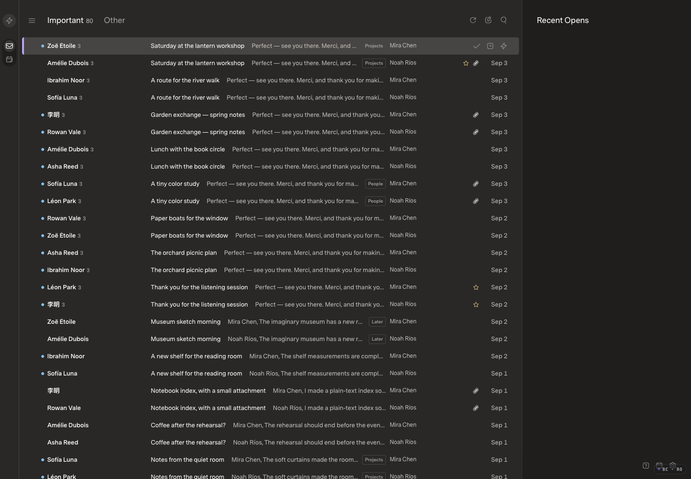
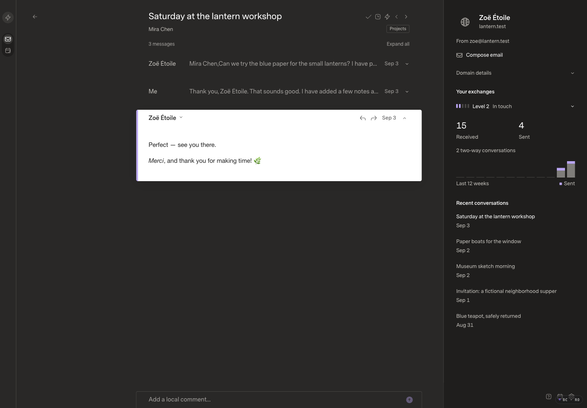
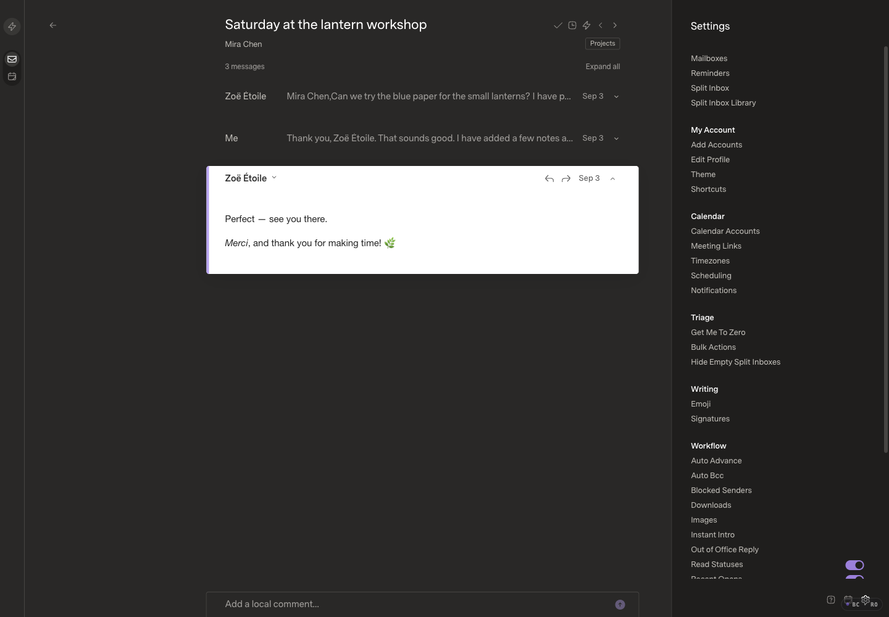

# Optional AI triage and local preferences

## Current baseline

Review and deployed baseline: `b7f8e3c1252e6cb72fc92b4be8954d1285a28bd1`.
The original Mac checkout's unpublished offline-classifier commits and private
README edit are excluded. The current remote image is healthy and serves
`index-D6wJS4aX.js` / `index-Bb0O4DVi.css`; the same source builds locally as
`index-DKT4qbWB.js` / `index-Bb0O4DVi.css`.

Fictional SDK fixture: 160 messages/memberships, two sources, 80 projected inbox
conversations. Capture: 1440 × 1000 CSS pixels, 100% zoom, Carbon, Comfortable,
Super Sans/Normal, images enabled, optimized build, bounded timing logs enabled.
Screenshots were inspected. Browser actions use disclosed DOM activation in an
isolated read-only Browser Control session, not native input.

## Requested scope

- Optional semantic assessment: message type, response/action needs, urgency and
  grounded deadlines, topics, suspected spam/phishing and uncertainty.
- Private local preference scores from explicit choices, confirmed correspondence
  and capped active reading. Preserve manual choices and current Done/W semantics.
- New-mail processing with a short bounded presentation wait and safe fallback;
  resumable historical processing without blocking mail, startup or sends.
- Replaceable inference transport, private runtime credentials, versioned decisions
  and model configuration. AI is off by default; per-user opt-in controls uploads.
- Durable bounded diagnostics, attempt/token accounting and transparent versioned
  price estimates, plus private inspection and correction controls. No public
  report upload, automatic execution, permanent deletion or provider spam moves.

Implementation and after evidence are pending. This is the required baseline-only
draft, opened before UI implementation. The supplied inference credential is not
part of source, screenshots or diagnostics. Local tests use isolated fictional
state; the original Mac installation is not a deployment target.
