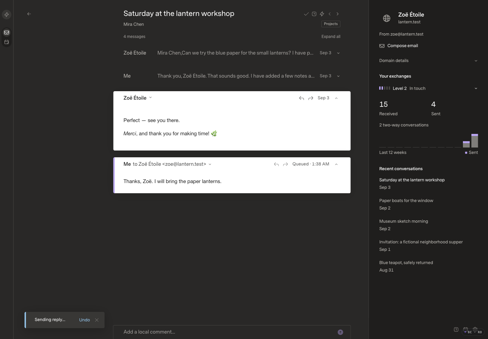
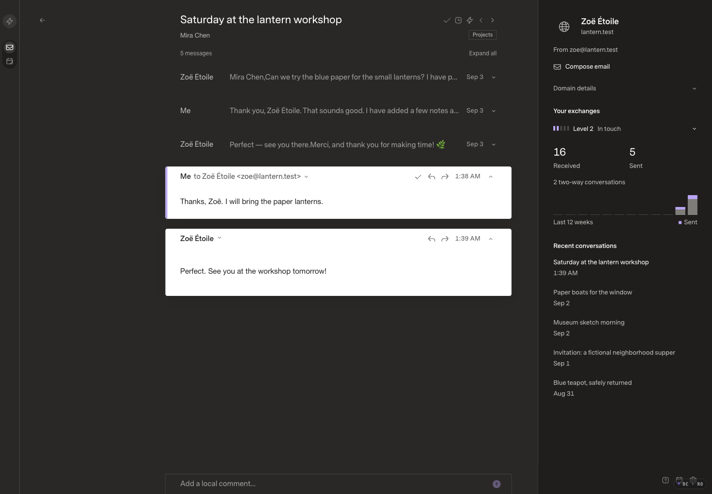
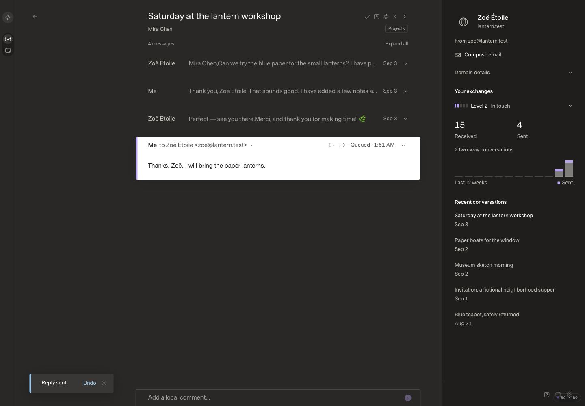
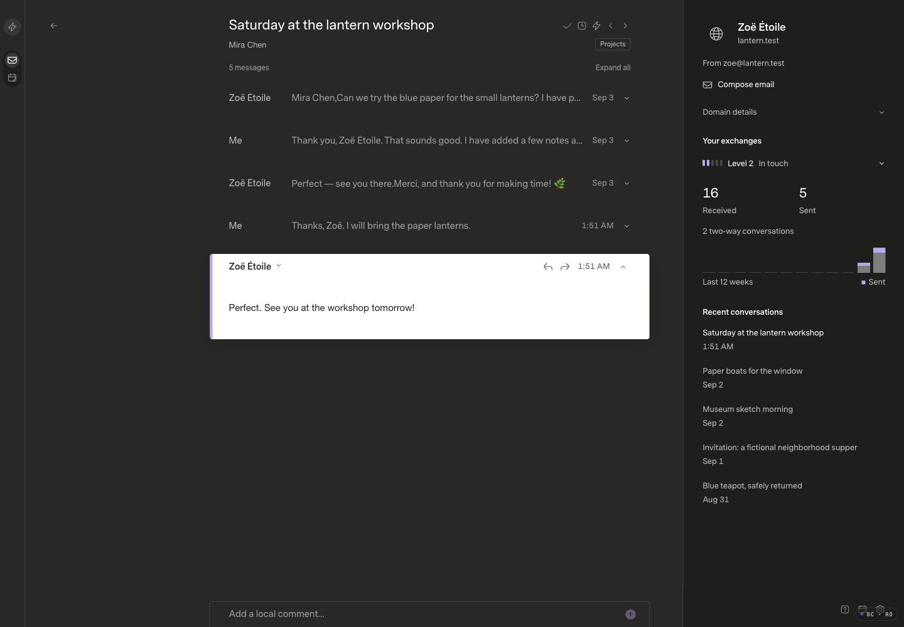

# Reply feedback and newest-message focus

## Baseline

Current deployed/public application: `088f1acf743f6b144e4a50c209e2c532a70fc8dc`.
The original Mac checkout's two unpublished commits concern offline classification;
they do not change this UI and are excluded. Its private README edit is untouched.
The remote currently serves `index-6mNjncul.js` and `index-Bb0O4DVi.css`.
The optimized local build of the same source serves `index-BnvlWz2W.js`.

The real SDK-backed offline fixture starts with 160 messages / 160 memberships,
two sources and 80 projected conversations. A fictional reply to the lantern
workshop conversation is sent, then a fictional incoming response is injected
through the mock provider and synchronized through the SDK. No real mail or
production writes are involved.

Captures: 1440 × 1000 CSS pixels, 100% zoom, Carbon theme, Comfortable density,
Super Sans / Normal text, images enabled, 10-second Undo Send policy, bounded
timing logs enabled. Browser actions use disclosed DOM activations in a read-only
Browser Control session, not OS-level input.

## Reproduced before implementation

- Accepted replies display “Sending reply…” throughout the intentional hold.
- Sending retains the previous expanded message beside the outgoing message.
- Returning to the thread after a newer incoming reply opens both the old sent
  reply and the new incoming message. The old sent reply receives the accent.
- This is retained send-focus state, not a duplicate SDK message or provider send.

## Change

Use the explicitly requested “Reply sent” / “Email sent” acknowledgment with
Undo while cancellation is available. This is a requested UI-copy exception
for accepted immediate submissions, not a change to delivery state: SDK pending,
processing, scheduled, failed, partial and uncertain states remain authoritative.
Do not change the hold, send earlier, claim delivery receipts, or offer Undo after
the SDK has begun sending. Scheduled sends and unsuccessful outcomes stay explicit.

Reader entry consumes previous send-focus state rather than replaying it. The
newest message owns the highlight. A new send replaces automatic expansion,
while explicit pointer/keyboard expansion choices are retained. Expansion and
active-message identity use the existing operation/message article key, so a
pending message becoming canonical does not reopen a manually collapsed card
or steal focus. Undo restores the original message above the draft when the
automatically opened outgoing card disappears; explicit choices remain intact.

The same status watcher now handles replies and new email. Undo disappears when
the operation leaves pending, and failures/partial/unconfirmed outcomes remain
explicit. The message header still displays its actual queued/scheduled state.
No SDK, provider, queue, send policy, CSS, dependency or configuration changed.

## Matching evidence

| Scenario | Before | After |
| --- | --- | --- |
| Accepted send |  |  |
| New incoming reply, reentry |  |  |
| Send and hold | [Before video](before-send.mp4) | [After video](after-send.mp4) |
| Reader reentry | [Before video](before-reentry.mp4) | [After video](after-reentry.mp4) |

Final candidate assets: `index-DKT4qbWB.js`, unchanged `index-Bb0O4DVi.css`.
Both runs restore the same fictional ready-state snapshot, including the saved
reply and its text. The initial screenshots are pixel-identical. Each then sends
once and receives one new mock reply: 162 messages / memberships afterward,
80 conversations. New action timestamps naturally reflect each run's clock.
Videos assemble timed screenshots (250 ms first send sample, approximately
750 ms following samples; 150 ms reentry sampling), not OS-input recordings or
frame-rate/animation benchmarks. All frames and final screenshots were inspected.

## Performance and correctness

- Existing web suite: 61 tests; API suite: 214 tests / 6,142 assertions.
- Root SDK typecheck/build and optimized frontend TypeScript/Vite build pass.
- No new test files, fixtures in source, dependencies or CI changes.
- Browser checks confirm reply acknowledgment with real pending state, real Undo
  cancellation and exact draft/recipient restoration across reload, new-email
  acknowledgment and Undo expiry after the unchanged hold, newest-only reader
  reentry, manual/keyboard expansion and 1440/900-pixel layouts without horizontal
  overflow. The first candidate's Undo-context collapse was caught and corrected;
  the final candidate restores the expanded incoming message above the draft.
- A collapsed pending reply remained collapsed after canonical success, with one
  article for the operation and the exact older focused article still connected
  and focused. An earlier probe clicked a collapsed button and thereby replaced
  its own focus target; that invalid probe was retracted and repeated correctly.
- A real scheduled mock email showed “Email scheduled for Sep 5, 9:00 AM” and
  Undo while the SDK operation remained pending with the matching future sendAt.
  Undo produced “Email cancelled. Draft restored.”; the fixture draft was cleaned
  up. Failure/partial/uncertain copy paths were code-reviewed, not newly exercised
  through injected browser response states. No real provider sends were made.
- Five cached opens each, click through next rendered frame, same final thread:

| Build | Median | p95 / max |
| --- | ---: | ---: |
| Baseline | 24.7 ms | 26.7 ms |
| Candidate | 22.2 ms | 29.8 ms |

Candidate cached opens issued zero body requests. Hardware: Apple M5 Max,
macOS 27.0, Bun 1.4.0, Chromium 152, Browser Control 0.5.1; warm mailbox/body
cache, bounded timing logging enabled. Measurements preceded other test load.
These small-fixture measurements show no material reader-entry regression, not
a new 6.5k/50k qualification or an OS-level latency claim. Startup, first body
load, E/W and provider send latency are unchanged paths, not newly benchmarked.

The pre-existing Vite >500 kB warning remains. Approval is required before merge
or deployment; the remote installation is not changed by this review branch.
