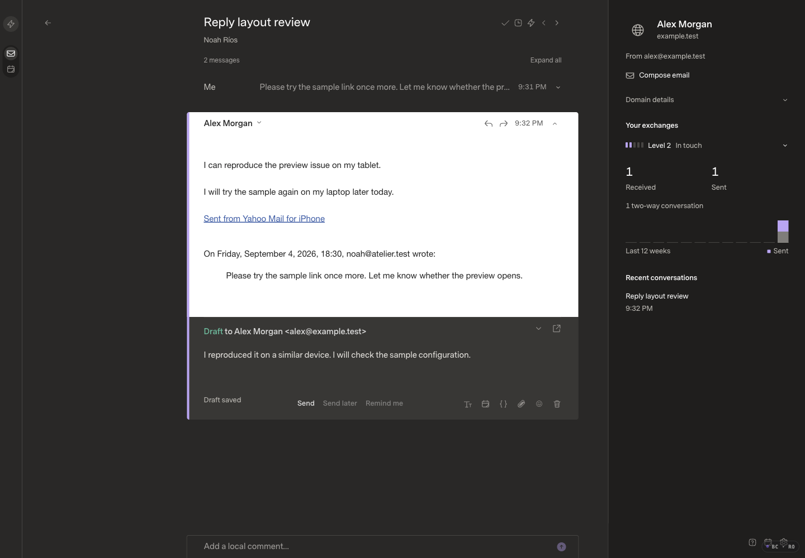
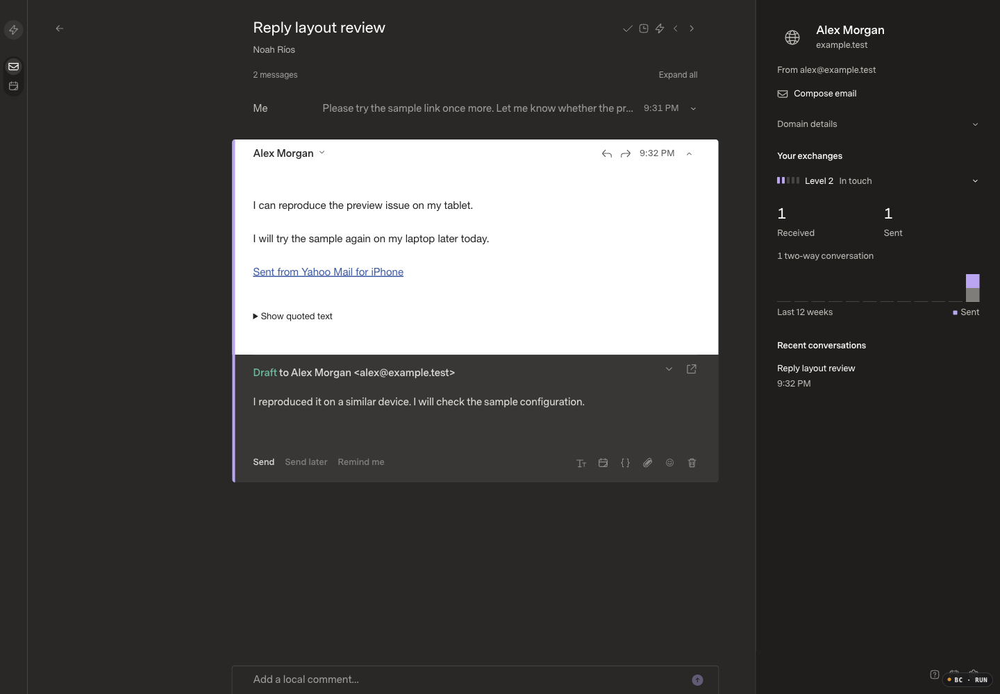
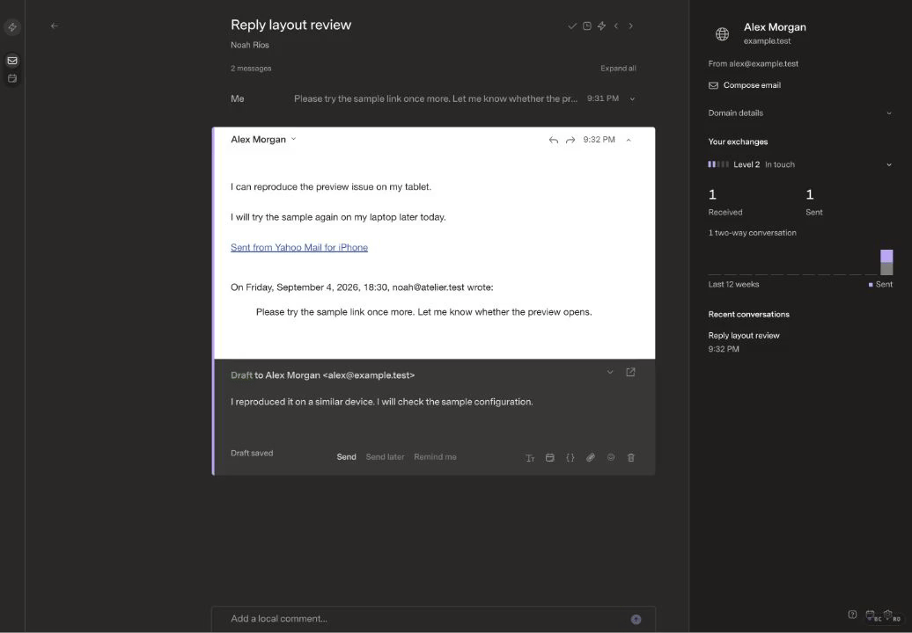
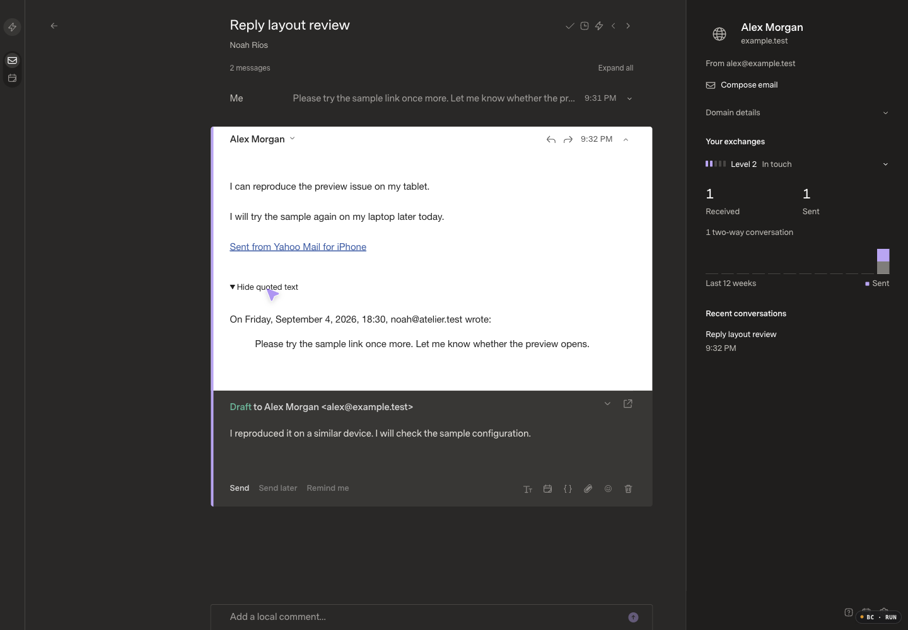

# Reply footer and quoted history

## Scope and baseline

Combined draft [PR15](https://github.com/R44VC0RP/superlocal/pull/15) fixes the displaced reply actions and always-expanded recognized email history. No merge or deployment was performed by this session.

- Approved base: PR12 merge `4fb65106b72855497ada4eafe3ea2862bd2753d5`; application tree matches the qualified `1881b6c` tree. The original Mac README edit, private config/databases and two unpublished classifier commits remain untouched and excluded.
- Baseline-only draft commit: `9e06eda`, created before application edits. Source implementation: **`f71e5553649f28dda8ba01cf8b30b8b222ee491c`**.
- Hosted asset identity at baseline: `index-Ba2d0NbS.js` / `index-kKVWxxy0.css`. The release coordinator owns production. Local optimized baseline: `index-CWPNzOho.js`; candidate: `index-CsE3T75m.js`. Both use `index-kKVWxxy0.css`.
- Matching visual fixture: default offline mock seed plus eight fictional received examples, **168 canonical messages / two sources / one saved reply**. Independent copies of the same seed; no real email, external inference or provider traffic.
- Appearance: **Carbon / Comfortable / Super Sans (SuperMailSans) / Normal**, 1440×1000 CSS px, DPR1, 100% zoom. Existing sender formatting and scriptless isolation remain intact.

## Before and after

| Scenario | Before | After |
| --- | --- | --- |
| Reply footer and collapsed history |  |  |
| History disclosure |  |  |
| Full older reply remains available | Always visible above |  |

Screenshots and decoded recording frames were inspected. Embedded GIFs render directly in GitHub; the original [before MP4](before-reader.mp4) and [after MP4](after-reader.mp4) remain downloadable. The after recording is an unchanged-speed six-second excerpt showing the native disclosure expand and reclose, not a latency benchmark. Supplementary fictional edge states: [unsaved recipient](after-unsaved-recipient.png), [save conflict](after-save-error.png), [expanded mobile quote](after-mobile-expanded.png), [popped-out reply](after-popout.png).

## Changes

| Before | After |
| --- | --- |
| Routine saved/saving text was a third footer group, moving Send toward the center | Send / Send later / Remind me remain at left, utility icons at right; actionable unsaved-recipient feedback remains above the footer |
| Complete quote history always rendered | Native, keyboard-accessible Show/Hide quoted text inside the existing iframe; every sanitized quoted node remains available |
| Unused, sender-spoofable quote classes | Server-only structural annotation of at most two adjacent nodes; size/depth/event bounds and a cheap no-quote fast path |
| Reader link-only Tab traversal could bypass a new disclosure | Tab includes generated summaries; Enter/Space retain native activation; iframe height updates on toggle |

Autosave and submission logic are unchanged. Save failures, local writing recovery and explicit Reload saved draft confirmation remain. There was no Share draft implementation to remove.

### Conservative detection

Eligible shapes are a trailing Yahoo `yahoo-quoted-begin` attribution plus `blockquote.iosymail`, a Gmail attribution plus quoted block, or an explicit citation block. Detection requires preceding current content and rejects later meaningful content through every ancestor. It never hides a broad Gmail wrapper.

Generic quotations, plain text, unpaired headers, header-only Outlook shapes, quote-only messages, signatures without current content, new inline/bottom replies and over-budget/ambiguous documents stay visible. Sender-supplied collapse markers are stripped. Text, inline attachments and remote-image/tracker policy are preserved. The generated disclosure has a 44px target; no iframe scripts or client re-sanitization were added.

New text placed by an email author *inside* an actual quoted block cannot be distinguished reliably without additional metadata. The disclosure is always reversible rather than deleting that content.

## Correctness verification

- **68 web tests**, **252 API tests / 7,560 assertions**, zero failures. SDK and host type checks, SDK build, optimized web TypeScript/Vite build, and `git diff --check` passed. Only existing API tests were extended; no dependencies, test files or CI added. The unchanged 10,000-thread/33rd-arrival API watchdog passed at 4,481.66ms.
- Native browser QA verified Tab from the preceding link to the disclosure, Enter to expand, Space to collapse, visible Yahoo/Gmail/cite quote content, and visible inline/bottom/generic/plain text.
- Actual fixture PATCH saves returned 200 and persisted across reload. Original draft body/recipient were restored. Incomplete recipient input produced **Unsaved recipient changes above the footer**. Schedule/reminder/formatting/snippet menus and popped-out reply layout worked without sending.
- A parent-owned interception of **only the fictional draft PATCH** returned a controlled 412. Writing and error alert/recovery remained visible; Keep editing preserved writing, and confirmed Reload draft restored the saved original. The interception was removed and restoration reverified after reload.
- At 1440/900/390 widths, document and iframe widths had no horizontal overflow. Native expand/reclose heights were 228→337→228, 228→361→228 and 276→481→276px. Mobile quote/footer remained readable/reachable, and mobile Formatting activation worked.

The initial read-only QA correctly could not exercise trusted interactions. Ryan then explicitly authorized an interaction-enabled session **for disposable localhost fixtures only**; the blocked checks above were completed, not counted as passes beforehand. Browser Control logged sandbox script refusals during some native actions; scripts remained blocked and the native disclosure still functioned. Attachment Tab traversal was not directly tested in the browser; SDK media-preservation cases passed. A separate new-message composer was not created; inline and popped-out shared composers were exercised.

## Performance

Apple M5 Max / 48GiB, macOS27, Bun1.4.0, Node24.16.0, Chrome152, Browser Control0.5.1. Optimized builds, performance logging on, 1440×1000/DPR1/100%, same selected appearance, independent copies of complete common seeds: **10,000 canonical messages / 8,000 threads / 15,000 memberships** and **50,000 / 40,000 / 75,000**, two sources/three views each. No budgets lowered, cache clearing, throttling or reduced data.

At least five samples per case; one excluded startup warmup per size/build. Startup is rows-ready plus two frames. Action values are the application's handler-to-next-double-frame estimate *after completed receipt*, not browser paint or full native input latency. First browser body reads are separate from settled cached opens; cached samples issued zero body GETs. Exit animation is not receipt latency. Candidate measurements use the identical source now committed as `f71e555`.

| Scenario | Baseline median / p95 / max (ms) | Candidate median / p95 / max (ms) |
| --- | ---: | ---: |
| 10k startup → rows | 828.8 / 839.4 / 839.4 | 1335.6 / 1342.7 / 1342.7 |
| 10k first body ready | 37.9 / 48.6 / 48.6 | 80.8 / 107.3 / 107.3 |
| 10k settled cached open | 24.1 / 31.0 / 31.0 | 27.7 / 28.7 / 28.7 |
| 10k E | 33.9 / 36.7 / 36.7 | 45.7 / 47.6 / 47.6 |
| 10k W | 37.2 / 50.3 / 50.3 | 49.0 / 52.8 / 52.8 |
| 50k startup → rows | 2730.5 / 2733.3 / 2733.3 | 2724.4 / 2813.8 / 2813.8 |
| 50k first body ready | 135.8 / 208.7 / 208.7 | 192.8 / 242.2 / 242.2 |
| 50k settled cached open | 16.8 / 31.8 / 31.8 | 29.1 / 30.1 / 30.1 |
| 50k E | 58.8 / 111.3 / 111.3 | 63.8 / 116.8 / 116.8 |
| 50k W | 66.7 / 391.4 / 391.4 | 66.8 / 70.8 / 70.8 |

All final candidate n=5 startup, cached-open and E/W sets meet their respective targets; all 20 correlated E/W Undo actions restored the exact reader hash. Baseline used scoped synthetic dispatch; candidate used trusted native input after permission was granted. The handler-completion values remain useful, but this is **not a full input-latency or causal speedup comparison**. The 10k startup/body-ready values increased; no startup improvement is claimed. First-body cases used matched mixed HTML/plain-text threads and 2–3 GETs. The last 10k cache sample followed an excluded exact-thread rewarm; it issued zero GETs. The five 50k Done records were recovered from the content-free application timing ledger after an observation execute timed out, not rerun.

### Concurrent arrival and remaining findings

After the main five-sample sets, one new fictional reply was delivered through the actual mock provider in each 50k runtime, with sync and Done requests started 3ms apart on the candidate and 11ms apart on the baseline. Correlated Undo restored the reader, and the arriving reply rendered in its iframe. Read-only database verification found **50,001 canonical messages / 75,002 memberships** per runtime; the new reply remained unread, undeleted and not Done in both memberships. This is one correctness/latency smoke per build, not an n=5 concurrent-load benchmark.

- Concurrent-smoke baseline E / Undo: **227.1 / 73.5ms**; candidate E / Undo: **137.5 / 280.9ms**. The high baseline E and candidate Undo observation are retained; no latency fix or waiver is claimed.
- An exploratory candidate W action returned an error (34.9ms) and no Undo control before the final settled five-sample run. Its HTTP/root cause was not established. The subsequent qualified W samples do **not** erase this observation; unrelated W debugging is outside this PR.
- The first concurrency observation incorrectly searched the parent document for HTML iframe text, and the baseline observation briefly encountered an unloaded iframe body. Fresh frame-specific reads verified both outcomes without repeating the actions. These were observation errors, not evidence of lost replies.
- The new disclosure has no animated transition; native toggle plus the next resize frame determines expansion. Underlying reader/list animation was unchanged and was not conflated with the completed receipt metrics.

The baseline 50k W pass already recorded two 150ms-budget breaches: **391.4ms and 236.8ms**. The older PR12 concurrent W finding of **205.7ms** also remains recorded; neither is a global waiver or claimed fixed by this footer/quote work.

## Review gate

- [x] Baseline captured and inspected before implementation; isolated branch excludes unrelated/private work.
- [x] Matching fictional after screenshots and native disclosure recording inspected.
- [x] Functional regressions, native interaction, persistence and recovery checks passed.
- [x] Candidate scale/arrival evidence complete; timing exceptions retained above for reviewer decision.
- [ ] Ryan/release coordinator approves exact reviewed revision before merge/deployment.
