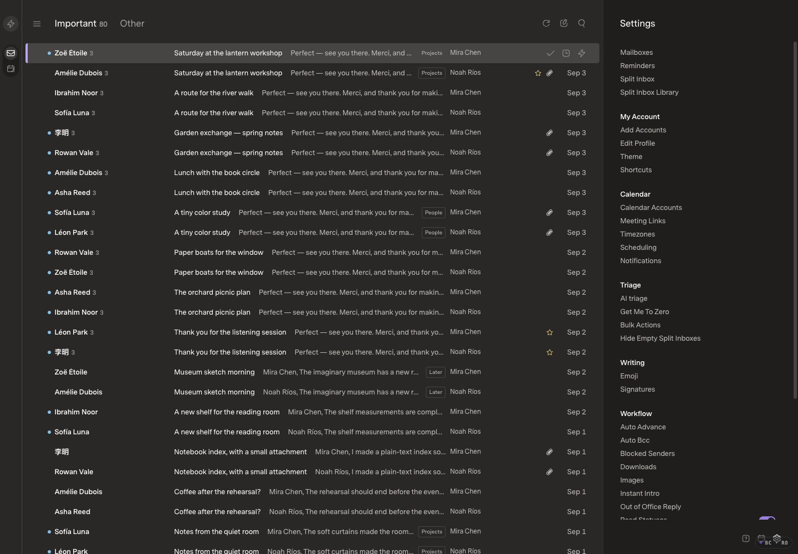
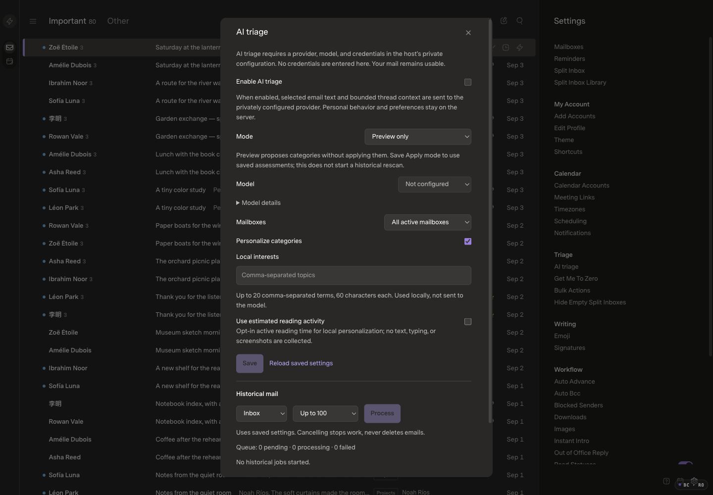

# Unified settings and reliable triage

## Scope

Replace scattered settings-sidebar links and ordinary setting dialogs with one continuous, scrollable settings workspace. Put AI status, explanations, progress and failures beside its controls. Correct the demonstrated generic triage failure without sender-specific exceptions or weakening genuine uncertainty, safety, ownership or manual-choice protections.

Current hosted baseline: `18c78f673e1cc8ca7112f851f3ed6cf797c59c62` (PR #11), verified healthy before work. Original Mac checkout retains its private README edit and two unpublished offline-classifier commits; those are not applicable to the hosted runtime and are excluded. Other worktrees are preserved.

## Before

Fictional 160-message fixture, two mock sources; same retained seed used for prior UI evidence. Optimized baseline tree equals hosted main; loaded `index-DafGZ9nT.js` / `index-Bk50KCF5.css`. 1440×1000, DPR 1, 100% zoom, Carbon / Comfortable / Super Sans Normal. This isolated baseline has AI unconfigured and off; it is not a screenshot or workload claim about the user's live mail or enabled AI.

[Existing settings interaction](before-settings.mp4)

Images and decoded video frames inspected. The short recording illustrates navigation only, not performance.

## Expected differences

- Settings replaces the email workspace; one vertical scroller exposes ordinary settings instead of a sidebar menu with separate dialogs.
- AI controls explain Important/Other and saved versus pending configuration; status distinguishes disabled, idle, processing, partial failures and unavailable progress.
- Existing settings, theme, typography, mail navigation context and draft/save boundaries remain intact.
- Transactional account authorization and destructive confirmations may remain separate; no new provider connection or real-mail mutation is part of UI testing.
- Triage correction is general, not a sender allowlist. No automatic paid full-mailbox rescan, provider Spam movement, or change to W/Done feedback meaning.

## After and verification

Pending implementation. This draft is opened before application source changes. Matching after evidence, existing regression results, bounded private real-mail validation and applicable performance qualification will be attached before requesting approval. No private mail, prompts, credentials or logs may be published.

## Review gate

No merge or deployment approval yet. PR #11's accepted W latency outlier deferral is not a waiver for this change.
